# Documentación técnica: Sistema de Seguimiento de Proyectos Gráficos

Este documento describe **cómo funciona el sistema por dentro**: arquitectura, modelo de datos y
cardinalidades, reglas de negocio, seguridad, contratos de la API, flujos entre componentes y
decisiones de diseño. Describe el comportamiento real del código en el repositorio. No es un manual
de uso: ese es [`MANUAL_USUARIO.md`](MANUAL_USUARIO.md), para docentes y estudiantes, con capturas.
El sistema está desplegado en Azure: la sección 19 registra cómo se hizo, y la guía para
repetirlo es [`DESPLIEGUE_AZURE.md`](DESPLIEGUE_AZURE.md).

> Los diagramas están en **Mermaid**. Se ven en GitHub y en la vista previa de Markdown de VS Code
> (con la extensión *Markdown Preview Mermaid Support*).

## Índice

1. [Propósito y alcance](#1-propósito-y-alcance)
2. [Glosario](#2-glosario)
3. [Arquitectura](#3-arquitectura)
4. [Modelo de datos y cardinalidades](#4-modelo-de-datos-y-cardinalidades)
5. [Seguridad](#5-seguridad)
6. [Reglas de negocio](#6-reglas-de-negocio)
7. [Contrato de la API](#7-contrato-de-la-api)
8. [Flujos principales](#8-flujos-principales)
9. [Ciclos de vida y estados](#9-ciclos-de-vida-y-estados)
10. [Frontend](#10-frontend)
11. [API Gateway](#11-api-gateway)
12. [Concurrencia y consistencia](#12-concurrencia-y-consistencia)
13. [Tolerancia a fallos y degradación](#13-tolerancia-a-fallos-y-degradación)
14. [Configuración y ejecución](#14-configuración-y-ejecución)
15. [Calidad y pruebas](#15-calidad-y-pruebas)
16. [Limitaciones conocidas y trabajo futuro](#16-limitaciones-conocidas-y-trabajo-futuro)
17. [Trazabilidad de requisitos](#17-trazabilidad-de-requisitos)
18. [Estructura del repositorio](#18-estructura-del-repositorio)
19. [Despliegue en Azure (registro del despliegue)](#19-despliegue-en-azure-registro-del-despliegue)

---

## 1. Propósito y alcance

### 1.1 Problema que resuelve

En los cursos de diseño gráfico, un proyecto se trabaja por **iteraciones**: el estudiante (o un
grupo de estudiantes) entrega una versión, el docente la comenta, se corrige y se entrega otra. Ese
proceso suele quedar disperso en correos, chats y carpetas compartidas. Se pierde la trazabilidad de
qué se pidió, qué cambió y con qué nota terminó cada iteración.

El sistema centraliza ese ciclo:
- Cada **versión** queda registrada de forma inmutable, con su archivo, su descripción y la
  retroalimentación que recibió.
- Un proyecto puede ser **individual** o **por grupos**. En los proyectos por grupos, los
  estudiantes forman sus grupos dentro del plazo que fija el docente, y las versiones son del grupo.
- Al final, el docente asigna la **calificación final**: por estudiante o por grupo, según cómo se
  haya configurado el proyecto.
- El portafolio se exporta en PDF de dos maneras:
  - El portafolio de **un proyecto**, que puede generar el docente o el estudiante.
  - El **portafolio académico** del estudiante, que reúne los cursos y proyectos que él elija.

### 1.2 Actores

| Actor | Cómo se identifica | Qué puede hacer |
|---|---|---|
| **Docente** | Cuenta con `role = "docente"` | Crear cursos y proyectos (individuales o por grupos, con tamaño de grupo, plazo y modo de calificación). Editar, ocultar, mostrar y eliminar (si no tienen entregas) sus proyectos. Cambiar el plazo para formar grupos. Ver las versiones de sus estudiantes. Dejar retroalimentación y calificaciones parciales. Asignar la calificación final (por estudiante o por grupo). Ver el progreso. Exportar el portafolio de cualquier estudiante de sus cursos |
| **Estudiante** | Cuenta con `role = "estudiante"` | Unirse a cursos con un código. Crear grupos, unirse a uno o salir de él dentro del plazo. Subir versiones (propias o de su grupo). Ver su historial, la retroalimentación y su progreso. Exportar el portafolio de un proyecto y armar su portafolio académico |
| **Visitante** | Sin sesión | Iniciar sesión, registrarse y leer los documentos legales |

El rol se elige al registrarse y **no cambia nunca**: no existe un endpoint para modificarlo.

### 1.3 Alcance

**Incluido:**
- Registro y login.
- Cursos con código de invitación.
- Proyectos individuales o por grupos.
- Edición de proyectos, visibilidad (ocultar y mostrar, también como borrador) y eliminación de
  proyectos sin entregas.
- Formación de grupos por los propios estudiantes, con plazo.
- Versiones inmutables.
- Retroalimentación con calificación parcial opcional.
- Calificación final única (por estudiante o por grupo).
- Progreso.
- Exportación a PDF (por proyecto y portafolio académico).
- Documentos legales (tratamiento de datos, términos y derechos de autor).

**Excluido a propósito:**
- Editar o borrar versiones y retroalimentación.
- Eliminar un proyecto que ya tiene versiones: se oculta en su lugar.
- Co-docentes.
- Corregir una calificación final.
- Que el docente arme o modifique los grupos.
- Cambiar la modalidad, el tamaño de los grupos o el modo de calificación después de que el
  proyecto tenga grupos o versiones.
- Salir de un curso o expulsar estudiantes.
- Recuperar la contraseña.
- Restringir el dominio del correo.
- Notificaciones.
- Paginación.

---

## 2. Glosario

| Término | Significado en el sistema |
|---|---|
| **Curso** | Agrupación creada por un docente. Tiene un código de 6 caracteres para que los estudiantes se unan |
| **Docente titular** | El único docente de un curso: quien lo creó (`courses.teacher_id`) |
| **Matriculado** | Estudiante cuyo id está en `courses.student_ids` |
| **Proyecto** | Encargo dentro de un curso, con título y descripción (el enunciado). Es individual o por grupos (`work_mode`) |
| **Proyecto oculto** | Proyecto con `hidden = true`: no existe para los estudiantes (no lo ven y responde 404), pero el docente lo ve y todo su contenido se conserva. Sirve como borrador o para retirar un proyecto |
| **Proyecto por grupos** | Proyecto en el que los estudiantes forman grupos de entre `group_min_size` y `group_max_size` integrantes, y las versiones son del grupo |
| **Grupo** | Conjunto de estudiantes matriculados que trabajan juntos en un proyecto por grupos. Un estudiante está a lo sumo en un grupo por proyecto |
| **Plazo para formar grupos** | `group_deadline`: hasta ese momento se pueden crear grupos, unirse o salir. El docente lo puede cambiar |
| **Modo de calificación** | `grading_mode` de un proyecto por grupos. `individual` da una calificación final a cada integrante; `group` da una sola calificación para todo el grupo. Son excluyentes |
| **Versión** | Una entrega: un archivo (JPG, PNG, PDF o SVG) y una descripción. Es inmutable. En proyectos por grupos pertenece al grupo y registra qué integrante la subió |
| **Hilo** | Las versiones de un dueño en un proyecto, en orden cronológico: de **un estudiante** (individual) o de **un grupo** (por grupos). Se numeran v1, v2… dentro del hilo |
| **Retroalimentación** | Un comentario del docente sobre una versión, con calificación parcial opcional |
| **Calificación parcial vigente** | La nota más reciente que tiene una versión. Las anteriores quedan como *reemplazadas* |
| **Calificación final** | La nota de cierre de un estudiante en un proyecto. Se asigna una sola vez, sobre una versión de su hilo |
| **Progreso** | Porcentaje de versiones que ya recibieron al menos una retroalimentación |
| **Portafolio de proyecto** | PDF con el hilo de un estudiante en un proyecto: versiones, retroalimentación y calificación final |
| **Portafolio académico** | PDF que arma el estudiante con los proyectos que elija (de uno o varios cursos), con o sin comentarios, calificaciones e imágenes |
| **H-6** | Regla de autorización por **pertenencia**: no basta el rol, el usuario debe pertenecer al curso del recurso (y, en proyectos por grupos, al grupo de la versión) |

---

## 3. Arquitectura

### 3.1 Vista general

El sistema sigue una **arquitectura de microservicios** con un **API Gateway** como único punto de
entrada y una **SPA** (Single Page Application) como cliente.

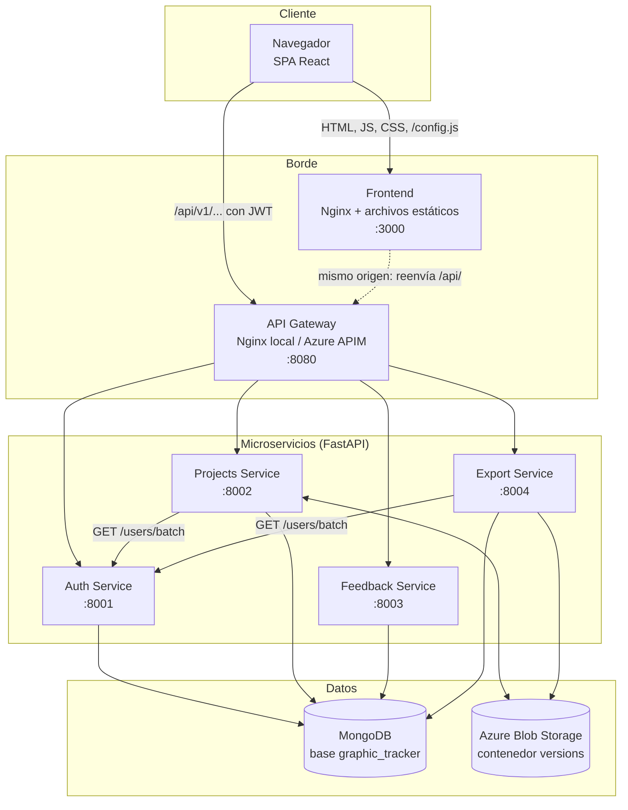
```mermaid
flowchart TB
    subgraph Cliente
        B[Navegador<br/>SPA React]
    end

    subgraph Borde
        F[Frontend<br/>Nginx + archivos estáticos<br/>:3000]
        G[API Gateway<br/>Nginx local / Azure APIM<br/>:8080]
    end

    subgraph Servicios["Microservicios (FastAPI)"]
        A[Auth Service<br/>:8001]
        P[Projects Service<br/>:8002]
        FB[Feedback Service<br/>:8003]
        E[Export Service<br/>:8004]
    end

    subgraph Datos
        M[(MongoDB<br/>base graphic_tracker)]
        S[(Azure Blob Storage<br/>contenedor versions)]
    end

    B -- "HTML, JS, CSS, /config.js" --> F
    B -- "/api/v1/... con JWT" --> G
    F -. "mismo origen: reenvía /api/" .-> G
    G --> A & P & FB & E
    A --> M
    P --> M
    FB --> M
    E --> M
    P <--> S
    E --> S
    P -- "GET /users/batch" --> A
    E -- "GET /users/batch" --> A
```

El navegador puede llegar a la API de dos maneras. Las decide la variable `API_GATEWAY_URL` del
contenedor del frontend (ver [10.7](#107-configuración-en-tiempo-de-ejecución)):
- **Mismo origen** (vacía, el modo local por defecto): el navegador llama a `/api/...` del propio
  servidor del frontend, y su Nginx lo reenvía al gateway. Basta exponer un solo puerto.
- **Gateway directo** (con una URL, el modo en Azure): el navegador llama directamente a API
  Management.

### 3.2 Componentes y responsabilidades

| Componente | Responsabilidad | Escribe en | Lee de |
|---|---|---|---|
| **Frontend** | Interfaz. Mantiene la sesión en el navegador. Solo conoce la URL del gateway | — | API |
| **API Gateway** | Enruta por path hacia cada servicio. No valida el JWT ni transforma el cuerpo de las peticiones | — | — |
| **Auth Service** | Registro, login, emisión del JWT, datos del usuario actual y resolución de ids a nombres | `users` | `users` |
| **Projects Service** | Cursos, matrícula, proyectos (individuales o por grupos; edición, visibilidad y eliminación), grupos y su plazo, versiones (archivo en Blob) y cálculo del progreso | `courses`, `projects`, `groups`, `versions`, Blob | Lo anterior y `feedback` (solo lectura) |
| **Feedback Service** | Retroalimentación, calificaciones parciales y calificación final (por estudiante o por grupo) | `feedback` | `feedback`, y `versions`, `projects`, `courses`, `groups` (solo lectura) |
| **Export Service** | Genera los PDF bajo demanda: portafolio de un proyecto y portafolio académico. No es dueño de ninguna colección | — | `courses`, `projects`, `groups`, `versions`, `feedback`, Blob |

### 3.3 Base de datos compartida con propiedad por colección

Los cuatro servicios usan **la misma base MongoDB** (`graphic_tracker`), pero cada colección tiene
**un único dueño**. Solo el dueño escribe en ella; los demás la leen en modo solo lectura.

| Colección / almacén | Dueño (único que escribe) | Lectores |
|---|---|---|
| `users` | Auth | Auth. Ningún otro servicio la lee: los nombres se piden por HTTP a `GET /users/batch` |
| `courses` | Projects | Projects, Feedback, Export |
| `projects` | Projects | Projects, Feedback (modo de trabajo y de calificación), Export |
| `groups` | Projects | Projects, Feedback (integrantes, para autorizar y para la calificación grupal), Export |
| `versions` | Projects | Projects, Feedback, Export |
| `feedback` | Feedback | Feedback, Projects (progreso, bloqueo de subidas y de cambios de grupo), Export |
| Blob `versions` | Projects | Projects (para servir el archivo), Export (imágenes del PDF) |

**Por qué así y no una base por servicio:**
- Para validar la pertenencia (H-6), Feedback necesita saber quién es el docente titular del curso
  de una versión y quiénes integran su grupo.
- Para el progreso y el bloqueo de subidas, Projects necesita saber qué versiones tienen
  retroalimentación y quién tiene calificación final.
- Con bases separadas, esto exigiría llamadas HTTP entre servicios en cada petición o replicar los
  datos con eventos. Para el tamaño del sistema, las lecturas directas son más simples y
  consistentes.

**Cómo se contiene el acoplamiento:**
- Las lecturas cruzadas están **aisladas** en módulos concretos:
  - `Feedback_Service/app/db/projects_readonly.py`, con vistas que solo declaran los campos que usa
    (`app/models/projects.py`).
  - Funciones puntuales en Projects: `progress.py`, `_ensure_student_not_graded` en `versions.py`
    y `_ensure_not_graded` en `groups.py`.
  - `Export_Service/app/core/portfolio.py`, que concentra todas las lecturas de Export.
- La colección `users` es la excepción deliberada: tiene correos y hashes de contraseñas, así que
  se aísla por completo detrás de un endpoint que solo devuelve `id`, `name` y `role`
  (minimización de datos, RNF-06).

### 3.4 Comunicación entre servicios

- **Síncrona por HTTP, solo hacia Auth.** Projects (progreso) y Export (PDF) llaman a
  `GET /api/v1/users/batch` de Auth para convertir ids en nombres.
  - Reenvían **el JWT del usuario que hizo la petición**, así que la llamada se autoriza con su
    propia identidad: no hay credenciales de servicio.
  - El timeout es de 5 segundos y los ids van en lotes de hasta 100.
  - La URL se configura con `AUTH_SERVICE_URL`.
- **Por datos.** El resto de la coordinación ocurre leyendo las colecciones de otros servicios
  ([3.3](#33-base-de-datos-compartida-con-propiedad-por-colección)).
- **No hay mensajería asíncrona** (colas o eventos).

### 3.5 Estructura interna de cada microservicio

Los cuatro servicios derivan de `service-template/` y comparten esta estructura:

```
app/
├── main.py              # FastAPI, lifespan (conexiones e índices), CORS, handler de errores
├── core/
│   ├── config.py        # Settings (pydantic-settings) leídas de variables de entorno
│   ├── security.py      # Verificación del JWT → CurrentUser(id, role). Igual en los cuatro
│   └── logging.py
├── db/
│   └── mongodb.py       # Cliente Motor único (async), con tz_aware=True
├── api/
│   ├── deps.py          # Punto único de dependencias (get_db, get_current_user…)
│   └── v1/              # Routers. /health va fuera de /api/v1
├── models/              # Forma de los documentos de MongoDB (Pydantic)
├── schemas/             # Contratos de entrada y salida de la API (Pydantic)
└── exceptions.py        # Excepciones de dominio → {"detail": "..."}
```

**Ciclo de vida.** En el `lifespan` de FastAPI, cada servicio:
1. Abre el cliente de MongoDB (Motor conecta de forma perezosa).
2. En Projects, inicializa el cliente de Blob Storage.
3. Crea sus índices: `create_index` es idempotente.

Si la creación de índices falla, el servicio **no arranca**. Es intencional, porque varias reglas de
negocio dependen de esos índices ([12](#12-concurrencia-y-consistencia)).

**Errores.** La lógica lanza excepciones de dominio, y un handler global las traduce a
`{"detail": "mensaje"}` con su código HTTP:

| Excepción | HTTP |
|---|---|
| `NotFoundError` | 404 |
| `ForbiddenError` | 403 |
| `ConflictError` | 409 |
| `ValidationError` / `UnprocessableError` / `UnprocessableEntityError` | 422 |
| `ServiceUnavailableError` | 503 |

Las validaciones de esquema de Pydantic responden 422 con la lista de errores de FastAPI. Las
reglas entre campos de la configuración de grupos usan `PydanticCustomError`, para que el mensaje
llegue sin el prefijo "Value error".

### 3.6 Stack tecnológico

| Capa | Tecnología |
|---|---|
| Backend | Python 3.13, FastAPI, Pydantic v2, pydantic-settings, Uvicorn |
| Acceso a datos | Motor (driver async de MongoDB) |
| Autenticación | python-jose (JWT HS256), bcrypt |
| Archivos | azure-storage-blob (async en Projects, sync en un hilo en Export). Azurite en local |
| PDF | ReportLab |
| HTTP entre servicios | httpx |
| Frontend | React 18, TypeScript, Vite, React Router 6, TanStack Query 5, Axios, Tailwind CSS 3, Radix UI, react-hook-form + zod, date-fns, sonner (toasts), lucide (íconos) |
| Gateway | Nginx 1.27 (local), Azure API Management (nube) |
| Base de datos | MongoDB 7 (local), Cosmos DB for MongoDB vCore / Azure DocumentDB (nube) |
| Contenedores | Docker, Docker Compose |
| Calidad | pytest (backend), Ruff, Vitest + Testing Library + MSW (frontend), Biome, `tsc` |

### 3.7 Decisiones de arquitectura

| # | Decisión | Motivo | Consecuencia |
|---|---|---|---|
| D1 | Microservicios por capacidad de negocio | Separar responsabilidades: identidad, entregas, evaluación y documentos | Cada servicio se despliega y escala por separado |
| D2 | Gateway como único punto de entrada | El frontend no conoce las URLs internas. Se cambia Nginx por APIM sin tocar el frontend | La tabla de rutas vive en dos lugares (`nginx.conf` y `apim-policy.xml`) y debe mantenerse igual |
| D3 | El JWT lo validan los servicios, no el gateway | Cada servicio es responsable de su seguridad (defensa en profundidad) | El gateway se mantiene simple. Todos los servicios comparten `JWT_SECRET_KEY` |
| D4 | JWT simétrico (HS256) con un secreto compartido | Simplicidad | Cualquier servicio con el secreto podría emitir tokens; solo Auth lo hace por convención y código |
| D5 | Base compartida con un dueño por colección | Validar la pertenencia sin llamadas HTTP en cada petición | Acoplamiento de esquema, contenido en módulos de solo lectura |
| D6 | Inmutabilidad (sin `PUT` ni `DELETE`) | La trazabilidad académica: lo entregado y lo evaluado no se reescribe | Corregir algo significa agregar un registro nuevo |
| D7 | Reglas de unicidad y cupo garantizadas por la base (índices únicos y actualizaciones condicionales) | Dos peticiones simultáneas pasarían cualquier verificación previa hecha en la aplicación | Los servicios dependen de que la base soporte índices únicos parciales y multikey |
| D8 | Blob privado; el archivo se sirve a través de la API | El archivo hereda la misma autorización que su versión | El tráfico de archivos pasa por Projects |
| D9 | PDF generado bajo demanda, sin guardarlo | Siempre refleja el estado actual y no deja copias con datos personales | El costo de CPU se paga en cada exportación |
| D10 | Configuración del frontend en tiempo de ejecución (`/config.js`) | La misma imagen sirve en local y en Azure | No hace falta reconstruir para cambiar el gateway |
| D11 | En proyectos por grupos, la versión es del **grupo** (`versions.group_id`) y conserva quién la subió (`student_id`) | El grupo comparte un solo historial y todos sus integrantes lo ven | Las lecturas por "hilo" usan `group_id` en vez de `student_id` |
| D12 | La calificación grupal se **materializa un registro por integrante** | Cada estudiante sigue teniendo su propia calificación final: el bloqueo de subidas, la vista del estudiante, el progreso y el PDF funcionan igual en todos los modos | Un mismo acto del docente crea N registros iguales (mismo `group_id`, nota y comentario). La regla "una por estudiante y proyecto" la sigue garantizando el mismo índice |
| D13 | Los estudiantes forman los grupos ellos mismos, con plazo | Lo pidió el modelo de trabajo del curso: autonomía del estudiante y control del tiempo por el docente | El docente no asigna integrantes; solo puede ampliar o cerrar el plazo |
| D15 | **Eliminar solo proyectos sin versiones; ocultar en lugar de borrar** | Las versiones y su retroalimentación son evidencia académica inmutable (RNF-08). Ocultar cubre "ya no lo quiero ver" sin perder nada | Un proyecto con entregas nunca desaparece de la base. La visibilidad la respetan los cuatro servicios (404 para el estudiante) |
| D14 | El portafolio académico recibe la **lista explícita de proyectos** | "Un curso" y "todos los cursos" son atajos de la interfaz; el backend verifica cada proyecto | Un solo endpoint cubre todas las combinaciones, con validación por proyecto |

---

## 4. Modelo de datos y cardinalidades

### 4.1 Diagrama entidad-relación

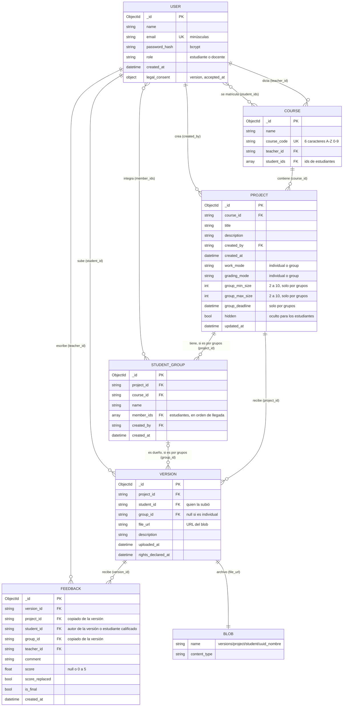
```mermaid
erDiagram
    USER ||--o{ COURSE : "dicta (teacher_id)"
    USER }o--o{ COURSE : "se matricula (student_ids)"
    COURSE ||--o{ PROJECT : "contiene (course_id)"
    USER ||--o{ PROJECT : "crea (created_by)"
    PROJECT ||--o{ STUDENT_GROUP : "tiene, si es por grupos (project_id)"
    USER }o--o{ STUDENT_GROUP : "integra (member_ids)"
    PROJECT ||--o{ VERSION : "recibe (project_id)"
    STUDENT_GROUP |o--o{ VERSION : "es dueño, si es por grupos (group_id)"
    USER ||--o{ VERSION : "sube (student_id)"
    VERSION ||--o{ FEEDBACK : "recibe (version_id)"
    USER ||--o{ FEEDBACK : "escribe (teacher_id)"
    VERSION ||--|| BLOB : "archivo (file_url)"

    USER {
        ObjectId _id PK
        string name
        string email UK "minúsculas"
        string password_hash "bcrypt"
        string role "estudiante o docente"
        datetime created_at
        object legal_consent "version, accepted_at"
    }
    COURSE {
        ObjectId _id PK
        string name
        string course_code UK "6 caracteres A-Z 0-9"
        string teacher_id FK
        array student_ids FK "ids de estudiantes"
    }
    PROJECT {
        ObjectId _id PK
        string course_id FK
        string title
        string description
        string created_by FK
        datetime created_at
        string work_mode "individual o group"
        string grading_mode "individual o group"
        int group_min_size "2 a 10, solo por grupos"
        int group_max_size "2 a 10, solo por grupos"
        datetime group_deadline "solo por grupos"
        bool hidden "oculto para los estudiantes"
        datetime updated_at
    }
    STUDENT_GROUP {
        ObjectId _id PK
        string project_id FK
        string course_id FK
        string name
        array member_ids FK "estudiantes, en orden de llegada"
        string created_by FK
        datetime created_at
    }
    VERSION {
        ObjectId _id PK
        string project_id FK
        string student_id FK "quien la subió"
        string group_id FK "null si es individual"
        string file_url "URL del blob"
        string description
        datetime uploaded_at
        datetime rights_declared_at
    }
    FEEDBACK {
        ObjectId _id PK
        string version_id FK
        string project_id FK "copiado de la versión"
        string student_id FK "autor de la versión o estudiante calificado"
        string group_id FK "copiado de la versión"
        string teacher_id FK
        string comment
        float score "null o 0 a 5"
        bool score_replaced
        bool is_final
        datetime created_at
    }
    BLOB {
        string name "versions/project/student/uuid_nombre"
        string content_type
    }
```

`USER` aparece varias veces con significados distintos según su rol. Los `teacher_id` y
`created_by` de proyectos y cursos siempre apuntan a un docente; los `student_id`, `student_ids` y
`member_ids`, a estudiantes. Las referencias son **strings** con el `ObjectId` del documento
referido. MongoDB no tiene llaves foráneas: la integridad la mantiene la aplicación
([4.4](#44-integridad-referencial)).

### 4.2 Cardinalidades

| Relación | Cardinalidad | Lectura | Cómo se implementa | Quién la garantiza |
|---|---|---|---|---|
| Docente → Curso | **1 : 0..N** | Un docente dicta cero o más cursos. Un curso tiene **exactamente un** docente | `courses.teacher_id` | Projects lo asigna al crear el curso y nunca lo cambia. No hay co-docentes |
| Estudiante ↔ Curso | **N : M** (0..N : 0..N) | Un estudiante puede estar en varios cursos, y un curso tener varios estudiantes | Arreglo `courses.student_ids` dentro del curso, sin colección intermedia | `$addToSet` en la matrícula, que impide duplicados |
| Curso → Proyecto | **1 : 0..N** | Un curso tiene cero o más proyectos. Un proyecto pertenece a **exactamente un** curso | `projects.course_id` | Projects, al crear el proyecto en un curso del docente titular |
| Docente → Proyecto (autoría) | **1 : 0..N** | Quién creó el proyecto | `projects.created_by` | Redundante con el titular del curso; se guarda por trazabilidad |
| Proyecto (por grupos) → Grupo | **1 : 0..N** | Un proyecto por grupos tiene cero o más grupos. Un grupo pertenece a **exactamente un** proyecto. Un proyecto individual no tiene grupos | `groups.project_id` | Projects: solo se crean grupos en proyectos con `work_mode = "group"` |
| Estudiante ↔ Grupo, **dentro de un proyecto** | **0..1 : min..max** | Un estudiante está en **a lo sumo un** grupo por proyecto. Un grupo tiene entre 1 y `group_max_size` integrantes. `group_min_size` es una meta que se advierte, no se bloquea | Arreglo `groups.member_ids` | El índice único multikey `(project_id, member_ids)` garantiza el "a lo sumo uno". El máximo lo garantiza un `$push` condicional y atómico |
| Estudiante ↔ Grupo, **en todo el sistema** | **N : M** | Un estudiante puede estar en grupos de distintos proyectos | El mismo arreglo | — |
| Grupo → Integrante matriculado | Restricción | Solo estudiantes matriculados en el curso pueden crear un grupo o unirse | Verificación H-6 al crear o unirse | Projects |
| Proyecto → Versión | **1 : 0..N** | Un proyecto recibe cero o más versiones. Una versión pertenece a **exactamente un** proyecto | `versions.project_id` | Projects |
| Estudiante → Versión (autoría) | **1 : 0..N** | Un estudiante sube cero o más versiones. Una versión tiene **exactamente un** autor | `versions.student_id` | Projects, que lo toma del JWT y no del cuerpo de la petición |
| Grupo → Versión | **1 : 0..N** | Las versiones de un proyecto por grupos son del grupo de quien las sube. En proyectos individuales, `group_id` es `null` | `versions.group_id` | Projects: la versión toma el grupo del estudiante al subirla |
| Hilo → Versión | **1 : 0..N** | El hilo es (estudiante, proyecto) en proyectos individuales o (grupo) en proyectos por grupos. Sus versiones se numeran v1, v2… | Índices `(project_id, student_id, uploaded_at)` y `(project_id, group_id, uploaded_at)` | La numeración se deriva al leer (frontend y Export). No se guarda |
| Versión → Archivo (Blob) | **1 : 1** | Cada versión tiene un archivo y cada archivo pertenece a una versión | `versions.file_url` | Nombre de blob único (uuid) y `overwrite=False` |
| Versión → Retroalimentación | **1 : 0..N** | Una versión acumula cero o más comentarios. Cada uno es sobre **exactamente una** versión | `feedback.version_id` | Feedback |
| Docente → Retroalimentación | **1 : 0..N** | Quién escribió cada comentario | `feedback.teacher_id` | Feedback, que lo toma del JWT |
| Versión → Calificación parcial **vigente** | **1 : 0..1** | Una versión tiene a lo sumo una nota parcial vigente | Índice único parcial `unique_current_partial_grade` | MongoDB, con el índice |
| Versión → Calificación parcial **reemplazada** | **1 : 0..N** | Las notas anteriores se conservan como historial | `score_replaced = true` | Feedback |
| (Estudiante, Proyecto) → Calificación final | **1 : 0..1** | Un estudiante tiene a lo sumo una calificación final por proyecto, en todos los modos | Índice único parcial `unique_final_grade_per_student` | MongoDB, con el índice |
| Grupo → Calificación final (modo `group`) | **1 : 0..1** como acto, **1 : N** como registros | El docente califica al grupo una vez; se crea un registro por integrante, con el mismo `group_id`, nota y comentario | `insert_many` ordenado | El mismo índice por estudiante: si alguno ya la tenía, no se inserta ninguno |
| Calificación final → Versión evaluada | **N : 1** | La calificación final se asigna sobre una versión del hilo | `feedback.version_id` con `is_final = true` | Feedback valida que la versión sea del proyecto y, por grupos, que el estudiante sea del grupo |
| Usuario → Consentimiento legal | **1 : 1** (embebido) | Prueba de la autorización de tratamiento de datos | Subdocumento `users.legal_consent` | Auth, al registrar |
| Usuario → Rol | **N : 1** | Cada usuario tiene exactamente un rol, inmutable | `users.role` (enum) | Auth. No hay endpoint para cambiarlo |

**Restricciones de pertenencia que acompañan las cardinalidades.** No las garantiza la base de
datos, sino la autorización:
- Una **versión** solo la puede crear un estudiante **matriculado** en el curso del proyecto. En
  proyectos por grupos, además debe **tener grupo**.
- Una **retroalimentación** solo la puede crear el **docente titular** del curso de la versión. Por
  lo tanto, `feedback.teacher_id` siempre es igual a `courses.teacher_id` de ese curso.
- En una calificación final por integrante (`grading_mode = "individual"` en un proyecto por
  grupos), el estudiante calificado debe ser **integrante del grupo de la versión**, aunque no la
  haya subido.

### 4.3 Colecciones en detalle

#### `users` (Auth Service)

| Campo | Tipo | Restricciones | Notas |
|---|---|---|---|
| `_id` | ObjectId | PK | Se expone como string en la API y como `sub` en el JWT |
| `name` | string | 2 a 100 caracteres | Nombre que se muestra |
| `email` | string | Correo válido, **único** y en minúsculas | `Ana@UDI.edu.co` y `ana@udi.edu.co` son la misma cuenta |
| `password_hash` | string | bcrypt con sal aleatoria | La contraseña llega con 8 a 72 caracteres y como máximo 72 bytes |
| `role` | string | `estudiante` o `docente` | Inmutable |
| `created_at` | datetime (UTC) | | |
| `legal_consent.version` | string | 1 a 20 caracteres | Versión de los documentos legales aceptados (`LEGAL_VERSION` del frontend) |
| `legal_consent.accepted_at` | datetime (UTC) | | Momento de la autorización (Decreto 1377 de 2013, art. 8) |

**Índices:** `email` único.

#### `courses` (Projects Service)

| Campo | Tipo | Restricciones | Notas |
|---|---|---|---|
| `_id` | ObjectId | PK | |
| `name` | string | 1 a 100 caracteres, sin espacios a los lados | |
| `course_code` | string | **Único**, 6 caracteres de `A-Z0-9` | Lo genera el sistema con `secrets.choice` (36⁶ ≈ 2.176 millones de combinaciones) |
| `teacher_id` | string | id de un docente | El titular |
| `student_ids` | string[] | Sin duplicados | Matriculados, en orden de llegada |

**Índices:** `course_code` único.

#### `projects` (Projects Service)

| Campo | Tipo | Restricciones | Notas |
|---|---|---|---|
| `_id` | ObjectId | PK | |
| `course_id` | string | Curso existente | |
| `title` | string | 1 a 150 caracteres | |
| `description` | string | 0 a 5000 caracteres | El enunciado del proyecto |
| `created_by` | string | id del docente titular | |
| `created_at` | datetime (UTC, en ms) | | Orden de listado |
| `work_mode` | string | `individual` (por defecto) o `group` | Fijo desde la creación |
| `grading_mode` | string | `individual` (por defecto) o `group` | Solo tiene efecto en proyectos por grupos; en individuales siempre es `individual`. Fijo desde la creación |
| `group_min_size` | int o null | 2 a 10, ≤ máximo | `null` en individuales |
| `group_max_size` | int o null | 2 a 10 | `null` en individuales |
| `group_deadline` | datetime (UTC, en ms) o null | Futura al crear el proyecto | `null` en individuales. El docente la puede cambiar después |
| `hidden` | bool | Por defecto `false` | `true`: oculto para los estudiantes (borrador o retirado). Se puede crear oculto |
| `updated_at` | datetime (UTC, en ms) o null | | Última edición (`PATCH`). `null` si nunca se editó |

Si el proyecto es individual, el servidor **descarta** cualquier configuración de grupos que llegue.
Los proyectos creados antes de que existieran los grupos o la visibilidad no tienen estos campos y se
leen como individuales y visibles (valores por defecto en `ProjectInDB` y en las vistas de Feedback;
las consultas usan `hidden: {$ne: true}`).

**Índices:** `course_id` (no único).

#### `groups` (Projects Service)

| Campo | Tipo | Restricciones | Notas |
|---|---|---|---|
| `_id` | ObjectId | PK | |
| `project_id` | string | Proyecto por grupos | |
| `course_id` | string | Curso del proyecto | Desnormalizado, por trazabilidad |
| `name` | string | 1 a 60 caracteres | Lo elige quien crea el grupo. Si no, "Grupo N", con N = grupos existentes + 1 |
| `member_ids` | string[] | Entre 1 y `group_max_size`. Sin duplicados | Integrantes en orden de llegada. Un grupo que queda vacío se elimina |
| `created_by` | string | Estudiante | Primer integrante |
| `created_at` | datetime (UTC, en ms) | | Orden de listado |

**Índices:** `unique_group_member_per_project` sobre `(project_id, member_ids)`, **único y
multikey**. Cada par (proyecto, integrante) solo puede aparecer en un documento.

#### `versions` (Projects Service)

| Campo | Tipo | Restricciones | Notas |
|---|---|---|---|
| `_id` | ObjectId | PK | |
| `project_id` | string | | |
| `student_id` | string | Tomado del JWT | Quien subió la versión. El cliente no puede elegirlo |
| `group_id` | string o null | Grupo del estudiante al subir | `null` en proyectos individuales |
| `file_url` | string | URL completa del blob | Formato del nombre: `versions/{project_id}/{student_id}/{uuid32}_{nombre}` |
| `description` | string | 1 a 2000 caracteres | Qué cambió en esta versión |
| `uploaded_at` | datetime (UTC, en ms) | | Orden cronológico del hilo |
| `rights_declared_at` | datetime (UTC) | Siempre presente | Evidencia de la declaración de autoría y permisos. No se expone en la API |

**Índices:**
- `(project_id, student_id, uploaded_at)`: el historial completo de un proyecto y el hilo de un
  estudiante.
- `(project_id, group_id, uploaded_at)`: el hilo de un grupo.

#### `feedback` (Feedback Service)

| Campo | Tipo | Restricciones | Notas |
|---|---|---|---|
| `_id` | ObjectId | PK | |
| `version_id` | string | Versión existente | |
| `project_id` | string | Copiado de la versión | Desnormalizado. Las versiones son inmutables, así que la copia nunca se desincroniza |
| `student_id` | string | | En retroalimentación parcial: el autor de la versión, copiado. En calificación final: **el estudiante calificado** |
| `group_id` | string o null | Copiado de la versión | Permite que todos los integrantes vean la retroalimentación y agrupar la calificación grupal |
| `teacher_id` | string | Tomado del JWT | |
| `comment` | string | 1 a 5000 caracteres, sin espacios a los lados | |
| `score` | float o null | 0.0 a 5.0 | `null` es un comentario sin nota. El frontend permite pasos de 0.1 |
| `score_replaced` | bool | | `true` si una nota posterior de la misma versión la reemplazó |
| `is_final` | bool | | `true` solo en la calificación final |
| `created_at` | datetime (UTC) | | Orden cronológico. `_id` desempata |

Un registro de `feedback` puede ser de cuatro tipos:

| Tipo | `is_final` | `score` | `score_replaced` |
|---|---|---|---|
| Comentario sin nota | `false` | `null` | `false` |
| Calificación parcial vigente | `false` | número | `false` |
| Calificación parcial reemplazada | `false` | número | `true` |
| Calificación final | `true` | número (obligatorio) | `false` |

**Índices:**

| Nombre / campos | Tipo | Para qué |
|---|---|---|
| `version_id` | Normal | Hilo de una versión |
| `(project_id, student_id, created_at)` | Compuesto | Historial por proyecto y filtro del estudiante |
| `group_id` | Normal | Retroalimentación del grupo y verificación "el grupo ya fue calificado" |
| `unique_final_grade_per_student` sobre `(project_id, student_id)` con filtro `is_final: true` | **Único parcial** | Una calificación final por estudiante y proyecto |
| `unique_current_partial_grade` sobre `version_id` con filtro `is_final: false, score_replaced: false, score: {$type: "number"}` | **Único parcial** | Una calificación parcial vigente por versión |

Al arrancar, Feedback ejecuta una migración idempotente (`_migrate_partial_grades`). Si hay datos
anteriores a la regla de una nota vigente por versión, deja vigente solo la más reciente y marca las
demás como reemplazadas. Así se puede crear el índice único sin errores.

#### Blob Storage, contenedor `versions`

- Es **privado**: no admite acceso anónimo.
- El nombre del blob incluye un `uuid4` en hexadecimal, así que dos archivos con el mismo nombre
  nunca chocan.
- El nombre original se depura con `_safe_filename`: se queda solo con el nombre base, de modo que
  `../../x.png` se guarda como `x.png`.
- Se sube con `overwrite=False` y con el `Content-Type` validado.
- Si el contenedor no existe, Projects lo crea en la primera subida del proceso.

### 4.4 Integridad referencial

MongoDB no tiene llaves foráneas. La integridad se mantiene así:

1. **Por construcción.** Las referencias se toman de documentos ya validados: el `student_id` y el
   `teacher_id` vienen del JWT; el `project_id`, el `course_id` y el `group_id`, del documento que
   se acaba de leer y autorizar.
2. **Por inmutabilidad.** No existe ningún endpoint que borre o modifique usuarios, cursos,
   versiones ni retroalimentación. Un proyecto se puede editar (sin tocar las referencias) y solo
   se puede **eliminar si no tiene versiones**, así que nunca deja versiones ni retroalimentación
   huérfanas. Sin borrados de evidencia no hay referencias colgantes, y sin ediciones de versiones
   no se desincronizan las copias desnormalizadas.
3. **Por diseño defensivo en las lecturas.** Un id con formato inválido se trata igual que uno
   inexistente (404). Si un nombre no se puede resolver, se muestra *"Nombre no disponible"*. Si un
   blob falta al exportar, el PDF dice *"Archivo no disponible"*.

**Escrituras sobre registros existentes.** Son las únicas, y ninguna rompe referencias:
- `feedback.score_replaced` pasa de `false` a `true` cuando llega una nota nueva para la misma
  versión.
- `courses.student_ids` crece con cada matrícula.
- `projects.group_deadline` cambia cuando el docente amplía o cierra el plazo.
- Los demás campos de `projects` cambian con la edición (`PATCH`). La modalidad, el tamaño de los
  grupos y el modo de calificación solo mientras no haya grupos ni versiones; así ningún grupo
  queda por encima del nuevo máximo ni una calificación hecha con otras reglas.
- `groups.member_ids` cambia al unirse o salir. Salir solo se permite si el grupo **no tiene
  versiones**, y un grupo solo se elimina cuando queda sin integrantes. Así, ninguna
  `versions.group_id` ni `feedback.group_id` puede apuntar a un grupo borrado.
- **Eliminaciones del sistema:** un grupo vacío, y un proyecto **sin versiones** junto con sus
  grupos. Nada más se borra.
- Un grupo con calificación final **no admite nuevos integrantes**. Así, la calificación grupal
  cubre siempre a todos los integrantes.

### 4.5 Ejemplo de documentos relacionados

```jsonc
// users
{ "_id": ObjectId("66a…01"), "name": "Laura Méndez", "email": "docente.demo@udi.edu.co",
  "password_hash": "$2b$12$…", "role": "docente", "created_at": ISODate("2026-10-08T14:00:00Z"),
  "legal_consent": { "version": "2026-10-08", "accepted_at": ISODate("2026-10-08T14:00:00Z") } }

// courses
{ "_id": ObjectId("66b…10"), "name": "Diseño Editorial", "course_code": "K7Q2ZP",
  "teacher_id": "66a…01", "student_ids": ["66a…02", "66a…03", "66a…04"] }

// projects: uno por grupos, con calificación grupal
{ "_id": ObjectId("66c…20"), "course_id": "66b…10", "title": "Campaña cultural",
  "description": "Cartel y piezas para redes…", "created_by": "66a…01",
  "created_at": ISODate("2026-10-08T14:05:00.123Z"), "work_mode": "group", "grading_mode": "group",
  "group_min_size": 2, "group_max_size": 3, "group_deadline": ISODate("2026-10-18T04:59:00Z") }

// groups
{ "_id": ObjectId("66f…50"), "project_id": "66c…20", "course_id": "66b…10", "name": "Los Bauhaus",
  "member_ids": ["66a…02", "66a…03"], "created_by": "66a…02", "created_at": ISODate("…") }

// versions: del grupo, subida por 66a…03
{ "_id": ObjectId("66d…30"), "project_id": "66c…20", "student_id": "66a…03", "group_id": "66f…50",
  "file_url": "https://<cuenta>.blob.core.windows.net/versions/versions/66c…20/66a…03/3f9c…e1_cartel.png",
  "description": "Primera propuesta", "uploaded_at": ISODate("2026-10-09T15:00:00.000Z"),
  "rights_declared_at": ISODate("2026-10-09T15:00:00.000Z") }

// feedback: un comentario con nota y la calificación grupal (un registro por integrante)
{ "_id": ObjectId("66e…40"), "version_id": "66d…30", "project_id": "66c…20", "student_id": "66a…03",
  "group_id": "66f…50", "teacher_id": "66a…01", "comment": "Falta contraste", "score": 3.0,
  "score_replaced": false, "is_final": false, "created_at": ISODate("…") }
{ "_id": ObjectId("66e…41"), "version_id": "66d…30", "student_id": "66a…02", "group_id": "66f…50",
  …, "comment": "Buen cierre", "score": 4.4, "is_final": true }
{ "_id": ObjectId("66e…42"), "version_id": "66d…30", "student_id": "66a…03", "group_id": "66f…50",
  …, "comment": "Buen cierre", "score": 4.4, "is_final": true }
```

---

## 5. Seguridad

### 5.1 Autenticación: JWT

**Emisión.** Solo Auth Service emite tokens, en `POST /auth/login`. El token se firma con
**HS256** y la clave `JWT_SECRET_KEY`, que es la misma en los cuatro servicios. Lleva exactamente
estos claims:

| Claim | Valor |
|---|---|
| `sub` | id del usuario (ObjectId como string) |
| `role` | `"estudiante"` o `"docente"` |
| `exp` | Emisión + `JWT_EXPIRE_MINUTES` (60 por defecto, RNF-01) |

**Verificación.** Cada servicio la hace en `core/security.py`, con código idéntico en los cuatro:
1. Extrae el token del header `Authorization: Bearer <token>`.
2. Verifica la firma y el algoritmo, y exige `exp`.
3. Valida que `role` sea uno de los dos valores permitidos.
4. Devuelve `CurrentUser(id, role)`.

Cualquier falla responde `401 {"detail": "Token inválido o expirado"}` con
`WWW-Authenticate: Bearer`.

**El token no se consulta contra la base.** El rol del token es la fuente de verdad mientras el token
sea válido. Como el rol es inmutable, no hay riesgo de privilegios desactualizados. Tampoco existe la
revocación de tokens: un token vale hasta que expira.

**Contraseñas:**
- Se guardan con hash **bcrypt** y sal aleatoria.
- El hash y la verificación corren en un hilo (`asyncio.to_thread`) para no bloquear el event loop.
- El límite de bcrypt es de 72 **bytes**, no caracteres. El registro rechaza contraseñas más largas
  en bytes, que con tildes o `ñ` pueden tener menos de 72 caracteres.
- El login responde el mismo mensaje (*"Credenciales inválidas"*) tanto si el correo no existe como
  si la contraseña falla. Así no se pueden descubrir qué correos tienen cuenta.

### 5.2 Autorización: rol + pertenencia (H-6)

La autorización tiene **dos capas**, y ambas se verifican en el backend:

1. **Rol** (desde el token): por ejemplo, solo un docente crea cursos y solo un estudiante sube
   versiones o forma grupos. Si el rol no corresponde, la respuesta es `403`.
2. **Pertenencia** (desde la base de datos, regla H-6): el usuario debe pertenecer al curso del
   recurso.
   - **Docente:** debe ser el titular (`courses.teacher_id == sub`).
   - **Estudiante:** debe estar matriculado (`sub ∈ courses.student_ids`). Sobre versiones,
     retroalimentación y portafolios, solo accede **a lo suyo**. En proyectos por grupos, "lo suyo"
     incluye **lo de su grupo**, salvo las calificaciones finales de sus compañeros.

Cada servicio verifica la pertenencia contra sus propias lecturas:

| Servicio | Dónde | Recorrido |
|---|---|---|
| Projects | `app/api/access.py`, `_student_can_see` en `versions.py` | proyecto → curso; versión → autor o grupo |
| Feedback | `app/api/deps.py` | versión → proyecto → curso; versión → grupo → integrantes |
| Export | `_resolve_student_id` en `export.py`, `_select` en `portfolio.py` | proyecto → curso → matrícula del estudiante |

**Orden de las respuestas:** primero 404 (el recurso no existe), después 403 (existe pero no hay
acceso). Hay una excepción deliberada en Projects. Si un **estudiante** pide una versión que no es
suya ni de su grupo, recibe **403 tanto si existe como si no**, para que no pueda sondear qué
versiones tienen sus compañeros.

**Proyectos ocultos:** para el estudiante, un proyecto con `hidden = true` **no existe**. No aparece
en el listado ni cuenta en su progreso, y todo lo que dependa de él responde 404: versiones,
archivos, grupos, retroalimentación, calificaciones finales y los dos tipos de PDF. Lo aplican los
cuatro servicios con el mismo criterio (`get_member_project` en Projects, `verify_*` en Feedback,
`export.py` y `portfolio.py` en Export). El docente titular lo sigue viendo y gestionando.

**Filtros que el cliente no puede saltarse:**
- **Listar versiones:** si quien pide es un estudiante, el backend fuerza `student_id = sub`
  (individual) o `group_id = su grupo` (por grupos), e ignora los filtros que envíe el cliente.
- **Retroalimentación:** el estudiante recibe la de sus versiones y los comentarios de las de su
  grupo, pero **nunca la calificación final de otro estudiante**, aunque esté sobre una versión
  compartida (filtro `$or: [{is_final: false}, {student_id: sub}]`).
- **Exportar un proyecto:** el `student_id` del estudiante se ignora y se usa el suyo.
- **Portafolio académico:** cada proyecto pedido debe ser de un curso en el que el estudiante esté
  matriculado. Si uno no lo es, se rechaza toda la petición.

### 5.3 Matriz de permisos

| Operación | Endpoint | Estudiante | Docente | Condición de pertenencia |
|---|---|---|---|---|
| Registrarse | `POST /auth/register` | ✔ | ✔ | Pública |
| Iniciar sesión | `POST /auth/login` | ✔ | ✔ | Pública |
| Ver su perfil | `GET /auth/me` | ✔ | ✔ | El propio |
| Resolver nombres | `GET /users/batch` | ✔ | ✔ | Cualquier sesión válida. Solo expone `id`, `name` y `role` |
| Crear curso | `POST /courses` | ✘ | ✔ | Queda como titular |
| Listar cursos | `GET /courses` | ✔ (matriculados) | ✔ (propios) | El filtro depende del rol |
| Unirse a curso | `POST /courses/join` | ✔ | ✘ | Código válido |
| Crear proyecto | `POST /courses/{id}/projects` | ✘ | ✔ | Titular del curso |
| Listar proyectos | `GET /courses/{id}/projects` | ✔ (solo visibles) | ✔ (todos) | Miembro del curso |
| Editar, ocultar o mostrar un proyecto | `PATCH /projects/{id}` | ✘ | ✔ | Titular del curso |
| Eliminar un proyecto | `DELETE /projects/{id}` | ✘ | ✔ | Titular del curso, y el proyecto sin versiones |
| Ver progreso | `GET /courses/{id}/progress` | ✔ (el suyo) | ✔ (el de todo el curso) | Miembro del curso |
| Ver grupos | `GET /projects/{id}/groups` | ✔ | ✔ | Miembro del curso |
| Crear grupo, unirse, salir | `POST /projects/{id}/groups[/{gid}/join\|leave]` | ✔ | ✘ | Matriculado y dentro del plazo |
| Cambiar el plazo de grupos | `POST /projects/{id}/group-deadline` | ✘ | ✔ | Titular del curso |
| Subir versión | `POST /projects/{id}/versions` | ✔ | ✘ | Matriculado, con grupo si el proyecto es por grupos, y sin calificación final propia |
| Listar versiones | `GET /projects/{id}/versions` | ✔ (las suyas o las de su grupo) | ✔ (todas, o filtradas por estudiante o grupo) | Miembro del curso |
| Ver versión y archivo | `GET /projects/{id}/versions/{vid}[/file]` | ✔ (suyas o de su grupo) | ✔ | Miembro del curso |
| Comentar o calificar parcialmente | `POST /versions/{id}/feedback` | ✘ | ✔ | Titular del curso de la versión |
| Ver retroalimentación de una versión | `GET /versions/{id}/feedback` | ✔ (de sus versiones o las de su grupo) | ✔ | Titular, autor o integrante del grupo |
| Ver retroalimentación del proyecto | `GET /projects/{id}/feedback` | ✔ (la suya y la de su grupo) | ✔ (toda) | Miembro del curso |
| Asignar calificación final | `POST /projects/{id}/final-grade` | ✘ | ✔ | Titular, con una versión del proyecto |
| Ver calificaciones finales | `GET /projects/{id}/final-grade` | ✔ (la suya) | ✔ (todas) | Miembro del curso |
| Exportar portafolio de un proyecto | `GET /projects/{id}/export` | ✔ (el suyo) | ✔ (con `student_id`) | Titular, o matriculado. El estudiante exportado debe estar matriculado |
| Exportar portafolio académico | `POST /portfolio/export` | ✔ (solo lo suyo) | ✘ | Matriculado en el curso de cada proyecto pedido |

En el frontend, `RoleRoute` y la visibilidad de botones son **solo UX**: el backend vuelve a validar
todo.

### 5.4 Protección de los archivos

Una versión pasa por varias validaciones antes de guardarse (`validate_file`, RNF-05):

1. **Tipo declarado** en la lista permitida: `image/jpeg`, `image/png`, `application/pdf` o
   `image/svg+xml`.
2. **Tamaño:** mayor que 0 y como máximo `MAX_FILE_SIZE_MB` (20 MB).
3. **Firma del contenido** (los primeros 1024 bytes), que debe coincidir con el tipo declarado:

   | Tipo | Firma esperada |
   |---|---|
   | PNG | `\x89PNG\r\n\x1a\n` |
   | JPEG | `\xff\xd8\xff` |
   | PDF | `%PDF-` |
   | SVG | Contiene `<svg` |

   Esto impide, por ejemplo, subir un SVG con scripts declarado como PDF.

**Al servir el archivo** (`GET …/file`), Projects envía estas cabeceras:

| Cabecera | Para qué |
|---|---|
| `Content-Security-Policy: default-src 'none'; style-src 'unsafe-inline'; sandbox` | Un SVG abierto directamente no puede ejecutar scripts |
| `X-Content-Type-Options: nosniff` | El navegador respeta el tipo declarado |
| `Cache-Control: private, max-age=86400, immutable` | La versión nunca cambia, pero solo se cachea en el navegador del usuario |

**En el frontend**, el archivo se descarga con el JWT y se muestra mediante una URL `blob:`, que
hereda el origen de la app. Por eso hay tres precauciones:
- El tipo se decide por el `Content-Type` real del archivo, no por la extensión.
- Las imágenes, incluido SVG, solo se muestran en ``, donde los scripts no corren.
- El `<iframe>` solo recibe PDF de verdad. La descarga manual se hace como `octet-stream`.

### 5.5 Seguridad del frontend y del transporte

**CSP del Nginx del frontend:**
- `script-src 'self'`.
- `connect-src` limitado al propio origen y a la URL del gateway.
- `img-src 'self' blob: data:` y `frame-src blob:`.
- `object-src 'none'` y `frame-ancestors 'none'`: la app no se puede incrustar en otra página.

**Otras cabeceras:** `X-Content-Type-Options: nosniff` y
`Referrer-Policy: strict-origin-when-cross-origin`.

**Token:** se guarda en `localStorage` (clave `auth_token`). Es un compromiso aceptado en la
especificación: es legible desde JS, y por eso la CSP estricta es la mitigación principal contra
XSS. El trabajo futuro es pasarlo a una cookie `httpOnly` con `SameSite=Strict`.

**CORS:** se configura en **un solo lugar**, porque si se duplica, el navegador rechaza la respuesta:
- En local lo resuelve cada servicio con `CORS_ALLOWED_ORIGINS`.
- En Azure lo resuelve APIM, y los servicios corren con `CORS_ALLOWED_ORIGINS=[]`.

En ambos casos se expone `Content-Disposition`, que el frontend necesita para el nombre del PDF.

**PDF exportados** (los dos tipos): se entregan con `Cache-Control: no-store`, porque contienen
datos personales y calificaciones.

### 5.6 Protección de datos personales y derechos de autor

| Mecanismo | Base normativa | Implementación |
|---|---|---|
| **Autorización expresa** antes de crear la cuenta | Ley 1581 de 2012, art. 9 | La casilla nunca viene marcada (frontend). `accept_legal` debe ser `true` (Auth responde 422 si no) |
| **Prueba de la autorización** | Decreto 1377 de 2013, art. 8 | Se guarda `users.legal_consent = {version, accepted_at}` |
| **Minimización de datos** | Ley 1581 de 2012, principio de finalidad. RNF-06 | Ningún servicio fuera de Auth lee `users`. `/users/batch` excluye correo y hash por proyección en la propia consulta |
| **Privacidad entre compañeros de grupo** | Principio de finalidad | Los integrantes comparten versiones y comentarios, pero no ven la calificación final individual de los demás |
| **Declaración de autoría y permisos** al subir | Ley 23 de 1982 | Sin `rights_declaration=true`, la subida responde 422. Se guarda `versions.rights_declared_at` |
| **Aviso de derechos** en los PDF | Ley 23 de 1982 | La portada indica que las obras son del estudiante. Los metadatos del PDF ponen como autor al estudiante |
| **Responsable del tratamiento** | Ley 1581 de 2012, art. 3 | Los datos de la UDI y la versión de los documentos están en `frontend/src/features/legal/legalConfig.ts` |
| Documentos legales públicos | — | `/legal/privacidad`, `/legal/terminos` y `/legal/derechos-de-autor`, accesibles sin sesión |

Si cambian la finalidad del tratamiento o el responsable, se debe subir `LEGAL_VERSION`. Los usuarios
nuevos quedan registrados con la nueva versión.

---

## 6. Reglas de negocio

Cada regla indica dónde se aplica. "Índice" significa que la garantiza MongoDB aunque haya
peticiones simultáneas.

### Usuarios
- **RN-01.** El correo es único y no distingue mayúsculas: se normaliza a minúsculas al registrar y
  al hacer login. *(Auth, índice `email` único → 409)*
- **RN-02.** La contraseña tiene entre 8 y 72 caracteres y como máximo 72 bytes. *(Auth → 422)*
- **RN-03.** El rol se fija al registrarse y no cambia. *(Auth: no existe endpoint para cambiarlo)*
- **RN-04.** No hay cuenta sin autorización de tratamiento de datos. *(Auth → 422)*
- **RN-05.** Registrarse no inicia sesión. El frontend hace login automáticamente con las mismas
  credenciales.

### Cursos y matrícula
- **RN-06.** Solo un docente crea cursos y queda como su titular único.
- **RN-07.** El código del curso lo genera el sistema: 6 caracteres de `A-Z0-9`. Si hay colisión, se
  reintenta hasta 5 veces; si las 5 fallan, responde 409. *(Índice `course_code` único)*
- **RN-08.** El estudiante se une con el código. El código se normaliza a mayúsculas y sin espacios,
  así que `k7q2zp ` funciona igual que `K7Q2ZP`.
- **RN-09.** Unirse es **idempotente**: si el estudiante ya estaba matriculado, responde 200 con el
  mismo curso. *(`$addToSet`, sin duplicados aunque las peticiones sean simultáneas)*
- **RN-10.** Un código inexistente responde `404 "Código de curso no válido"`.
- **RN-11.** El docente ve sus cursos; el estudiante, aquellos en los que está matriculado. Ambos se
  ordenan por nombre.

### Proyectos
- **RN-12.** Solo el docente titular crea proyectos en su curso.
- **RN-13.** Los proyectos se listan en orden de creación (`created_at`, y `_id` para desempatar).
- **RN-14.** Un proyecto es **individual** (por defecto) o **por grupos**. La modalidad, el tamaño
  de los grupos y el modo de calificación se fijan al crearlo y solo se pueden cambiar mientras el
  proyecto no tenga grupos ni versiones (RN-56).
- **RN-15.** Un proyecto por grupos exige un mínimo y un máximo de integrantes (2 a 10, mínimo ≤
  máximo) y una fecha límite futura para formar grupos. *(Projects → 422 con un mensaje por cada
  caso)*
- **RN-16.** El modo de calificación de un proyecto por grupos es `individual` (una nota por
  integrante) o `group` (una nota para todo el grupo). Son **mutuamente excluyentes**. En un
  proyecto individual, el modo siempre es `individual`.
- **RN-17.** **Advertencia de formación.** Al crear un proyecto por grupos, el frontend calcula si
  los `n` estudiantes inscritos se pueden repartir en grupos de `min` a `max` sin que nadie quede
  por fuera. Es posible si existe un número de grupos `k` con `k·min ≤ n ≤ k·max`, es decir, si
  `⌈n/max⌉ ≤ ⌊n/min⌋`.
  - Si no se puede, o no hay inscritos, o `n < min`, muestra una **advertencia**.
  - La advertencia no bloquea la creación, porque los estudiantes pueden seguir matriculándose.
  - Si se puede, informa cuántos grupos se pueden formar.

### Edición, visibilidad y eliminación de proyectos
- **RN-56.** **Editar** (`PATCH`, solo el docente titular, edición parcial):
  - El título, la descripción, la visibilidad y la fecha límite de grupos se pueden cambiar
    **siempre**.
  - La modalidad, el tamaño de los grupos y el modo de calificación, **solo mientras el proyecto no
    tenga grupos ni versiones**
    (`409 "La modalidad, el tamaño de los grupos y la calificación ya no se pueden cambiar…"`).
  - Enviar los mismos valores de estructura no cuenta como cambio: el frontend puede enviar el
    formulario completo.
- **RN-57.** La edición valida el estado resultante con las mismas reglas que la creación. Al pasar
  de individual a grupos, la fecha límite debe ser futura. En un proyecto que ya era por grupos se
  acepta una fecha pasada, que cierra la formación de grupos. Volver a individual descarta la
  configuración de grupos.
- **RN-58.** **Ocultar y mostrar.** `hidden = true` saca el proyecto de la vista de los estudiantes
  en todo el sistema (404); el docente lo sigue viendo, marcado como oculto. Mostrarlo de nuevo
  devuelve todo intacto. Un proyecto se puede **crear oculto**, como borrador.
- **RN-59.** **Eliminar** (`DELETE`, solo el docente titular): solo un proyecto **sin versiones**.
  Se eliminan el proyecto y los grupos que se hubieran formado. Con versiones responde
  `409 "El proyecto tiene versiones: ocúltalo en lugar de eliminarlo"`, y la interfaz ofrece
  ocultarlo.

### Grupos
- **RN-18.** Los grupos los forman los **estudiantes matriculados**: crean un grupo (y quedan como
  primer integrante), se unen a uno con cupo o salen del suyo. El docente no asigna integrantes.
- **RN-19.** Todo cambio de grupo (crear, unirse o salir) solo se permite **hasta la fecha límite**
  (`now ≤ group_deadline`). Después responde `403 "El plazo para formar grupos terminó"`.
- **RN-20.** El docente titular puede **cambiar la fecha límite** en cualquier momento: ampliarla
  para los rezagados o cerrarla antes (una fecha pasada la cierra de inmediato).
- **RN-21.** Un estudiante está en **a lo sumo un grupo por proyecto**. Responde
  `409 "Ya perteneces a un grupo de este proyecto"`. *(Índice multikey
  `unique_group_member_per_project`)*
- **RN-22.** Un grupo no supera el **máximo** de integrantes. Responde
  `409 "El grupo está completo"`. *(`$push` condicionado a que no exista la posición `max`, una
  operación atómica)*
- **RN-23.** El **mínimo** es una meta, no un bloqueo. El docente ve una advertencia por cada grupo
  por debajo del mínimo y por cada estudiante sin grupo.
- **RN-24.** Unirse al grupo propio es idempotente (responde 200).
- **RN-25.** Solo se puede **salir** de un grupo que todavía **no ha subido versiones**
  (`409 "El grupo ya subió versiones: no puedes salir de él"`). Si el grupo queda vacío, se elimina.
- **RN-26.** Un grupo con calificación final **no admite nuevos integrantes**
  (`403 "El grupo ya tiene calificación final: no admite cambios"`).
- **RN-27.** Si un grupo se crea sin nombre, se llama "Grupo N", con N = grupos existentes + 1. Dos
  grupos pueden llegar a llamarse igual.

### Versiones
- **RN-28.** Solo un estudiante matriculado sube versiones.
- **RN-29.** En un proyecto por grupos, el estudiante necesita grupo para subir
  (`403 "Este proyecto es por grupos: únete a un grupo para subir versiones"`). La versión queda a
  nombre del grupo (`group_id`) y registra quién la subió (`student_id`).
- **RN-30.** La subida exige declarar la autoría y los permisos. Sin la declaración, responde 422.
- **RN-31.** Formato (JPG, PNG, PDF o SVG), tamaño (entre 1 byte y 20 MB) y firma de contenido
  válidos. Si no, responde 422 con un mensaje específico.
- **RN-32.** **Las versiones son inmutables**: no existen `PUT` ni `DELETE`, y el blob se sube con
  `overwrite=False` (RNF-08).
- **RN-33.** **Bloqueo por calificación final, por estudiante.** Un estudiante con calificación
  final en el proyecto ya no sube versiones
  (`403 "Ya tienes calificación final en este proyecto: no se aceptan más versiones"`). Calificar a
  un estudiante **no bloquea a sus compañeros**:
  - Proyecto individual: calificar a Carlos bloquea solo a Carlos; Pepe y Juan siguen subiendo
    hasta que los califiquen.
  - Por grupos, calificación individual: cada integrante calificado deja de subir; los demás
    integrantes siguen subiendo al historial del grupo.
  - Por grupos, calificación grupal: todos los integrantes reciben su registro a la vez, así que el
    grupo entero queda bloqueado. Los otros grupos no se afectan.
- **RN-34.** El historial se ordena por `uploaded_at` ascendente (y `_id` para desempatar). Las
  versiones se numeran **por hilo** (v1, v2…): por estudiante o por grupo. La numeración la
  calculan el frontend y el PDF al leer.
- **RN-35.** Orden de las validaciones al subir:
  1. Pertenencia (404 o 403).
  2. Grupo, si el proyecto es por grupos (403).
  3. Declaración de derechos (422).
  4. Archivo (422).
  5. Bloqueo por calificación final propia (403).
  6. Subida a Blob (503 si falla).
  7. Inserción en MongoDB.

### Retroalimentación y calificaciones
- **RN-36.** Solo el docente titular del curso de la versión comenta y califica.
- **RN-37.** Una versión admite **varios comentarios**. El comentario es obligatorio (1 a 5000
  caracteres) y la nota es opcional (0 a 5).
- **RN-38.** **Una sola calificación parcial vigente por versión.** Un comentario con nota marca la
  nota vigente anterior como `score_replaced = true` y queda él como vigente. Nada se borra: el
  historial conserva las notas reemplazadas, y el PDF las muestra tachadas. *(Índice único parcial)*
- **RN-39.** Si dos notas parciales llegan al mismo tiempo sobre la misma versión, una gana y la
  otra recibe `409 "La calificación de esta versión cambió mientras guardabas…"`.
- **RN-40.** En proyectos por grupos, la retroalimentación de una versión la ven **todos los
  integrantes** del grupo.
- **RN-41.** **Calificación final.** Se asigna sobre una versión del proyecto (si no, 422), exige
  comentario y nota, y **no se puede corregir**. Depende del proyecto:
  - **Individual:** califica al autor de la versión. Un segundo intento responde
    `409 "El estudiante ya tiene una calificación final en este proyecto"`.
  - **Por grupos con calificación individual:** exige `student_id`, que debe ser integrante del
    grupo de la versión aunque no la haya subido. Si falta, 422 *"Indica qué integrante del grupo
    estás calificando"*; si no es del grupo, 422 *"El estudiante no pertenece al grupo de esta
    versión"*.
  - **Por grupos con calificación grupal:** **no** admite `student_id` (422 *"Este proyecto se
    califica por grupo: no se indica un estudiante"*). Crea un registro por integrante, todos o
    ninguno. Un segundo intento responde
    `409 "El grupo ya tiene una calificación final en este proyecto"`.

  *(Índice único parcial por estudiante y proyecto; inserción ordenada)*
- **RN-42.** El endpoint de calificación final devuelve **la lista** de registros creados: uno, o
  uno por integrante.
- **RN-43.** La retroalimentación parcial **sigue permitida** después de la calificación final. Es
  una decisión explícita del servicio.
- **RN-44.** La retroalimentación se lista en orden cronológico (`created_at` y `_id`).

### Progreso (RF-08)
- **RN-45.** Fórmula:
  `progreso = versiones con al menos un registro de retroalimentación / total de versiones × 100`,
  redondeado a 2 decimales. Si no hay versiones, es 0.
  - Varios comentarios sobre una misma versión cuentan **una vez**.
  - La calificación final también es un registro de `feedback` sobre una versión, así que cuenta.
- **RN-46.** Las versiones de un estudiante son las que subió en proyectos individuales **más las de
  su grupo** en proyectos por grupos. Una versión de grupo cuenta para **cada integrante**. Los
  totales del curso cuentan versiones distintas, no una por integrante.
- **RN-47.** El estudiante recibe solo su progreso en el curso. El docente recibe el total del curso
  más un desglose por estudiante, que incluye a los matriculados sin entregas.

### Exportación (RF-07)
- **RN-48.** **Portafolio de un proyecto.** El docente debe indicar `student_id` (si falta, 422), y
  ese estudiante debe estar matriculado (si no, 403). Para el estudiante, el parámetro se ignora.
  En proyectos por grupos, el documento incluye el grupo (nombre e integrantes), las versiones del
  grupo con quién subió cada una, y **solo la calificación final del estudiante exportado**.
- **RN-49.** Estructura del portafolio de un proyecto (A4, márgenes de 2 cm):
  1. **Portada:** título del proyecto, estudiante, curso, grupo (si aplica), fecha de generación,
     número de versiones, descripción y aviso de derechos de autor.
  2. **Una página por versión:** número, fecha, autor (por grupos), descripción, archivo y
     retroalimentación parcial. Las notas reemplazadas aparecen tachadas.
  3. **Página de calificación final**, si existe.
  4. **Pie de página** en todas: número de página y nombre de la plataforma.
- **RN-50.** **Portafolio académico** (exclusivo del estudiante, 403 para el docente):
  - El estudiante elige los proyectos (de 1 a 100, de uno o varios cursos) y tres opciones,
    activas por defecto: **comentarios del docente**, **calificaciones** e **imágenes**.
  - "Un curso entero" o "todos los cursos" se resuelven en el frontend a la lista de proyectos.
  - Si un proyecto no existe, responde 404. Si es de un curso donde no está matriculado, 403 para
    toda la petición.
- **RN-51.** Estructura del portafolio académico:
  1. **Portada:** nombre del estudiante, número de cursos, proyectos y versiones, contenido
     incluido, fecha de generación, índice por curso y aviso de derechos de autor.
  2. **Por cada proyecto** (cursos por nombre; proyectos en orden de creación), en una página nueva:
     curso, título, grupo, descripción y sus versiones. Las versiones van seguidas, con un salto de
     página si no cabe el encabezado.
  3. **Calificación final** de cada proyecto, si se incluyen las calificaciones.
- **RN-52.** Efecto de las opciones:
  - **Sin comentarios:** no aparece la retroalimentación, pero si se incluyen calificaciones se
    muestra la nota parcial vigente de cada versión.
  - **Sin calificaciones:** no aparece ninguna nota (parcial ni final).
  - **Sin imágenes:** las imágenes no se descargan ni se incrustan; se lista el nombre del archivo
    con *"Vista previa omitida en este documento"*.
- **RN-53.** Las imágenes JPG y PNG se incrustan con una altura máxima de 11 cm, y se descargan como
  máximo 6 a la vez. Los PDF y SVG se listan solo por su nombre. Si un archivo no se puede descargar,
  se muestra *"Archivo no disponible"* y la exportación sigue.
- **RN-54.** Un proyecto sin versiones aparece igual, con el aviso *"No hay evidencias registradas"*
  (flujo A1 de CU-04).
- **RN-55.** Nombres de archivo en ASCII, sin tildes ni espacios:
  `portafolio_{proyecto}_{estudiante}.pdf` y `portafolio_academico_{estudiante}.pdf`.

---

## 7. Contrato de la API

Todas las rutas van bajo `/api/v1`, salvo `/health`. El cuerpo de las peticiones y respuestas es JSON,
salvo la subida de versiones (`multipart/form-data`) y los archivos y PDF (binario). Las fechas se
serializan en ISO 8601 con zona UTC. Las fechas que envía el cliente (`group_deadline`) deben llevar
zona horaria.

### 7.1 Formato de error

```json
{ "detail": "Mensaje legible para el usuario" }
```

Los errores de validación de FastAPI (422) devuelven una lista en `detail` (`[{loc, msg, type}]`). El
frontend la convierte en un mensaje uniendo los `msg`.

| Código | Significado en el sistema |
|---|---|
| 200 / 201 / 204 | Éxito (201 al crear; 204 al salir de un grupo) |
| 401 | Falta el token, o es inválido o expiró. También las credenciales inválidas en el login |
| 403 | El rol no corresponde, no hay pertenencia (H-6), el plazo de grupos terminó, falta grupo, el grupo ya fue calificado o el estudiante ya tiene calificación final |
| 404 | El recurso no existe (o el id tiene formato inválido) |
| 409 | Conflicto: correo, código de curso, calificación final repetida, nota parcial simultánea, ya pertenece a un grupo, grupo completo o grupo con versiones |
| 422 | Datos inválidos: formulario, configuración de grupos, archivo, declaración de derechos, proyecto individual en una acción de grupos, versión de otro proyecto o integrante incorrecto |
| 503 | Blob Storage no disponible al subir o descargar |

### 7.2 Auth Service

| Método y ruta | Auth | Entrada | Salida | Errores |
|---|---|---|---|---|
| `POST /auth/register` | — | `{name, email, password, role, accept_legal, legal_version}` | 201 `UserResponse` | 409 si el correo existe. 422 |
| `POST /auth/login` | — | `{email, password}` | 200 `{access_token, token_type: "bearer", expires_in}` (en segundos) | 401 |
| `GET /auth/me` | JWT | — | 200 `UserResponse` | 401. 404 |
| `GET /users/batch?ids=a,b,c` | JWT | Hasta 100 ids separados por comas | 200 `[{id, name, role}]`, en el orden pedido. Omite los ids inexistentes o inválidos | 401. 422 si son más de 100 |

`UserResponse = {id, name, email, role, created_at}`. Nunca incluye `password_hash`.

### 7.3 Projects Service

| Método y ruta | Rol | Entrada | Salida | Errores |
|---|---|---|---|---|
| `POST /courses` | docente | `{name}` | 201 `CourseResponse` | 403. 409. 422 |
| `GET /courses` | ambos | — | 200 `[CourseResponse]`, ordenados por nombre | 401 |
| `POST /courses/join` | estudiante | `{course_code}` | 200 `CourseResponse` | 403. 404. 422 |
| `POST /courses/{course_id}/projects` | docente titular | `ProjectCreateRequest` | 201 `ProjectResponse` | 403. 404. 422 |
| `GET /courses/{course_id}/projects` | miembro | — | 200 `[ProjectResponse]` (el estudiante solo recibe los visibles) | 403. 404 |
| `PATCH /projects/{project_id}` | docente titular | `ProjectUpdateRequest` (solo los campos que cambian) | 200 `ProjectResponse` | 403. 404. 409 si la estructura está bloqueada. 422 |
| `DELETE /projects/{project_id}` | docente titular | — | 204 | 403. 404. 409 si tiene versiones |
| `GET /courses/{course_id}/progress` | miembro | — | 200 `StudentProgressResponse` (estudiante) o `CourseProgressResponse` (docente) | 403. 404 |
| `GET /projects/{project_id}/groups` | miembro | — | 200 `[GroupResponse]` en orden de creación (`[]` si es individual) | 403. 404 |
| `POST /projects/{project_id}/groups` | estudiante matriculado | `{name?}` | 201 `GroupResponse` | 403. 404. 409. 422 |
| `POST /projects/{project_id}/groups/{group_id}/join` | estudiante matriculado | — | 200 `GroupResponse` | 403. 404. 409. 422 |
| `POST /projects/{project_id}/groups/{group_id}/leave` | integrante | — | 204 | 403. 404. 409. 422 |
| `POST /projects/{project_id}/group-deadline` | docente titular | `{group_deadline}` | 200 `ProjectResponse` | 403. 404. 422 |
| `POST /projects/{project_id}/versions` | estudiante matriculado | multipart: `file`, `description` (1 a 2000), `rights_declaration=true` | 201 `VersionResponse` | 403. 404. 422. 503 |
| `GET /projects/{project_id}/versions?student_id=&group_id=` | miembro | Filtros: solo los usa el docente | 200 `[VersionResponse]`, en orden cronológico | 403. 404 |
| `GET /projects/{project_id}/versions/{version_id}` | miembro | — | 200 `VersionResponse` | 403. 404 |
| `GET /projects/{project_id}/versions/{version_id}/file` | miembro | — | 200 binario con el `Content-Type` original | 403. 404. 503 |

```
CourseResponse  = {id, name, course_code, teacher_id}
ProjectCreateRequest = {title, description?, work_mode?, group_min_size?, group_max_size?,
                        group_deadline?, grading_mode?, hidden?}
ProjectUpdateRequest = los mismos campos, todos opcionales
ProjectResponse = {id, course_id, title, description, created_by, created_at,
                   work_mode, grading_mode, group_min_size | null, group_max_size | null,
                   group_deadline | null, hidden, updated_at | null}
GroupResponse   = {id, project_id, name, member_ids, created_at}
VersionResponse = {id, project_id, student_id, group_id | null, file_url, description, uploaded_at}
StudentProgressResponse = {course_id, student_id, versions_count, versions_with_feedback, progress_percentage}
CourseProgressResponse  = {course_id, versions_count, versions_with_feedback, progress_percentage,
                           students: [{student_id, student_name | null, versions_count,
                                       versions_with_feedback, progress_percentage}]}
```

No existen `GET /courses/{id}` ni `GET /projects/{id}`. El frontend los obtiene de los listados, que
ya aplican la pertenencia.

### 7.4 Feedback Service

| Método y ruta | Rol | Entrada | Salida | Errores |
|---|---|---|---|---|
| `POST /versions/{version_id}/feedback` | docente titular | `{comment, score?}` | 201 `FeedbackResponse` | 403. 404. 409 si la nota es simultánea. 422 |
| `GET /versions/{version_id}/feedback` | titular, autor o integrante del grupo | — | 200 `[FeedbackResponse]` (sin las calificaciones finales de otros estudiantes) | 403. 404 |
| `GET /projects/{project_id}/feedback` | miembro | — | 200 `[FeedbackResponse]`. El estudiante recibe la suya y los comentarios de su grupo | 403. 404 |
| `POST /projects/{project_id}/final-grade` | docente titular | `{version_id, comment, score, student_id?}` | 201 `[FeedbackResponse]` con `is_final=true` (uno, o uno por integrante) | 403. 404. 409. 422 |
| `GET /projects/{project_id}/final-grade` | miembro | — | 200 `[FeedbackResponse]`. El estudiante recibe 0 o 1 | 403. 404 |

`FeedbackResponse = {id, version_id, project_id, student_id, group_id | null, teacher_id, comment,
score | null, score_replaced, is_final, created_at}`

### 7.5 Export Service

| Método y ruta | Rol | Entrada | Salida | Errores |
|---|---|---|---|---|
| `GET /projects/{project_id}/export?student_id=` | miembro | `student_id`: obligatorio para el docente | 200 `application/pdf` | 403. 404. 422 |
| `POST /portfolio/export` | estudiante | `{project_ids: [1..100], include_feedback, include_grades, include_images}` (las tres opciones son `true` por defecto) | 200 `application/pdf` | 403. 404. 422 |

Ambos responden con `Content-Disposition: attachment; filename="…"` y `Cache-Control: no-store`.

### 7.6 Salud

`GET /health` en cada servicio responde `{"status": "ok", "service": "<nombre>"}`, sin
autenticación. El gateway local también responde `/health`. Los Dockerfile lo usan como
`HEALTHCHECK`.

---

## 8. Flujos principales

### 8.1 Registro e inicio de sesión

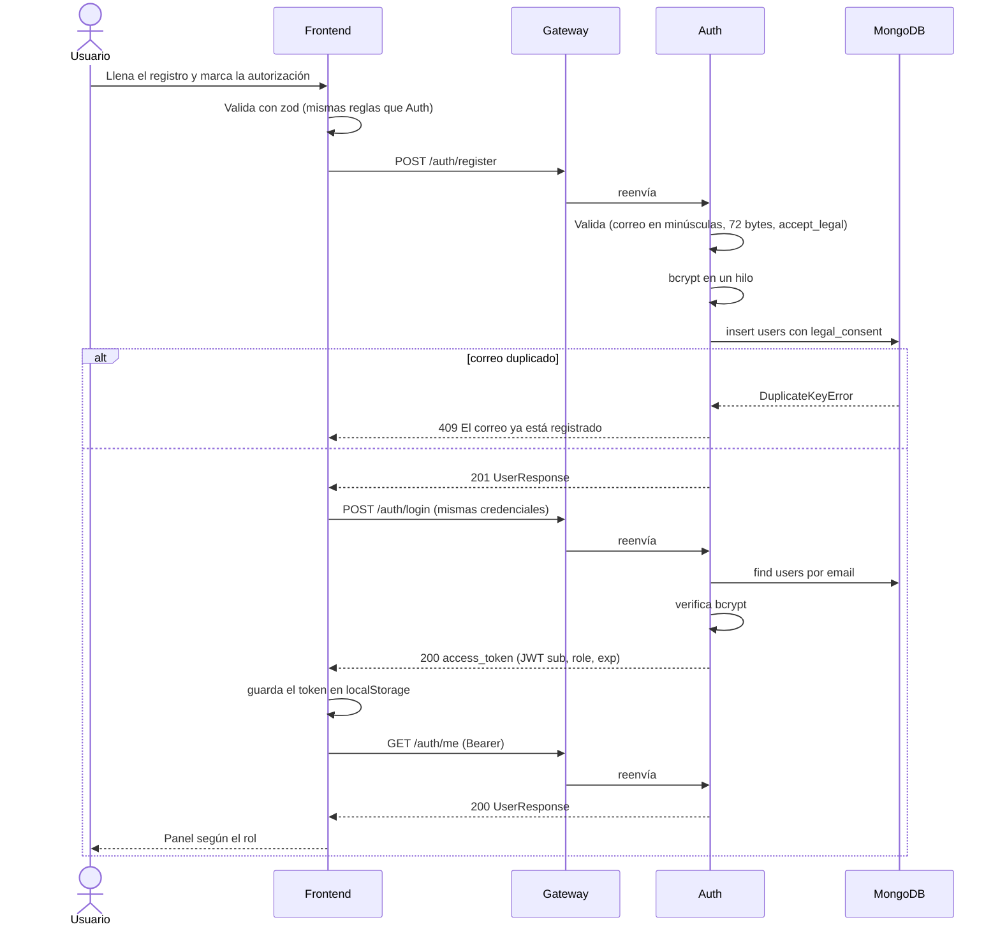
```mermaid
sequenceDiagram
    actor U as Usuario
    participant SPA as Frontend
    participant GW as Gateway
    participant A as Auth
    participant DB as MongoDB

    U->>SPA: Llena el registro y marca la autorización
    SPA->>SPA: Valida con zod (mismas reglas que Auth)
    SPA->>GW: POST /auth/register
    GW->>A: reenvía
    A->>A: Valida (correo en minúsculas, 72 bytes, accept_legal)
    A->>A: bcrypt en un hilo
    A->>DB: insert users con legal_consent
    alt correo duplicado
        DB-->>A: DuplicateKeyError
        A-->>SPA: 409 El correo ya está registrado
    else
        A-->>SPA: 201 UserResponse
        SPA->>GW: POST /auth/login (mismas credenciales)
        GW->>A: reenvía
        A->>DB: find users por email
        A->>A: verifica bcrypt
        A-->>SPA: 200 access_token (JWT sub, role, exp)
        SPA->>SPA: guarda el token en localStorage
        SPA->>GW: GET /auth/me (Bearer)
        GW->>A: reenvía
        A-->>SPA: 200 UserResponse
        SPA-->>U: Panel según el rol
    end
```

### 8.2 Revalidación de la sesión al abrir la app

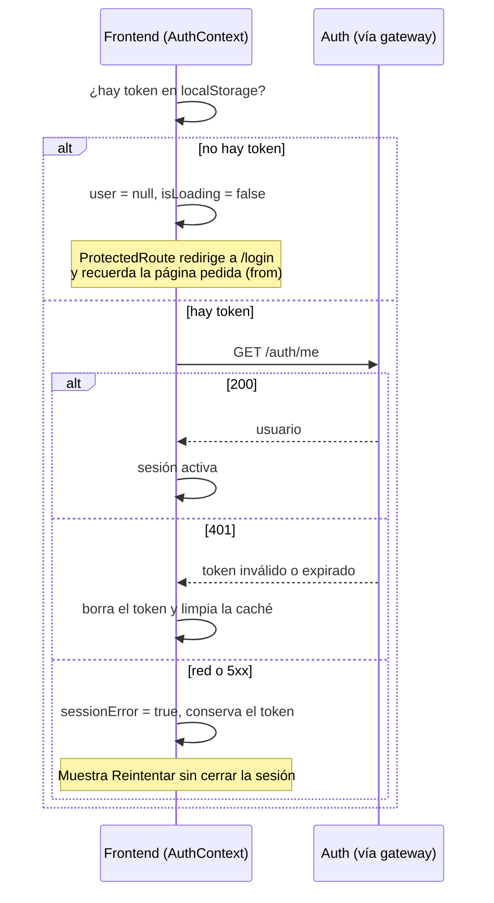
```mermaid
sequenceDiagram
    participant SPA as Frontend (AuthContext)
    participant A as Auth (vía gateway)

    SPA->>SPA: ¿hay token en localStorage?
    alt no hay token
        SPA->>SPA: user = null, isLoading = false
        Note over SPA: ProtectedRoute redirige a /login<br/>y recuerda la página pedida (from)
    else hay token
        SPA->>A: GET /auth/me
        alt 200
            A-->>SPA: usuario
            SPA->>SPA: sesión activa
        else 401
            A-->>SPA: token inválido o expirado
            SPA->>SPA: borra el token y limpia la caché
        else red o 5xx
            SPA->>SPA: sessionError = true, conserva el token
            Note over SPA: Muestra Reintentar sin cerrar la sesión
        end
    end
```

### 8.3 Unirse a un curso

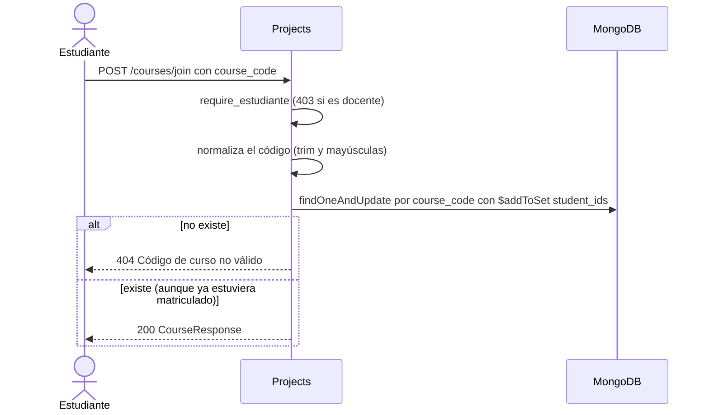
```mermaid
sequenceDiagram
    actor E as Estudiante
    participant P as Projects
    participant DB as MongoDB

    E->>P: POST /courses/join con course_code
    P->>P: require_estudiante (403 si es docente)
    P->>P: normaliza el código (trim y mayúsculas)
    P->>DB: findOneAndUpdate por course_code con $addToSet student_ids
    alt no existe
        P-->>E: 404 Código de curso no válido
    else existe (aunque ya estuviera matriculado)
        P-->>E: 200 CourseResponse
    end
```

### 8.4 Crear un proyecto por grupos

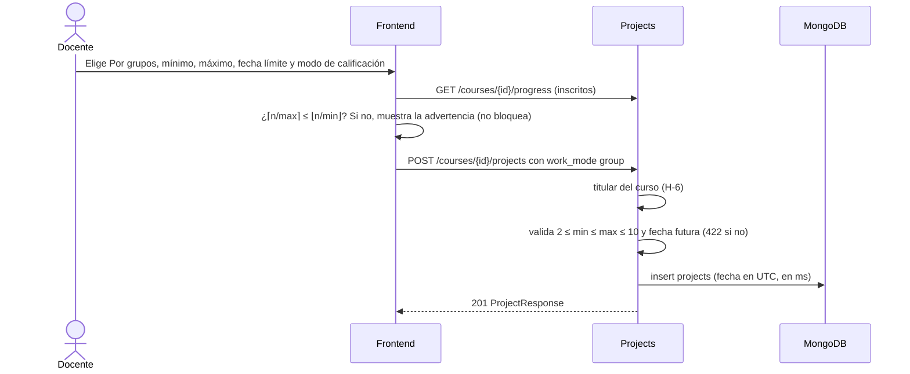
```mermaid
sequenceDiagram
    actor D as Docente
    participant SPA as Frontend
    participant P as Projects
    participant DB as MongoDB

    D->>SPA: Elige Por grupos, mínimo, máximo, fecha límite y modo de calificación
    SPA->>P: GET /courses/{id}/progress (inscritos)
    SPA->>SPA: ¿⌈n/max⌉ ≤ ⌊n/min⌋? Si no, muestra la advertencia (no bloquea)
    SPA->>P: POST /courses/{id}/projects con work_mode group
    P->>P: titular del curso (H-6)
    P->>P: valida 2 ≤ min ≤ max ≤ 10 y fecha futura (422 si no)
    P->>DB: insert projects (fecha en UTC, en ms)
    P-->>SPA: 201 ProjectResponse
```

### 8.5 Formar grupos

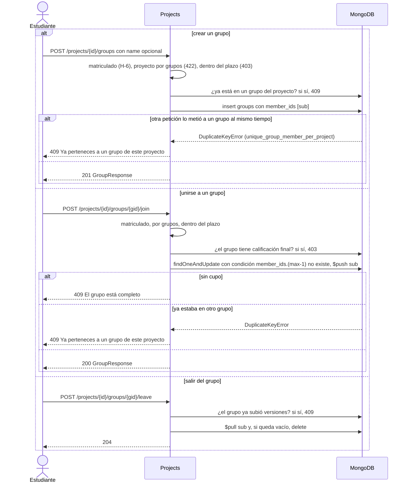
```mermaid
sequenceDiagram
    actor E as Estudiante
    participant P as Projects
    participant DB as MongoDB

    alt crear un grupo
        E->>P: POST /projects/{id}/groups con name opcional
        P->>P: matriculado (H-6), proyecto por grupos (422), dentro del plazo (403)
        P->>DB: ¿ya está en un grupo del proyecto? si sí, 409
        P->>DB: insert groups con member_ids [sub]
        alt otra petición lo metió a un grupo al mismo tiempo
            DB-->>P: DuplicateKeyError (unique_group_member_per_project)
            P-->>E: 409 Ya perteneces a un grupo de este proyecto
        else
            P-->>E: 201 GroupResponse
        end
    else unirse a un grupo
        E->>P: POST /projects/{id}/groups/{gid}/join
        P->>P: matriculado, por grupos, dentro del plazo
        P->>DB: ¿el grupo tiene calificación final? si sí, 403
        P->>DB: findOneAndUpdate con condición member_ids.(max-1) no existe, $push sub
        alt sin cupo
            P-->>E: 409 El grupo está completo
        else ya estaba en otro grupo
            DB-->>P: DuplicateKeyError
            P-->>E: 409 Ya perteneces a un grupo de este proyecto
        else
            P-->>E: 200 GroupResponse
        end
    else salir del grupo
        E->>P: POST /projects/{id}/groups/{gid}/leave
        P->>DB: ¿el grupo ya subió versiones? si sí, 409
        P->>DB: $pull sub y, si queda vacío, delete
        P-->>E: 204
    end
```

### 8.6 Subir una versión

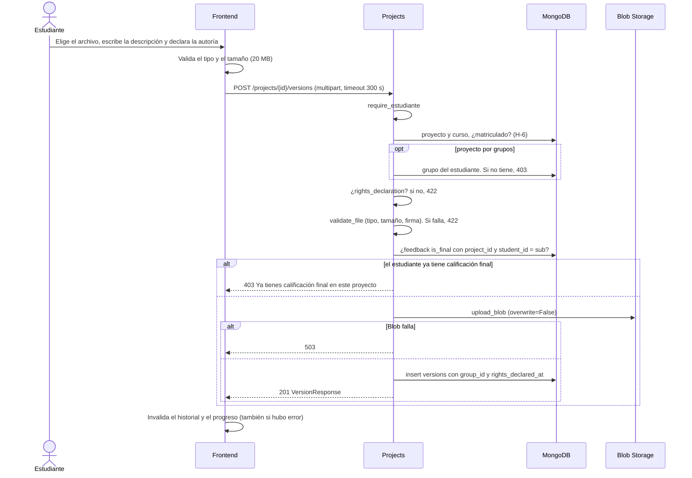
```mermaid
sequenceDiagram
    actor E as Estudiante
    participant SPA as Frontend
    participant P as Projects
    participant DB as MongoDB
    participant S as Blob Storage

    E->>SPA: Elige el archivo, escribe la descripción y declara la autoría
    SPA->>SPA: Valida el tipo y el tamaño (20 MB)
    SPA->>P: POST /projects/{id}/versions (multipart, timeout 300 s)
    P->>P: require_estudiante
    P->>DB: proyecto y curso, ¿matriculado? (H-6)
    opt proyecto por grupos
        P->>DB: grupo del estudiante. Si no tiene, 403
    end
    P->>P: ¿rights_declaration? si no, 422
    P->>P: validate_file (tipo, tamaño, firma). Si falla, 422
    P->>DB: ¿feedback is_final con project_id y student_id = sub?
    alt el estudiante ya tiene calificación final
        P-->>SPA: 403 Ya tienes calificación final en este proyecto
    else
        P->>S: upload_blob (overwrite=False)
        alt Blob falla
            P-->>SPA: 503
        else
            P->>DB: insert versions con group_id y rights_declared_at
            P-->>SPA: 201 VersionResponse
        end
    end
    SPA->>SPA: Invalida el historial y el progreso (también si hubo error)
```

El frontend invalida la caché **también si hubo error** (`onSettled`). Si la conexión se cortó
después de que el backend guardó la versión, el historial refrescado la muestra, y el estudiante no
la sube dos veces.

### 8.7 Retroalimentación con reemplazo de la nota parcial

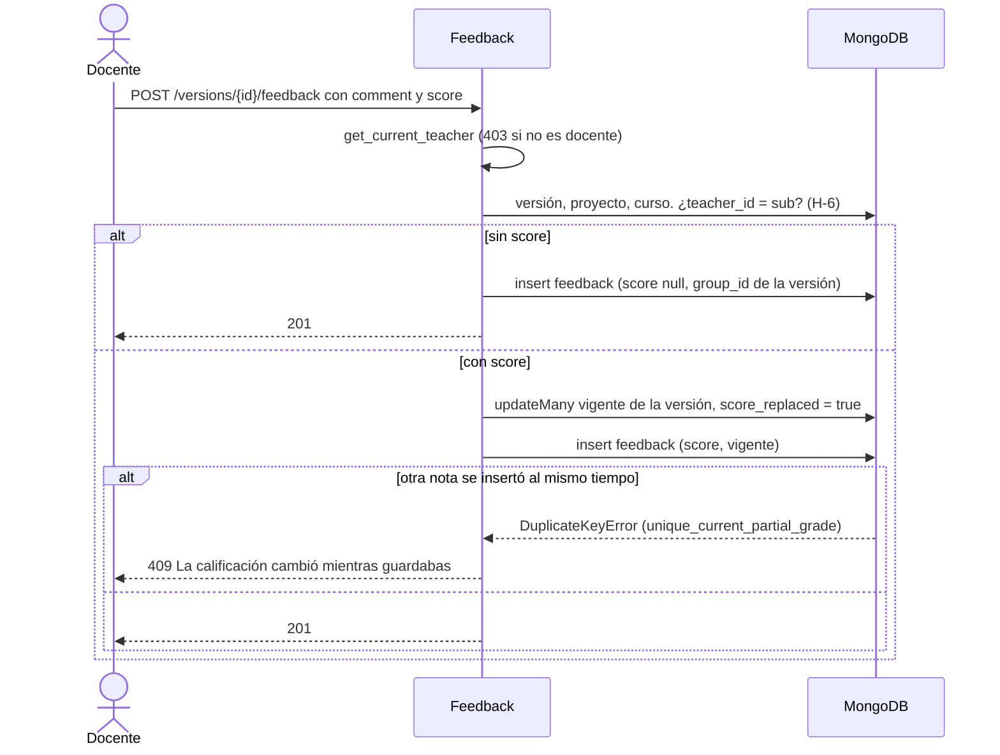
```mermaid
sequenceDiagram
    actor D as Docente
    participant F as Feedback
    participant DB as MongoDB

    D->>F: POST /versions/{id}/feedback con comment y score
    F->>F: get_current_teacher (403 si no es docente)
    F->>DB: versión, proyecto, curso. ¿teacher_id = sub? (H-6)
    alt sin score
        F->>DB: insert feedback (score null, group_id de la versión)
        F-->>D: 201
    else con score
        F->>DB: updateMany vigente de la versión, score_replaced = true
        F->>DB: insert feedback (score, vigente)
        alt otra nota se insertó al mismo tiempo
            DB-->>F: DuplicateKeyError (unique_current_partial_grade)
            F-->>D: 409 La calificación cambió mientras guardabas
        else
            F-->>D: 201
        end
    end
```

### 8.8 Calificación final

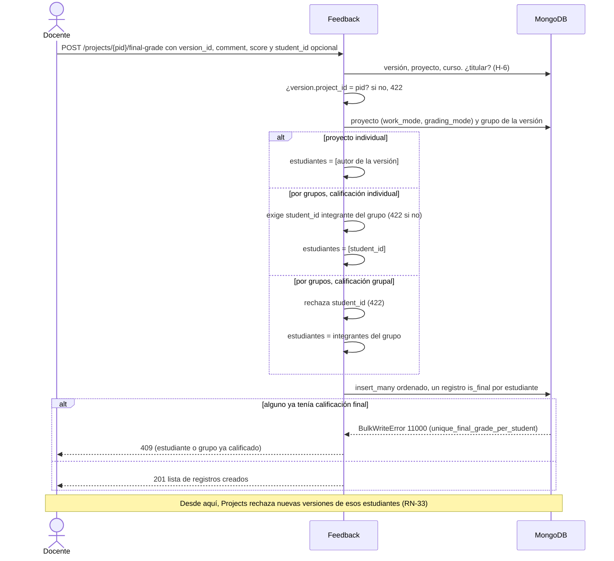
```mermaid
sequenceDiagram
    actor D as Docente
    participant F as Feedback
    participant DB as MongoDB

    D->>F: POST /projects/{pid}/final-grade con version_id, comment, score y student_id opcional
    F->>DB: versión, proyecto, curso. ¿titular? (H-6)
    F->>F: ¿version.project_id = pid? si no, 422
    F->>DB: proyecto (work_mode, grading_mode) y grupo de la versión
    alt proyecto individual
        F->>F: estudiantes = [autor de la versión]
    else por grupos, calificación individual
        F->>F: exige student_id integrante del grupo (422 si no)
        F->>F: estudiantes = [student_id]
    else por grupos, calificación grupal
        F->>F: rechaza student_id (422)
        F->>F: estudiantes = integrantes del grupo
    end
    F->>DB: insert_many ordenado, un registro is_final por estudiante
    alt alguno ya tenía calificación final
        DB-->>F: BulkWriteError 11000 (unique_final_grade_per_student)
        F-->>D: 409 (estudiante o grupo ya calificado)
    else
        F-->>D: 201 lista de registros creados
    end
    Note over D,DB: Desde aquí, Projects rechaza nuevas versiones de esos estudiantes (RN-33)
```

### 8.9 Progreso del curso (vista del docente)

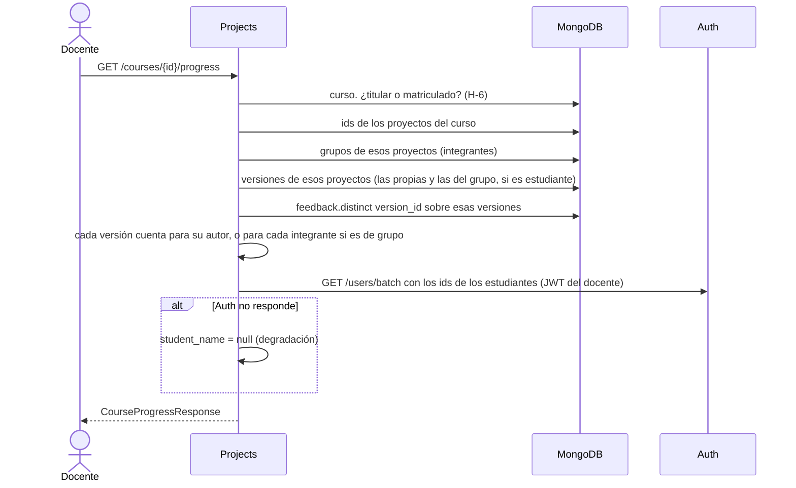
```mermaid
sequenceDiagram
    actor D as Docente
    participant P as Projects
    participant DB as MongoDB
    participant A as Auth

    D->>P: GET /courses/{id}/progress
    P->>DB: curso. ¿titular o matriculado? (H-6)
    P->>DB: ids de los proyectos del curso
    P->>DB: grupos de esos proyectos (integrantes)
    P->>DB: versiones de esos proyectos (las propias y las del grupo, si es estudiante)
    P->>DB: feedback.distinct version_id sobre esas versiones
    P->>P: cada versión cuenta para su autor, o para cada integrante si es de grupo
    P->>A: GET /users/batch con los ids de los estudiantes (JWT del docente)
    alt Auth no responde
        P->>P: student_name = null (degradación)
    end
    P-->>D: CourseProgressResponse
```

### 8.10 Exportación del portafolio de un proyecto

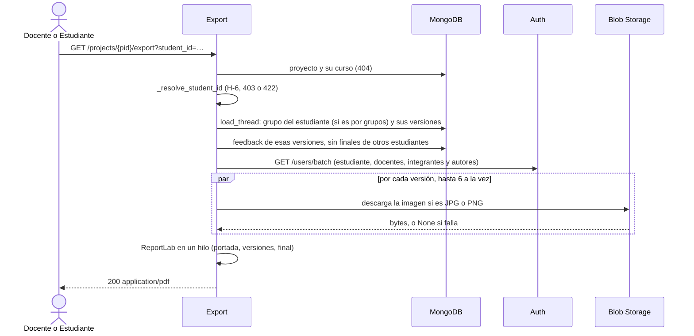
```mermaid
sequenceDiagram
    actor U as Docente o Estudiante
    participant X as Export
    participant DB as MongoDB
    participant A as Auth
    participant S as Blob Storage

    U->>X: GET /projects/{pid}/export?student_id=…
    X->>DB: proyecto y su curso (404)
    X->>X: _resolve_student_id (H-6, 403 o 422)
    X->>DB: load_thread: grupo del estudiante (si es por grupos) y sus versiones
    X->>DB: feedback de esas versiones, sin finales de otros estudiantes
    X->>A: GET /users/batch (estudiante, docentes, integrantes y autores)
    par por cada versión, hasta 6 a la vez
        X->>S: descarga la imagen si es JPG o PNG
        S-->>X: bytes, o None si falla
    end
    X->>X: ReportLab en un hilo (portada, versiones, final)
    X-->>U: 200 application/pdf
```

### 8.11 Portafolio académico del estudiante

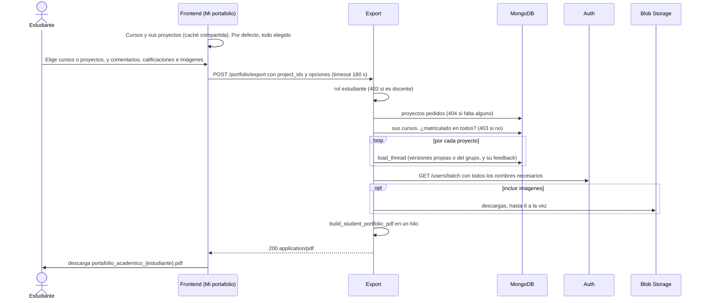
```mermaid
sequenceDiagram
    actor E as Estudiante
    participant SPA as Frontend (Mi portafolio)
    participant X as Export
    participant DB as MongoDB
    participant A as Auth
    participant S as Blob Storage

    SPA->>SPA: Cursos y sus proyectos (caché compartida). Por defecto, todo elegido
    E->>SPA: Elige cursos o proyectos, y comentarios, calificaciones e imágenes
    SPA->>X: POST /portfolio/export con project_ids y opciones (timeout 180 s)
    X->>X: rol estudiante (403 si es docente)
    X->>DB: proyectos pedidos (404 si falta alguno)
    X->>DB: sus cursos. ¿matriculado en todos? (403 si no)
    loop por cada proyecto
        X->>DB: load_thread (versiones propias o del grupo, y su feedback)
    end
    X->>A: GET /users/batch con todos los nombres necesarios
    opt incluir imágenes
        X->>S: descargas, hasta 6 a la vez
    end
    X->>X: build_student_portfolio_pdf en un hilo
    X-->>SPA: 200 application/pdf
    SPA->>E: descarga portafolio_academico_{estudiante}.pdf
```

### 8.12 Visualizar el archivo de una versión

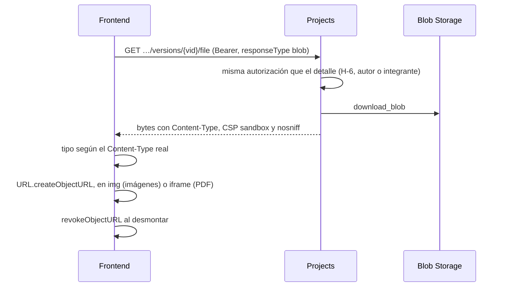
```mermaid
sequenceDiagram
    participant SPA as Frontend
    participant P as Projects
    participant S as Blob Storage

    SPA->>P: GET …/versions/{vid}/file (Bearer, responseType blob)
    P->>P: misma autorización que el detalle (H-6, autor o integrante)
    P->>S: download_blob
    P-->>SPA: bytes con Content-Type, CSP sandbox y nosniff
    SPA->>SPA: tipo según el Content-Type real
    SPA->>SPA: URL.createObjectURL, en img (imágenes) o iframe (PDF)
    SPA->>SPA: revokeObjectURL al desmontar
```

---

## 9. Ciclos de vida y estados

### 9.1 Calificación parcial de una versión

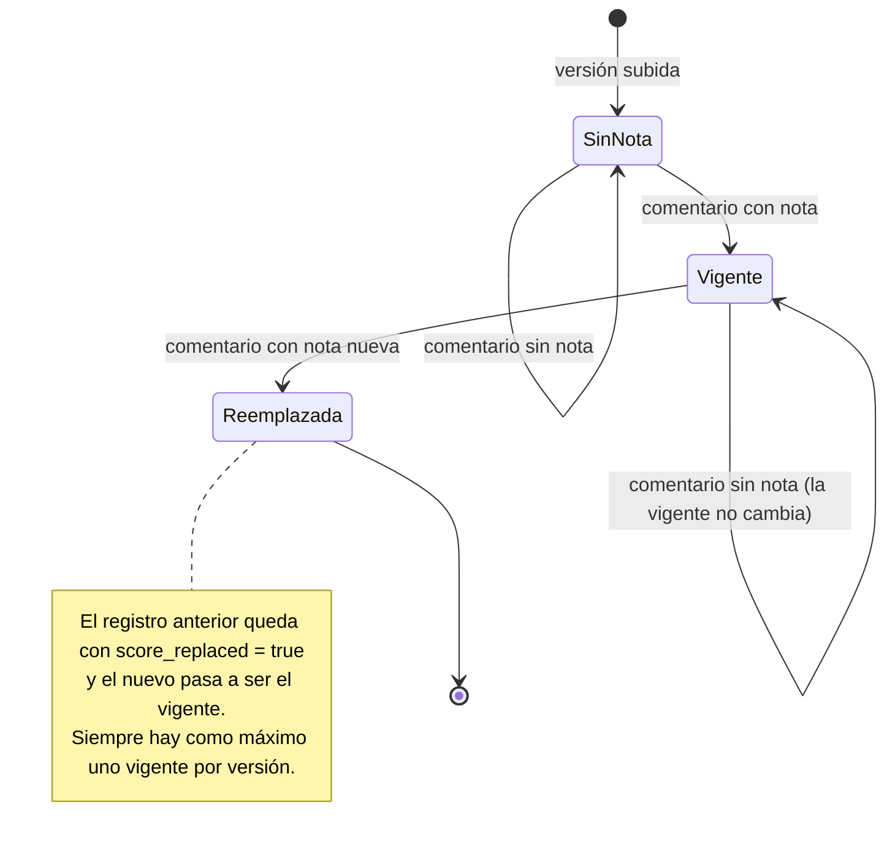
```mermaid
stateDiagram-v2
    [*] --> SinNota: versión subida
    SinNota --> SinNota: comentario sin nota
    SinNota --> Vigente: comentario con nota
    Vigente --> Vigente: comentario sin nota (la vigente no cambia)
    Vigente --> Reemplazada: comentario con nota nueva
    note right of Reemplazada
        El registro anterior queda con score_replaced = true
        y el nuevo pasa a ser el vigente.
        Siempre hay como máximo uno vigente por versión.
    end note
    Reemplazada --> [*]
```

### 9.2 Un proyecto

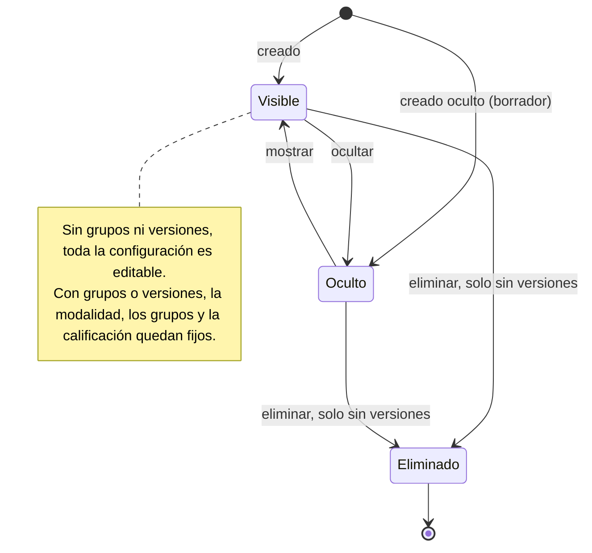
```mermaid
stateDiagram-v2
    [*] --> Visible: creado
    [*] --> Oculto: creado oculto (borrador)
    Visible --> Oculto: ocultar
    Oculto --> Visible: mostrar
    Visible --> Eliminado: eliminar, solo sin versiones
    Oculto --> Eliminado: eliminar, solo sin versiones
    Eliminado --> [*]
    note right of Visible
        Sin grupos ni versiones, toda la configuración es editable.
        Con grupos o versiones, la modalidad, los grupos y la calificación quedan fijos.
    end note
```

El título, la descripción, la visibilidad y el plazo de grupos se pueden editar en cualquier estado.

### 9.2.1 Formación de grupos en un proyecto

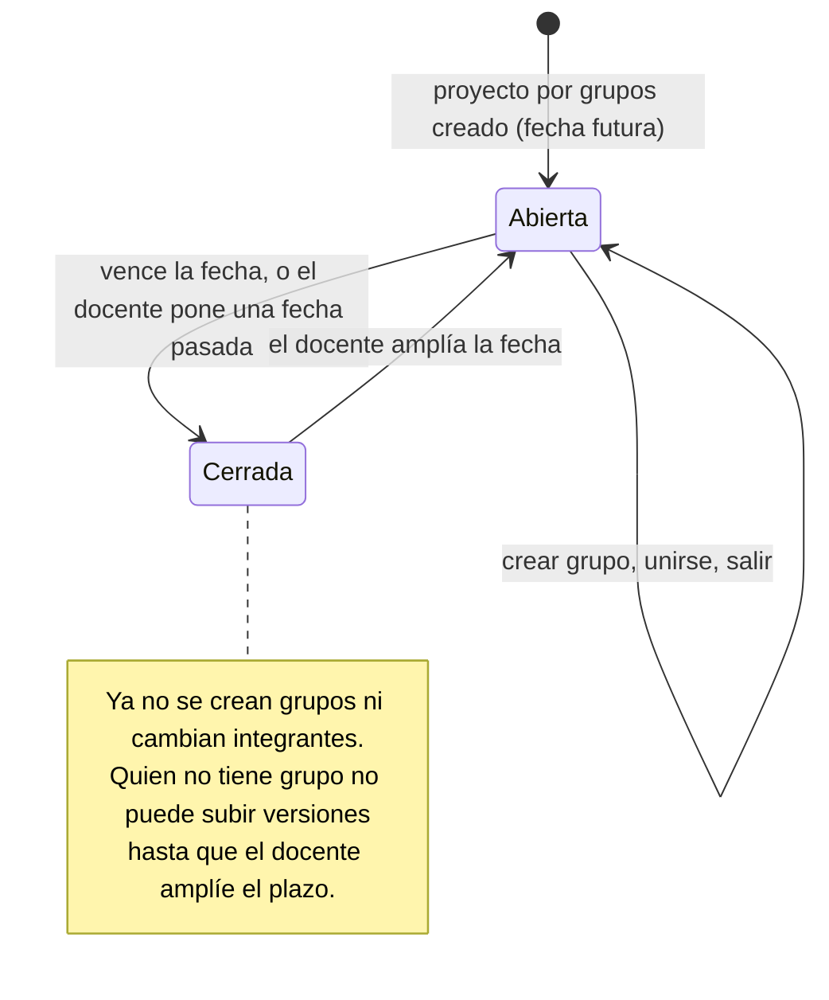
```mermaid
stateDiagram-v2
    [*] --> Abierta: proyecto por grupos creado (fecha futura)
    Abierta --> Abierta: crear grupo, unirse, salir
    Abierta --> Cerrada: vence la fecha, o el docente pone una fecha pasada
    Cerrada --> Abierta: el docente amplía la fecha
    note right of Cerrada
        Ya no se crean grupos ni cambian integrantes.
        Quien no tiene grupo no puede subir versiones
        hasta que el docente amplíe el plazo.
    end note
```

### 9.3 Un grupo

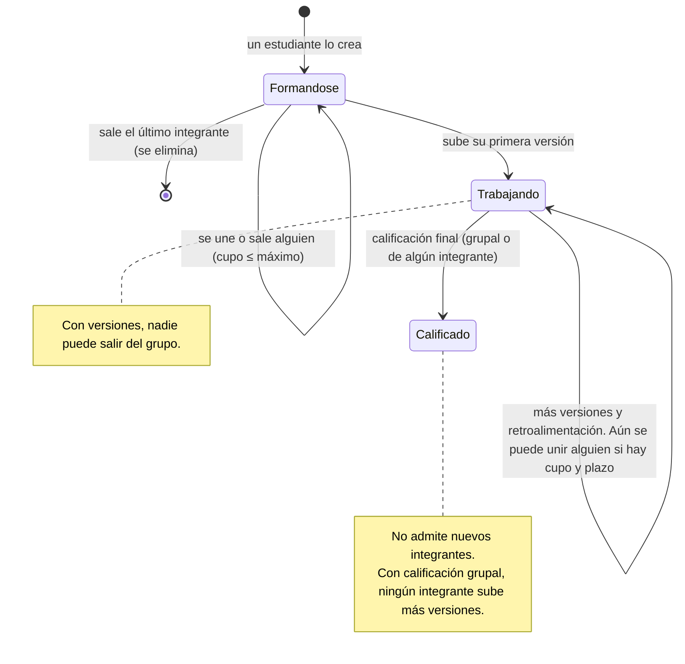
```mermaid
stateDiagram-v2
    [*] --> Formandose: un estudiante lo crea
    Formandose --> Formandose: se une o sale alguien (cupo ≤ máximo)
    Formandose --> [*]: sale el último integrante (se elimina)
    Formandose --> Trabajando: sube su primera versión
    Trabajando --> Trabajando: más versiones y retroalimentación. Aún se puede unir alguien si hay cupo y plazo
    Trabajando --> Calificado: calificación final (grupal o de algún integrante)
    note right of Trabajando
        Con versiones, nadie puede salir del grupo.
    end note
    note right of Calificado
        No admite nuevos integrantes.
        Con calificación grupal, ningún integrante sube más versiones.
    end note
```

### 9.4 Hilo de un estudiante en un proyecto

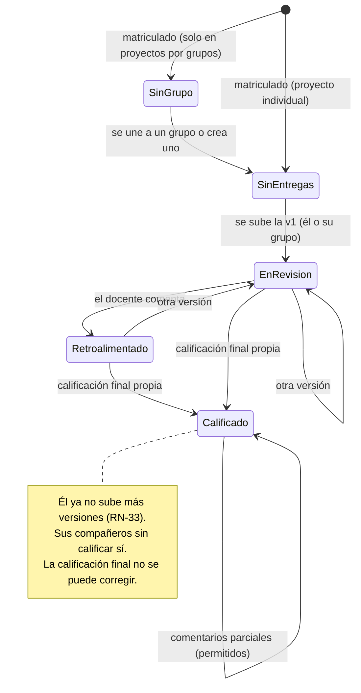
```mermaid
stateDiagram-v2
    [*] --> SinGrupo: matriculado (solo en proyectos por grupos)
    SinGrupo --> SinEntregas: se une a un grupo o crea uno
    [*] --> SinEntregas: matriculado (proyecto individual)
    SinEntregas --> EnRevision: se sube la v1 (él o su grupo)
    EnRevision --> EnRevision: otra versión
    EnRevision --> Retroalimentado: el docente comenta
    Retroalimentado --> EnRevision: otra versión
    Retroalimentado --> Calificado: calificación final propia
    EnRevision --> Calificado: calificación final propia
    Calificado --> Calificado: comentarios parciales (permitidos)
    note right of Calificado
        Él ya no sube más versiones (RN-33).
        Sus compañeros sin calificar sí.
        La calificación final no se puede corregir.
    end note
```

En cualquier estado se puede exportar el portafolio. Desde *SinEntregas* o *SinGrupo* sale el PDF
sin evidencias.

### 9.5 Sesión en el frontend

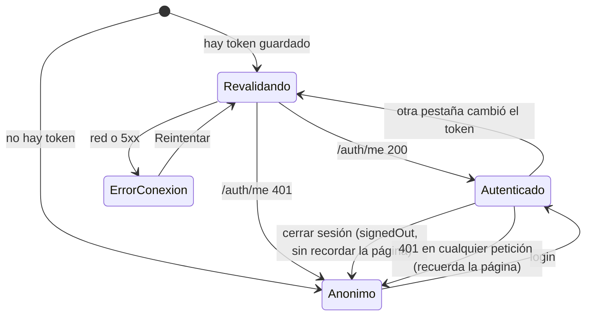
```mermaid
stateDiagram-v2
    [*] --> Revalidando: hay token guardado
    [*] --> Anonimo: no hay token
    Revalidando --> Autenticado: /auth/me 200
    Revalidando --> Anonimo: /auth/me 401
    Revalidando --> ErrorConexion: red o 5xx
    ErrorConexion --> Revalidando: Reintentar
    Anonimo --> Autenticado: login
    Autenticado --> Anonimo: cerrar sesión (signedOut, sin recordar la página)
    Autenticado --> Anonimo: 401 en cualquier petición (recuerda la página)
    Autenticado --> Revalidando: otra pestaña cambió el token
```

---

## 10. Frontend

### 10.1 Organización

Está organizado **por funcionalidad** (*feature folders*): cada carpeta agrupa sus páginas, su capa de
API, sus hooks de datos y sus esquemas de validación.

```
src/
├── main.tsx, App.tsx       # Providers: QueryClient, AuthProvider, Router y Toaster
├── routes/                 # index.tsx (tabla de rutas), ProtectedRoute, RoleRoute, ScrollToTop
├── lib/                    # axios (instancia única), session (token), config (runtime),
│                           # errors (normalización), groups (cálculos de grupos y fechas),
│                           # theme (modo claro, oscuro o del sistema),
│                           # queryClient, download, utils, useDocumentTitle
├── types/api.ts            # Tipos espejo de los contratos del backend
├── components/
│   ├── layout/             # AppShell, AppSidebar, PageHeader, States, SiteFooter…
│   └── ui/                 # Botones, inputs, diálogo, dropzone, barra de progreso, toast…
├── features/
│   ├── auth/               # AuthContext, Login, Register, useUserNames
│   ├── courses/            # Onboarding, paneles del docente y del estudiante, crear proyecto,
│   │                       # progreso, CourseGate/ProjectGate
│   ├── projects/           # Historial, detalle, subida, grupos, vista previa, tira de versiones
│   ├── feedback/           # Hilo, formulario y panel de calificación final (estudiante o grupo)
│   ├── export/             # ExportButton (un proyecto) y PortfolioPage (portafolio académico)
│   └── legal/              # Páginas legales y legalConfig
└── pages/StatusPages.tsx   # 404 y "no autorizado"
```

**Regla de capas:**
- Los componentes no importan Axios. Usan los **hooks** de su feature (TanStack Query).
- Los hooks llaman al `api.ts` de su feature.
- El `api.ts` usa la instancia única de `lib/axios.ts`, que solo conoce la URL del gateway.

### 10.2 Rutas

| Ruta | Pantalla | Protección |
|---|---|---|
| `/login`, `/register` | Inicio de sesión y registro | Públicas |
| `/legal/privacidad`, `/legal/terminos`, `/legal/derechos-de-autor` | Documentos legales | Públicas |
| `/` | Mis cursos: crear un curso (docente) o unirse a uno (estudiante) | Sesión |
| `/courses/:courseId` | Panel del curso. `CourseDashboardRouter` elige el del docente o el del estudiante según el rol | Sesión |
| `/courses/:courseId/projects/:projectId/versions` | Historial y retroalimentación (pantalla central) | Sesión |
| `/courses/:courseId/projects/:projectId/versions/:versionId` | Versión en grande | Sesión |
| `/courses/:courseId/projects/:projectId/groups` | Grupos del proyecto: formarlos (estudiante), plazo y advertencias (docente) | Sesión |
| `/courses/:courseId/projects/:projectId/upload` | Subir versión | Sesión, rol **estudiante** |
| `/portafolio` | Mi portafolio (portafolio académico) | Sesión, rol **estudiante** |
| `/courses/:courseId/projects/new` | Crear proyecto (individual o por grupos, visible u oculto) | Sesión, rol **docente** |
| `/courses/:courseId/projects/:projectId/edit` | Editar proyecto (mismo formulario; la estructura se bloquea si ya hay grupos o versiones) | Sesión, rol **docente** |
| `/courses/:courseId/progress` | Progreso del curso | Sesión, rol **docente** |
| `/no-autorizado`, `*` | Estado sin acceso y 404 | Sesión |

**Componentes de protección:**
- `ProtectedRoute`: mientras revalida muestra un esqueleto de carga. Sin sesión redirige a `/login`
  guardando `from`, salvo si el usuario cerró sesión.
- `RoleRoute`: si el rol no coincide, redirige a `/no-autorizado`.
- `CourseGate` y `ProjectGate`: buscan el curso y el proyecto en los listados del usuario. Si no
  están, muestran "sin acceso", nunca un 404 que oculte la causa.

### 10.3 Proyectos por grupos en la interfaz

- **Crear proyecto:**
  - La modalidad y el modo de calificación se eligen con tarjetas excluyentes (radios nativos).
  - Mínimo y máximo se validan con zod (2 a 10, mínimo ≤ máximo) y la fecha límite debe ser
    futura.
  - La advertencia de formación (RN-17) se calcula en `lib/groups.ts` con los inscritos que entrega
    el progreso del docente.
  - La fecha se elige con `datetime-local` (hora local) y se envía en UTC.
- **Grupos:**
  - Muestra el tamaño, el modo de calificación y el estado del plazo (fecha y tiempo restante, o
    cerrado).
  - El estudiante sin grupo puede crear uno o unirse a uno con cupo. El suyo aparece destacado,
    con "Salir del grupo" mientras el plazo siga abierto.
  - El docente ve las advertencias (inscritos sin grupo, grupos por debajo del mínimo, formación
    imposible) y un formulario para cambiar el plazo.
- **Historial:**
  - **Docente:** filtra por grupo en vez de por estudiante. Cada versión muestra "Grupo · Subida
    por X".
  - **Estudiante sin grupo:** ve un estado vacío que lo lleva a elegir grupo; no ve "Subir
    versión".
  - **Cierre del proyecto:** se arma por grupo.
    - Con calificación grupal, un solo panel califica a todo el grupo.
    - Con calificación individual, el docente elige el integrante.
    - El portafolio siempre es de un integrante.
- **Paneles:**
  - El estudiante ve "Sin grupo" y un botón "Elegir grupo", o el nombre de su grupo.
  - El docente ve las insignias "Grupos de X a Y" y "Nota por grupo" o "Nota individual".
- **Numeración:** `numberVersions` numera por hilo (`group_id ?? student_id`), igual que el PDF.

### 10.3.1 Gestión de proyectos en la interfaz

- **Acciones del docente** (`ProjectActions`): **Editar**, **Ocultar** o **Mostrar** y
  **Eliminar**. Aparecen en cada tarjeta del panel del curso y en el encabezado del historial.
- Un proyecto oculto se marca con la insignia "Oculto para los estudiantes", un borde punteado en
  su tarjeta y el ícono de ojo tachado en la barra lateral.
- **Editar** reutiliza el formulario de crear proyecto. Antes de mostrarlo, consulta si ya hay
  versiones o grupos. Si los hay, deshabilita la modalidad, el tamaño y la calificación, y lo
  explica. Solo envía lo que se puede cambiar.
- **Eliminar** abre un diálogo que consulta las versiones del proyecto. Sin versiones, confirma la
  eliminación (botón destructivo) y vuelve al curso. Con versiones, explica que son evidencia
  académica y ofrece "Ocultar en su lugar".
- Para el estudiante, un proyecto oculto desaparece de los listados. Si tenía abierta una de sus
  páginas, `ProjectGate` muestra "sin acceso".

### 10.3.2 Calificación final en la interfaz (RF-09)

Rediseño del 28 de octubre de 2026, solo en el frontend, después de una prueba de usabilidad con
6 docentes. 3 no encontraron cómo asignar la calificación final y otro tuvo que desplazarse mucho.
Varios pusieron una segunda nota parcial creyendo que era la final, y uno dijo que el control se
veía «transparente», como deshabilitado. La API y las reglas (RN-41 a RN-43) no cambiaron.
El código está en el commit `bb8ec87` y se publicó como frontend `v3` (sección 19.13).

**Piezas** (`frontend/src/features/feedback/`):

| Archivo | Qué hace |
|---|---|
| `useFinalGradeFlow.ts` | Estado compartido del flujo: a quién se califica (`GradeTarget`), el estado (`none`, `loading`, `error`, `pending`, `graded`), el formulario (react-hook-form + `finalGradeSchema`), la confirmación y el envío. Reutiliza `useAssignFinalGrade` |
| `FinalGradeBar.tsx` | Barra arriba del historial, antes de la descripción del proyecto: quién se revisa, qué versión está abierta, el indicador («Sin calificación final» o «Calificación final: 4,5», con coma decimal) y el botón **Asignar calificación final**. Con calificación, el botón no se muestra. Si está deshabilitado, el motivo va escrito al lado (sin versiones, consultando, error con *Reintentar*) |
| `FinalGradePanel.tsx` | Bloque **Calificación final (definitiva)** en el cierre: borde y encabezado `warning`, opacidad completa. Su botón, **Revisar y confirmar**, no envía: abre la confirmación |
| `ConfirmFinalGradeDialog.tsx` | Diálogo **Confirmar calificación final** sobre el `Dialog` de Radix del proyecto: resumen (estudiante o grupo, proyecto, versión, nota con coma y comentario), advertencia y **Cancelar** / **Confirmar calificación final** |
| `FeedbackForm.tsx` | Bloque **Comentario y nota parcial**: borde lateral `teacher` y la ayuda «La nota parcial se puede reemplazar con una nueva retroalimentación». El flujo de la nota parcial no cambió |

`VersionHistoryPage` calcula una sola vez a quién se califica (`gradeTargetOf`): el estudiante, todo
el grupo o el integrante elegido en un proyecto por grupos con calificación individual. Le pasa ese
mismo objetivo a la barra, al bloque y al diálogo. Al cambiar de estudiante, grupo o integrante, el
formulario se reinicia.

**Flujo:**

```mermaid
flowchart TD
    A[Docente pulsa «Asignar calificación final» en la barra] --> B{¿Formulario vacío?}
    B -- Sí --> C[Lleva al bloque B y pone el foco en el comentario, sin errores]
    B -- No --> D{¿Válido?}
    E[«Revisar y confirmar» en el bloque B] --> D
    D -- No --> F[Muestra los errores y enfoca el primer campo]
    D -- Sí --> G[Diálogo de confirmación]
    G -- Cancelar, Esc o clic fuera --> H[Cierra sin enviar y conserva lo escrito]
    G -- Confirmar --> I[POST /projects/id/final-grade, una sola vez]
    I -- 201 --> J[Cierra, aviso «Calificación final registrada», indicador al instante e invalidación]
    I -- 409 --> K[Sigue abierto: «Este estudiante ya tiene una calificación final registrada.», refresca el estado]
    I -- Red o 5xx --> L[Sigue abierto: «No se pudo conectar con el servidor. Intenta de nuevo.», permite reintentar]
```

**Detalles:**
- **Un solo envío.** Un `useRef` bloquea el segundo clic antes de que React vuelva a pintar el
  botón; además, el botón se deshabilita y dice «Registrando…». Mientras espera, el diálogo no se
  cierra (ni con Esc ni con clic fuera).
- **Después del 201.** `setQueryData` agrega los registros devueltos a la consulta de calificaciones
  finales para que el indicador cambie al instante. `useAssignFinalGrade` invalida la
  retroalimentación de la versión y del proyecto, las calificaciones finales y el progreso del
  curso; el flujo invalida además las versiones del proyecto.
- **409.** Invalida las calificaciones finales y la retroalimentación del proyecto: la barra y el
  cierre pasan a mostrar la nota existente. El diálogo cambia **Cancelar** por **Cerrar** y oculta
  **Confirmar**. En la calificación grupal los textos dicen «grupo» en lugar de «estudiante».
- **Accesibilidad.** `role="dialog"` (Radix), `aria-modal="true"`, `aria-labelledby` al título,
  `aria-describedby` a la advertencia. Foco inicial en **Cancelar**, foco atrapado (`FocusScope` de
  Radix) y foco devuelto al botón que abrió el diálogo. Si ese botón ya no existe (se registró la
  nota), el foco va al indicador de la barra, que es `aria-live="polite"`.
- `DialogContent` ahora deja pasar las props de Radix (`onOpenAutoFocus`, `onCloseAutoFocus`,
  `aria-*`). Los diálogos que ya existían no cambian.
- **Verificación.** 76/76 pruebas de Vitest y 52 comprobaciones con Playwright en Chrome contra el
  entorno local: 1280×800 y 360×640, modo oscuro, Esc, clic fuera, foco, error de red simulado, 409
  real, doble clic (una sola petición) y la calificación de un integrante (envía su `student_id`).

### 10.4 Mi portafolio

- Carga los cursos y, con `useQueries`, los proyectos de cada uno. Usa las mismas claves de caché
  que la barra lateral y los paneles.
- **Selección jerárquica:**
  - "Todos mis cursos y proyectos" (marcado por defecto).
  - Cada curso, con estado parcial (`indeterminate`) si solo algunos de sus proyectos están
    elegidos.
  - Cada proyecto, con la insignia "Grupal" si es por grupos.
- Tres opciones: comentarios, calificaciones e imágenes.
- Un resumen en vivo (`aria-live`) indica cuántos proyectos de cuántos cursos van. Sin proyectos
  elegidos, el botón se deshabilita.
- Al generar, envía la lista explícita de `project_ids` y descarga el PDF con un `<a download>`
  programático.

### 10.5 Estado del servidor (TanStack Query)

**Configuración global:**
- Los datos se consideran frescos durante 30 s (`staleTime`).
- No se vuelve a pedir al recuperar el foco de la ventana.
- Solo se reintentan las fallas de red y 5xx, hasta 2 veces. Reintentar un 401, 403, 404 o 422 no
  cambia el resultado.
- Las mutaciones no se reintentan.

**Claves de caché:**

| Clave | Contenido |
|---|---|
| `["courses"]` | Cursos del usuario |
| `["courses", courseId, "projects"]` | Proyectos del curso |
| `["courses", courseId, "progress"]` | Progreso |
| `["groups", projectId]` | Grupos del proyecto |
| `["versions", projectId, "all" \| studentId \| "group:{id}"]` | Versiones (todas, de un estudiante o de un grupo) |
| `["version", projectId, versionId]` | Detalle de una versión |
| `["version-file", projectId, versionId]` | Archivo (`staleTime` infinito, porque es inmutable) |
| `["feedback", "version", versionId]` | Hilo de la versión |
| `["feedback", "project", projectId]` | Retroalimentación del proyecto |
| `["feedback", "final", projectId]` | Calificaciones finales |
| `["users", "batch", ids]` | Nombres (`staleTime` de 5 min) |

**Invalidaciones tras cada mutación:**

| Mutación | Invalida |
|---|---|
| Crear curso o unirse | `courses` |
| Crear proyecto o cambiar el plazo de grupos | `courses/{id}/projects` |
| Editar, ocultar, mostrar o eliminar un proyecto | `courses/{id}/projects` y `progress` |
| Crear grupo, unirse o salir (éxito o error) | `groups`, `versions/{projectId}/*`, `feedback.project` y `progress` |
| Subir versión (éxito o error) | `versions/{projectId}/*` y `progress` |
| Comentar o calificar parcialmente | `feedback.version`, `feedback.project`, `feedback.final` y `progress` |
| Calificación final | Lo mismo que la anterior |
| Cerrar sesión o cambiar de cuenta | **Toda** la caché (`queryClient.clear()`) |

Las acciones de grupo invalidan también cuando fallan: un 409 *"grupo completo"* significa que la
lista ya cambió.

### 10.6 Sesión (`AuthContext` + `lib/session.ts`)

- El token vive en `localStorage`, **fuera de React**, para que el interceptor de Axios lo lea sin
  depender del árbol de componentes. `AuthContext` lo replica en memoria junto con el usuario.
- **Interceptor de petición:** agrega `Authorization: Bearer` cuando hay token.
- **Interceptor de respuesta:** un **401 de una petición que llevaba token** borra el token y avisa
  a `AuthContext` (`onSessionExpired`). Dos excepciones:
  - El 401 del login no lleva token, así que no cierra nada.
  - Un 403 **nunca** cierra la sesión: lo muestra el componente que hizo la llamada.
- **Sincronización entre pestañas:** el evento `storage` detecta que otra pestaña cerró la sesión o
  entró con otra cuenta. Esta pestaña limpia su estado y revalida.
- **Cerrar sesión** marca `signedOut`. Así el siguiente login empieza en `/` y no en la última página,
  que pudo ser de otra cuenta. Si la sesión **expiró** (401), sí se vuelve a la página donde estaba.

### 10.7 Configuración en tiempo de ejecución

Al arrancar el contenedor, `docker/40-runtime-config.sh` genera `/config.js`:

```js
window.__ENV__ = { API_GATEWAY_URL: "…", APP_NAME: "…" };
```

`lib/config.ts` decide la URL de la API en este orden:
1. `window.__ENV__.API_GATEWAY_URL`, si está definida. Una cadena vacía significa **mismo origen**.
2. `VITE_API_GATEWAY_URL`, al desarrollar con `pnpm dev`.

El Nginx del frontend procesa su plantilla con `envsubst`, así que la CSP incluye la URL del gateway.
También fija el caché:

| Recurso | Caché |
|---|---|
| `/assets/` (archivos con hash) | 1 año, inmutable |
| `index.html` | `no-cache` |
| `/config.js` | `no-store` |

Las rutas desconocidas sirven `index.html`, para que React Router las resuelva.

### 10.8 Errores, carga, validación y accesibilidad

**Errores y carga:**
- `lib/errors.ts` normaliza cualquier error en `{kind, status, message}`:
  - `kind` es uno de `network`, `unauthorized`, `forbidden`, `notFound`, `validation`, `conflict`
    o `server`.
  - El mensaje es el `detail` del backend cuando existe. En 5xx se muestra un mensaje genérico.
- `ErrorState` muestra el 403 como falta de acceso, nunca como 404. El 404 ofrece volver y las
  fallas de red o servidor ofrecen *Reintentar*.
- Con `responseType: "blob"` (archivo y PDF), el error JSON también llega como Blob.
  `normalizeBlobError` lo vuelve a convertir en JSON para mostrar el `detail`.
- Cada lista vacía tiene un `EmptyState` con una llamada a la acción, nunca una pantalla en blanco.

**Timeouts de Axios:**

| Petición | Timeout |
|---|---|
| General | 60 s |
| Subida de versión | 300 s (hasta 20 MB) |
| Portafolio de un proyecto | 120 s |
| Portafolio académico | 180 s |

**Validación de formularios.** Se usa react-hook-form con zod. Los esquemas **reflejan** las reglas
del backend para dar respuesta inmediata, pero el backend sigue siendo la autoridad. Los
formularios de registro, retroalimentación, calificación final, subida y crear proyecto validan lo
mismo que su endpoint. Un campo numérico vacío se convierte en `undefined` y no en 0.

**Accesibilidad e interfaz:**
- **Mobile first (RNF-03):** usable desde 360 px sin scroll horizontal. Se verificó con Playwright a
  390 px en las pantallas nuevas (crear proyecto, grupos, historial por grupos y Mi portafolio), y a
  360 × 640 en el historial del docente con la calificación final (barra a la vista sin desplazarse
  y diálogo de confirmación dentro de la pantalla).
- **Título de pestaña por pantalla** (`useDocumentTitle`, WCAG 2.4.2), por ejemplo
  *"Grupos: Campaña cultural | Seguimiento de Proyectos Gráficos"*.
- **Áreas táctiles** de al menos 24 px (WCAG 2.5.8). Foco visible. Se respeta
  `prefers-reduced-motion`.
- Los avisos que cambian sin recargar la página (advertencia de formación, resumen del portafolio)
  usan `<output>` o `aria-live`. Las casillas parciales usan `indeterminate` nativo.
- **Colores por rol:** una regla de color bajo el encabezado distingue la vista del docente de la del
  estudiante.

### 10.9 Modo oscuro

- **Tokens:** todos los colores salen de variables CSS en `src/styles/globals.css` (canales RGB que
  Tailwind usa con opacidad). El modo oscuro **redefine esas variables** bajo `:root.dark`, así que
  los componentes no cambian. La paleta oscura mantiene contraste WCAG AA en cada par texto/fondo.
- **Tokens propios del tema:**
  - `chrome`: el encabezado y el pie, oscuros en ambos temas.
  - `canvas` y `canvas-ink`: el fondo de las vistas previas de las obras, que sigue claro en modo
    oscuro para que una pieza con transparencias o trazos oscuros se vea como la diseñó el
    estudiante.
  - La intensidad de la cuadrícula de fondo (`--mat-strong`, `--mat-faint`), atenuada en oscuro.
- **Textos sobre colores:**
  - Los textos de error usan `text-danger-ink`.
  - Los botones primarios y las casillas marcadas usan `text-surface` sobre `bg-primary` o
    `bg-ink`: blanco en claro y oscuro en oscuro.
  - No hay blancos fijos sobre fondos que cambian.
- **Preferencia:** *Sistema* (por defecto), *Claro* u *Oscuro*.
  - Se cambia con el botón del encabezado (`ThemeToggle`), que recorre las tres opciones. Su
    nombre accesible indica el tema actual y el siguiente.
  - Se guarda en este navegador (`localStorage`, clave `theme`), no en la cuenta.
  - Con *Sistema*, sigue en vivo los cambios del sistema operativo. Otras pestañas se sincronizan.
- **Sin destello al cargar:** `public/theme.js` se carga en el `<head>` y aplica la clase `dark`
  antes de pintar. Es un archivo y no un script en línea porque la CSP solo permite scripts propios
  (`script-src 'self'`). La lógica completa está en `src/lib/theme.ts`.
- Los PDF exportados no cambian con el tema.

---

## 11. API Gateway

El gateway **enruta por path, no reescribe rutas**: reenvía la ruta completa `/api/v1/...` al
servicio. Tampoco valida el JWT.

| Ruta | Servicio |
|---|---|
| `/api/v1/auth/*`, `/api/v1/users/*` | Auth |
| `/api/v1/courses`, `/api/v1/courses/*` | Projects |
| `/api/v1/projects/{id}/versions[/…]` | Projects |
| `/api/v1/projects/{id}` (`PATCH` editar, `DELETE` eliminar) | Projects |
| `/api/v1/projects/{id}/groups[/…]`, `/api/v1/projects/{id}/group-deadline` | Projects |
| `/api/v1/versions/{id}/feedback` | Feedback |
| `/api/v1/projects/{id}/feedback`, `/api/v1/projects/{id}/final-grade` | Feedback |
| `/api/v1/projects/{id}/export` | Export |
| `/api/v1/portfolio/*` | Export |
| `/health` | El propio gateway |
| Cualquier otra | `404 {"detail": "Ruta no encontrada en el API Gateway"}` |

**Implementaciones:**
- **Local** (`gateway/nginx.conf`):
  - Resuelve los nombres de los servicios con el DNS de Docker en cada petición, así sigue
    funcionando aunque un contenedor se recree.
  - Límite de cuerpo de 25 MB (archivos de 20 MB más los campos del formulario) y `proxy_read_timeout`
    de 120 s, por los PDF.
- **Azure API Management** (`gateway/apim-policy.xml`):
  - Una API con sufijo `api/v1` y operaciones comodín `GET /*`, `POST /*`, `PATCH /*`,
    `DELETE /*` y `OPTIONS /*`. El CORS permite esos métodos.
  - Una política equivalente a `nginx.conf`: `<choose>` por expresión regular sobre el path y
    `set-backend-service` con *named values*.
  - CORS global, `forward-request timeout="120"` y el mismo 404 para rutas desconocidas.

Si se agrega un endpoint con una ruta nueva, hay que agregarlo **en los dos archivos**.

---

## 12. Concurrencia y consistencia

El sistema no usa transacciones de MongoDB. La consistencia se apoya en tres mecanismos.

**1. La base como árbitro final.** Cualquier verificación del tipo "consultar y luego insertar" la
pasarían dos peticiones simultáneas. Por eso la regla la hace cumplir la base:

| Regla | Mecanismo | Resultado de la carrera |
|---|---|---|
| Correo único | Índice `users.email` | La segunda recibe 409 |
| Código de curso único | Índice `courses.course_code` | Se reintenta con otro código (hasta 5 veces) |
| Un grupo por estudiante y proyecto | Índice único multikey `unique_group_member_per_project` | Si un estudiante se une a dos grupos a la vez, una petición recibe 409 |
| Cupo máximo del grupo | `findOneAndUpdate` condicionado a que no exista `member_ids.{max-1}` | Si dos estudiantes compiten por el último cupo, uno entra y el otro recibe 409 *"El grupo está completo"* |
| Una calificación final por estudiante y proyecto | Índice `unique_final_grade_per_student` | La segunda recibe 409 |
| Calificación grupal completa o nada | `insert_many(ordered=True)` sobre el mismo índice | Si dos peticiones compiten, la segunda falla en el primer registro y no inserta ninguno |
| Una nota parcial vigente por versión | Índice `unique_current_partial_grade` | La segunda recibe 409 *"cambió mientras guardabas"* |

Las pruebas de backend cubren estas carreras con peticiones simultáneas (`asyncio.gather`).

**2. Operaciones atómicas de un solo documento.** La matrícula usa `findOneAndUpdate` con
`$addToSet`, y unirse a un grupo, `findOneAndUpdate` con `$push` condicionado. Ambas son atómicas.

**3. Inmutabilidad.** Como versiones y retroalimentación no se editan ni se borran, no hay
conflictos de escritura sobre un mismo registro. Las excepciones son `score_replaced` y los cambios
de integrantes, protegidos por índices y condiciones.

**Ventanas de inconsistencia conocidas:**
- **Subida de versión:** se sube el blob y después se inserta el documento. Si la inserción falla
  después de subir, queda un **blob huérfano**, que no es visible para nadie. El caso inverso (un
  documento sin blob) no ocurre.
- **Bloqueo por calificación final:** si una versión se sube **al mismo tiempo** que se califica a
  su autor, puede quedar registrada justo después. No rompe ningún invariante de datos.
- **Salir de un grupo:** se verifica que el grupo no tenga versiones y después se saca al
  integrante. Si un compañero sube una versión justo en medio, el que sale queda fuera de un grupo
  que ya tiene versiones; sus versiones (si las hubiera) siguen siendo del grupo.
- **Unirse a un grupo recién calificado:** la verificación "el grupo no tiene calificación final" y
  el `$push` no son atómicos entre sí. Un integrante que entre en ese instante no tendría
  calificación grupal; el docente lo ve en el cierre del proyecto.
- **Eliminar un proyecto:** se verifica que no tenga versiones y después se borra. Si un
  estudiante sube una versión justo en medio, esa versión queda sin proyecto. Es improbable, porque
  un proyecto se elimina antes de que haya entregas. Para retirar un proyecto en uso está ocultarlo.
- **Editar la estructura:** se verifica que no haya grupos ni versiones y después se guarda. Un
  grupo creado justo en medio podría quedar con la configuración nueva.
- **Reemplazo de nota:** el `updateMany` y el `insert` no son atómicos entre sí. Si la inserción
  falla por otra razón que no sea el índice, la versión podría quedar sin nota vigente. El historial
  conserva todas las notas.

**Fechas.**
- Todas se guardan en **UTC**. Motor se configura con `tz_aware=True` y la API serializa con zona.
- Projects trunca a milisegundos las fechas que genera (`utc_now()`) y las que recibe del cliente
  (`to_mongo_precision`), la precisión de MongoDB. Así la respuesta de un `POST` coincide con lo que
  devuelve después un `GET`.
- El plazo de grupos se compara en el servidor (`utc_now() <= group_deadline`). El reloj del
  navegador solo se usa para mostrar el estado.

---

## 13. Tolerancia a fallos y degradación

| Falla | Comportamiento |
|---|---|
| Auth no responde al resolver nombres (progreso o PDF) | Se registra un *warning*. El progreso devuelve `student_name: null` y los PDF usan *"Nombre no disponible"*. **La operación no falla** |
| Un blob no se puede descargar al exportar | La imagen se reemplaza por *"Archivo no disponible"* y el PDF se genera igual. Export no reintenta y usa un timeout de 5 s, para no colgar la exportación |
| Blob Storage falla al subir o servir un archivo | `503` con un mensaje para reintentar más tarde |
| MongoDB no disponible al arrancar o al crear índices | El servicio no arranca. El orquestador lo reinicia |
| La red o un 5xx fallan al revalidar la sesión | El frontend conserva el token y ofrece *Reintentar* |
| Consultas con fallas transitorias | TanStack Query reintenta hasta 2 veces las fallas de red y 5xx |
| Un contenedor del gateway se recrea | Nginx vuelve a resolver el DNS cada 10 s y no necesita reiniciarse |
| La conexión se corta durante una subida | El frontend refresca el historial (`onSettled`) antes de dejar que el usuario vuelva a subir |
| Vence el plazo de grupos con estudiantes sin grupo | No pueden subir. El docente ve la advertencia y puede ampliar el plazo |

---

## 14. Configuración y ejecución

### 14.1 Variables de entorno de los servicios

Todas se leen con pydantic-settings, de variables de entorno o de un `.env`.

| Variable | Servicios | Por defecto | Descripción |
|---|---|---|---|
| `SERVICE_NAME` | todos | — (obligatoria) | Nombre que reporta `/health` |
| `ENVIRONMENT` | todos | `development` | `development` o `production` |
| `MONGODB_URI` | todos | — (obligatoria) | Cadena de conexión |
| `MONGODB_DB_NAME` | todos | — (obligatoria) | `graphic_tracker` |
| `JWT_SECRET_KEY` | todos | — (obligatoria) | **Idéntica en los cuatro** |
| `JWT_ALGORITHM` | todos | `HS256` | |
| `JWT_EXPIRE_MINUTES` | todos | `60` | La usa Auth al emitir el token |
| `CORS_ALLOWED_ORIGINS` | todos | `["*"]` | Lista JSON. `[]` cuando CORS lo maneja APIM |
| `LOG_LEVEL` | todos | `INFO` | |
| `AZURE_STORAGE_CONNECTION_STRING` | Projects, Export | — (obligatoria) | Azurite en local |
| `AZURE_STORAGE_CONTAINER` | Projects, Export | `versions` | |
| `MAX_FILE_SIZE_MB` | Projects | `20` | RNF-05 |
| `AUTH_SERVICE_URL` | Projects, Export | `http://auth-service:8000` | Para `/users/batch` |

**Frontend (contenedor):**
- `API_GATEWAY_URL`: vacía significa mismo origen.
- `API_PROXY_UPSTREAM`: adónde reenvía `/api/` el Nginx del frontend en modo mismo origen.
- `APP_NAME`.

**Frontend (`pnpm dev`):** `VITE_API_GATEWAY_URL` y `VITE_APP_NAME`.

Los grupos y el portafolio académico no necesitan variables nuevas. Los límites de grupo (2 a 10) y
del portafolio (100 proyectos, 6 descargas simultáneas) son constantes en el código.

### 14.2 Ejecución local

`docker-compose.yml`, en la raíz, levanta todo el sistema:

| Contenedor | Puerto en el host | Imagen o build |
|---|---|---|
| frontend | 3000 | `./frontend` (Node 22 para construir, Nginx 1.27 para servir) |
| gateway | 8080 | `nginx:1.27-alpine` con `gateway/nginx.conf` |
| auth-service | 8001 | `./Auth_Service` (Python 3.13 slim, multi-stage) |
| projects-service | 8002 | `./Projects_Service` |
| feedback-service | 8003 | `./Feedback_Service` |
| export-service | 8004 | `./Export_Service` |
| mongo | 27017 | `mongo:7`, con el volumen `mongo_data` |
| azurite | 10000 | Emulador de Blob Storage |

Dentro de la red de compose, cada servicio escucha en el puerto 8000 y se alcanza por su nombre
(`http://auth-service:8000`).

```bash
docker compose up -d --build
.venv/Scripts/python scripts/seed_demo.py     # datos de demostración (opcional)
```

`scripts/seed_demo.py` trabaja **a través del gateway**, como lo haría un cliente. Crea un docente,
tres estudiantes, un curso con dos proyectos individuales, versiones con imágenes generadas y
retroalimentación. Es idempotente con las cuentas: si ya existen, inicia sesión con ellas.

Si se cambia `gateway/nginx.conf`, basta `docker compose restart gateway`: el archivo está montado
como volumen.

### 14.3 Despliegue en Azure

La guía para repetirlo es [`DESPLIEGUE_AZURE.md`](DESPLIEGUE_AZURE.md). El despliegue real, con
sus recursos, comandos, salidas y verificaciones, está en la
[sección 19](#19-despliegue-en-azure-registro-del-despliegue). Las equivalencias son:

| Local | Azure |
|---|---|
| Contenedores de los servicios y del frontend | Azure Container Apps |
| Gateway Nginx | API Management (con `gateway/apim-policy.xml`, que ya incluye las rutas de grupos y del portafolio) |
| `mongo` | Azure DocumentDB (antes Cosmos DB for MongoDB vCore), Free tier |
| Azurite | Storage Account |
| Imágenes locales | Azure Container Registry |
| `JWT_SECRET_KEY` y cadenas de conexión | Secretos de cada Container App |

Los grupos dependen de un **índice único multikey** y de **índices únicos parciales**. La prueba de
índices del paso 4 de la guía de despliegue debe pasar antes de desplegar. Si la base no los soporta,
el plan B es MongoDB Atlas. En el despliegue real, DocumentDB Free tier (MongoDB 8.0) **pasó la
prueba** (sección 19.6, paso 3).

---

## 15. Calidad y pruebas

| Componente | Herramientas | Pruebas (pytest / vitest) |
|---|---|---|
| Auth Service | pytest + httpx (ASGI) | 20 |
| Projects Service | pytest | 83 (incluye `test_groups.py`, y `test_project_management.py`: edición, bloqueo de la estructura, proyectos ocultos y eliminación) |
| Feedback Service | pytest | 39 (incluye `test_group_feedback.py`: visibilidad en el grupo, los dos modos de calificación y proyectos ocultos) |
| Export Service | pytest (incluye el generador de PDF con datos planos) | 34 (incluye `test_portfolio.py`: PDF por grupos, portafolio académico y proyectos ocultos) |
| Frontend | Vitest + Testing Library + MSW (mock de la API) | 76 (incluye `groups.test.tsx`, `projectManagement.test.tsx`, `theme.test.tsx` y el registro sin rol en `auth.test.tsx`; las de calificación final siguen el flujo con confirmación de la sección 10.3.2) |

> **Última ejecución completa: 18 de octubre de 2026.**
> - Backend: **176 de 176** pruebas pasaron, sin advertencias.
> - Frontend: **76 de 76**. Se volvió a correr el 28 de octubre, con el rediseño de la
>   calificación final: **76 de 76**.
>
> El resultado, la duración y el contexto de cada prueba del backend están en
> [`RESULTADOS_PRUEBAS.md`](RESULTADOS_PRUEBAS.md).

Las pruebas de backend usan MongoDB real (base `graphic_tracker_test`, vaciada antes y después de
cada prueba) y simulan Blob Storage y Auth. Cubren:
- Las reglas de autorización H-6: 403 y 404 por rol, pertenencia y grupo.
- La unicidad y los cupos con **peticiones simultáneas**: correo, grupo por estudiante, cupo máximo,
  calificación final individual y grupal, y nota vigente.
- El bloqueo de subidas **por estudiante**: calificar a uno no bloquea a sus compañeros; la
  calificación grupal bloquea a todo el grupo.
- La validación de archivos por firma, la idempotencia de la matrícula y de unirse a un grupo, el
  plazo de grupos y su cambio por el docente.
- El progreso con versiones de grupo y la degradación cuando Auth falla.
- El contenido de los PDF (texto extraído con `pypdf`): grupo, autores, privacidad de las
  calificaciones finales y las opciones del portafolio académico.

Las del frontend cubren:
- Login, registro y sesión (expiración y cierre).
- La protección de rutas, la subida y la retroalimentación.
- El cálculo de formación de grupos y la advertencia.
- El formulario de proyecto por grupos y la elección de grupo.
- Las advertencias del docente y la calificación grupal o por integrante.
- Mi portafolio: selección, opciones y acceso exclusivo del estudiante.
- Editar (con estructura bloqueada o libre), ocultar desde el panel, eliminar con y sin versiones,
  y que el estudiante no vea las acciones.
- El tema: seguir al sistema, el recorrido sistema → claro → oscuro y la preferencia guardada.
- Regresiones de la interfaz, como no acumular paneles de calificación al cambiar de estudiante.

**Prueba manual en el navegador.** El flujo completo se probó en Chrome sobre el sistema
desplegado con Docker:
1. El docente crea un proyecto por grupos y ve la advertencia.
2. Los estudiantes forman dos grupos y suben versiones.
3. El docente califica a un grupo.
4. Los integrantes de ese grupo quedan bloqueados y el otro grupo sigue subiendo.
5. Un estudiante genera su portafolio académico.
6. El docente crea un borrador oculto, que el estudiante no ve (404).
7. El docente edita un proyecto con entregas (la estructura aparece bloqueada).
8. El docente intenta eliminar un proyecto con versiones (se le ofrece ocultarlo) y elimina el
   borrador vacío.

**Análisis estático:**
- Ruff en el backend.
- Biome y `tsc` en el frontend.

**Comandos:**

```bash
# Backend (por servicio, con MongoDB en localhost:27017)
cd Projects_Service && ../.venv/Scripts/python -m pytest
# Frontend
cd frontend && pnpm test && pnpm check && pnpm build
```

---

## 16. Limitaciones conocidas y trabajo futuro

| # | Limitación | Impacto | Posible solución |
|---|---|---|---|
| L1 | El docente no puede mover estudiantes entre grupos ni asignar a los rezagados | Si vence el plazo, el docente solo puede ampliarlo para que el estudiante se una | Endpoint del docente para asignar y mover integrantes |
| L2 | El mínimo de integrantes no se exige | Un grupo puede trabajar con menos integrantes del mínimo (el docente lo ve advertido) | Exigir el mínimo al cerrar el plazo o al subir la primera versión |
| L3 | La modalidad, el tamaño de los grupos y el modo de calificación se bloquean en cuanto hay un grupo o una versión | Corregir la configuración después obliga a crear otro proyecto | Permitir ampliar el máximo o reducir el mínimo cuando no rompa los grupos existentes |
| L19 | Un proyecto con versiones no se puede eliminar, solo ocultar | Los proyectos de prueba con entregas quedan en la base (ocultos) | Eliminación auditada por un administrador, con respaldo previo |
| L20 | Ocultar es todo o nada: no se puede ocultar a algunos estudiantes ni programar la publicación | Para publicar en una fecha, el docente debe mostrarlo a mano | Fecha de publicación programada (`visible_from`) |
| L4 | Nadie puede salir de un grupo que ya subió versiones | Un estudiante que deja el curso queda en el grupo | Flujo del docente para retirar integrantes, conservando sus versiones |
| L5 | Token en `localStorage` | Expuesto ante un XSS (mitigado por la CSP) | Cookie `httpOnly` + `SameSite=Strict` |
| L6 | JWT simétrico compartido y sin revocación | Un servicio comprometido podría emitir tokens. Un token robado vale hasta que expira | RS256 (solo Auth tiene la clave privada) y tokens cortos con *refresh* |
| L7 | La calificación final no se puede corregir | Un error del docente no tiene vuelta atrás en la aplicación | Flujo de corrección auditado (un registro nuevo que anule el anterior) |
| L8 | No hay co-docentes, retiro de estudiantes ni recuperación de contraseña | Operación manual en la base | Endpoints específicos |
| L9 | El panel del estudiante hace 3 o 4 consultas por proyecto (versiones, retroalimentación, finales y grupos) | Más peticiones a medida que crece el número de proyectos | Un endpoint de resumen por curso |
| L10 | No hay índices sobre `courses.teacher_id` ni `courses.student_ids` | El listado de cursos recorre toda la colección; sin impacto a esta escala | Crear esos índices |
| L11 | No hay paginación | Listas largas en cursos grandes | Paginación por cursor |
| L12 | Los archivos de hasta 20 MB se cargan completos en memoria, y el portafolio académico arma en memoria hasta 100 proyectos | Consumo de RAM en Projects y Export | Streaming, URLs SAS de corta duración o generación del PDF en segundo plano |
| L13 | Pueden quedar blobs huérfanos si falla la inserción después de subir | Almacenamiento desperdiciado | Limpieza periódica o insertar primero en estado pendiente |
| L14 | La base es compartida entre servicios | Un cambio de esquema afecta a varios servicios | Eventos de dominio y lecturas propias |
| L15 | En Azure, con APIM Consumption, los servicios tienen URL pública | Se puede saltar el gateway (el JWT sigue siendo obligatorio) | APIM con red virtual e ingress interno, o una cabecera secreta |
| L16 | No se restringe el dominio del correo | Cualquiera puede registrarse | Lista de dominios permitidos (`@udi.edu.co`) |
| L17 | `/users/batch` resuelve el nombre de cualquier id para cualquier sesión válida | Expone nombres y roles, nunca correos | Limitarlo a usuarios de cursos compartidos |
| L18 | Los nombres automáticos de grupo ("Grupo N") se calculan contando, y pueden repetirse si dos grupos se crean a la vez o tras eliminar uno | Dos grupos con el mismo nombre (se distinguen por sus integrantes) | Numeración con contador atómico o nombre único por proyecto |

---

## 17. Trazabilidad de requisitos

| Requisito | Descripción | Implementación |
|---|---|---|
| RF-01 | Inicio de sesión | `Auth_Service/app/api/v1/auth.py :: login`. `features/auth/LoginPage.tsx` |
| RF-02 | Cursos, matrícula y proyectos (individuales o por grupos) | `Projects_Service/app/api/v1/courses.py`, `schemas/project.py`. `features/courses/*` |
| RF-03 | Subir versión | `Projects_Service/app/api/v1/versions.py :: upload_version`. `UploadVersionPage.tsx` |
| RF-04 | Historial de versiones | `versions.py :: list_versions, get_version, get_version_file`. `VersionHistoryPage.tsx` |
| RF-05 | Retroalimentación con nota parcial | `Feedback_Service/app/api/v1/feedback.py :: create_feedback`. `FeedbackForm.tsx` |
| RF-06 | Historial de retroalimentación | `feedback.py :: list_version_feedback, list_project_feedback`. `FeedbackThread.tsx` |
| RF-07 | Exportar portafolio en PDF (por proyecto y académico) | `Export_Service/app/api/v1/export.py`, `portfolio.py`, `core/portfolio.py`, `core/pdf_builder.py`. `ExportButton.tsx`, `PortfolioPage.tsx` |
| RF-08 | Progreso | `Projects_Service/app/api/v1/progress.py`. `TeacherProgressPage.tsx`, paneles |
| RF-09 | Calificación final (por estudiante o por grupo) | `feedback.py :: create_final_grade, list_final_grades`. `useFinalGradeFlow.ts`, `FinalGradeBar.tsx`, `FinalGradePanel.tsx` y `ConfirmFinalGradeDialog.tsx` (sección 10.3.2) |
| RF-10 | Registro | `auth.py :: register`. `RegisterPage.tsx` |
| Gestión de proyectos | Editar, ocultar o mostrar, y eliminar proyectos sin versiones | `Projects_Service/app/api/v1/projects.py`, `access.py :: get_member_project`; ocultos en `Feedback_Service/app/api/deps.py` y `Export_Service/app/api/v1/export.py`, `portfolio.py`. `features/courses/ProjectActions.tsx`, `CreateProjectPage.tsx :: EditProjectPage` |
| Grupos | Proyectos por grupos: configuración, formación con plazo, versiones del grupo y calificación individual o grupal | `Projects_Service/app/api/v1/groups.py`, `models/group.py`. `Feedback_Service/app/models/projects.py`. `features/projects/GroupsPage.tsx`, `lib/groups.ts`, `CreateProjectPage.tsx` |
| RNF-01 | Sesión con JWT que expira a los 60 min | `core/credentials.py`, `core/security.py`. Interceptor 401 en `lib/axios.ts` |
| RNF-03 | Mobile first desde 360 px | Tailwind con breakpoints. `AppShell` y `AppSidebar`. Verificado con Playwright a 390 px |
| RNF-05 | Formatos y tamaño de archivo | `Projects_Service/app/core/storage.py :: validate_file`. `file-dropzone.tsx` |
| RNF-06 | Minimización de datos personales | `/users/batch` con proyección, `UserPublicResponse`, `auth_client.py` |
| RNF-08 | Inmutabilidad de versiones y retroalimentación | Sin `PUT` ni `DELETE`. `overwrite=False`. `score_replaced` en lugar de editar |
| H-6 | Autorización por pertenencia (curso y grupo) | `Projects_Service/app/api/access.py`, `versions.py :: _student_can_see`, `Feedback_Service/app/api/deps.py`, `export.py :: _resolve_student_id`, `portfolio.py :: _select` |
| CU-01 | Unirse a un curso | `courses.py :: join_course` |
| CU-02 | Subir versión | `versions.py :: upload_version` (incluye E3: bloqueo por calificación final, por estudiante) |
| CU-03 | Retroalimentar una versión | `feedback.py :: create_feedback` |
| CU-04 | Exportar portafolio | `export.py :: export_portfolio` y `portfolio.py :: export_student_portfolio` (incluye A1: PDF sin evidencias) |

---

## 18. Estructura del repositorio

```
.
├── Auth_Service/          # Identidad: usuarios, registro, login y JWT
├── Projects_Service/      # Cursos, proyectos, grupos, versiones, archivos y progreso
├── Feedback_Service/      # Retroalimentación y calificaciones (por estudiante o por grupo)
├── Export_Service/        # Portafolios en PDF (por proyecto y académico)
├── service-template/      # Plantilla base de los microservicios (core, db, exceptions)
├── frontend/              # SPA React + Nginx (06_Frontend_Especificacion.md = especificación)
├── gateway/               # nginx.conf (local), apim-policy.xml (Azure) y README con el contrato de rutas
├── scripts/seed_demo.py   # Datos de demostración a través del gateway (DEMO_PASSWORD para Azure)
├── infra/azure/           # vars.sh (variables del despliegue); secretos.sh y .trabajo/ no se suben
├── docs/
│   ├── DOCUMENTACION_TECNICA.md   # este documento
│   ├── MANUAL_USUARIO.md          # manual de uso para docentes y estudiantes, con capturas
│   ├── DESPLIEGUE_AZURE.md        # paso a paso para Azure
│   ├── INFORME_DESPLIEGUE_AZURE.md  # resultados, problemas, porqué de cada comando y otros ambientes
│   ├── RESULTADOS_PRUEBAS.md      # ejecución de las 176 pruebas del backend, con el contexto de cada una
│   ├── img/azure/                 # capturas del despliegue (sección 19.7)
│   ├── img/manual/                # capturas del manual de usuario
│   └── MOCKUPS/                   # Diseños de referencia de las pantallas
└── docker-compose.yml     # Sistema completo en local
```

Cada servicio tiene además su `README.md` con sus endpoints, reglas y variables, su `Dockerfile`
multi-stage, su `docker-compose.yml` para levantarlo de forma aislada y su carpeta `tests/`.

---

## 19. Despliegue en Azure (registro del despliegue)

Esta sección registra **el despliegue que se hizo realmente**:
- los recursos, con sus nombres y regiones;
- cada comando ejecutado, con su salida y su duración;
- las verificaciones y las capturas;
- los costos y los problemas que aparecieron, con su solución;
- las actualizaciones publicadas después (19.13).

Para repetirlo desde cero en otra suscripción, la guía genérica es
[`DESPLIEGUE_AZURE.md`](DESPLIEGUE_AZURE.md), que ya incluye todo lo aprendido aquí. Los
resultados, la cronología, los 17 problemas con su causa, el porqué de cada comando y cómo
adaptarlo a otro ambiente están en el informe
[`INFORME_DESPLIEGUE_AZURE.md`](INFORME_DESPLIEGUE_AZURE.md).

- **Fecha:** 16 de octubre de 2026, entre las 21:30 y las 22:10 (hora de Colombia).
- **Suscripción:** cuenta gratuita de Azure (crédito de US$200) llamada *Azure subscription 1*.
- **Estado:** desplegado y verificado de punta a punta.

### 19.1 Resultado

| Qué | URL |
|---|---|
| **Aplicación (frontend)** | https://frontend.yellowsand-87b574b4.westus.azurecontainerapps.io |
| **API (API Management)** | https://apim-graficos-js2026.azure-api.net/api/v1/... |
| Auth Service | https://auth-service.yellowsand-87b574b4.westus.azurecontainerapps.io |
| Projects Service | https://projects-service.yellowsand-87b574b4.westus.azurecontainerapps.io |
| Feedback Service | https://feedback-service.yellowsand-87b574b4.westus.azurecontainerapps.io |
| Export Service | https://export-service.yellowsand-87b574b4.westus.azurecontainerapps.io |

El navegador solo usa las dos primeras. Los microservicios tienen URL pública porque APIM
Consumption no entra a redes privadas (limitación L15, sección 19.11). Cada uno responde
`{"status":"ok"}` en `/health`.

**Cuentas de demostración** (`scripts/seed_demo.py`):
- Docente: `docente.demo@udi.edu.co`.
- Estudiantes: `ana.diaz@udi.edu.co`, `camila.lopera@udi.edu.co` y `gabriel.guevara@udi.edu.co`.
- Curso *Diseño Gráfico III*, con el código de matrícula `4LHA7D`.
- La contraseña **no es la del repositorio**. Es la variable `DEMO_PASSWORD` de
  `infra/azure/secretos.sh`, que no se sube a git; con la del repositorio el login responde 401.

### 19.2 Arquitectura desplegada

```mermaid
flowchart LR
    U[Navegador] -->|HTTPS| FE["frontend<br/>Container App · Nginx + SPA"]
    U -->|"HTTPS /api/v1/* (CORS)"| APIM["API Management<br/>apim-graficos-js2026<br/>Consumption · eastus"]
    subgraph CAE["Entorno de Container Apps cae-graficos · westus"]
        FE
        AUTH[auth-service]
        PROJ[projects-service]
        FB[feedback-service]
        EXP[export-service]
    end
    APIM -->|"política: ruta → servicio"| AUTH & PROJ & FB & EXP
    PROJ -->|"nombres (JWT)"| AUTH
    EXP -->|"nombres (JWT)"| AUTH
    AUTH & PROJ & FB & EXP --> DB[("Azure DocumentDB<br/>mongo-graficos-js2026<br/>Free tier · MongoDB 8.0 · westus")]
    PROJ & EXP --> BLOB[("Storage stgraficosjs2026<br/>contenedor privado versions")]
    ACR["Container Registry<br/>acrgraficosjs2026 · Basic"] -.->|imágenes v1| CAE
    CAE -.->|logs| LOG["Log Analytics<br/>log-graficos"]
```

### 19.3 Inventario de recursos

Todos los recursos están en el grupo `rg-graficos-udi`. Salida de
`az resource list -g rg-graficos-udi -o table`:

| Recurso | Tipo | Región | SKU / tamaño | Función |
|---|---|---|---|---|
| `apim-graficos-Js2026` | API Management | eastus | Consumption | Gateway: CORS, enrutamiento por ruta y 404 de rutas desconocidas |
| `cae-graficos` | Entorno de Container Apps | westus | Consumo | Red y escalado de los cinco contenedores |
| `auth-service` | Container App | westus | 0,25 vCPU · 0,5 GiB · 0–2 réplicas | Usuarios y JWT |
| `projects-service` | Container App | westus | 0,5 vCPU · 1 GiB · 0–2 réplicas | Cursos, proyectos, grupos, versiones y archivos |
| `feedback-service` | Container App | westus | 0,25 vCPU · 0,5 GiB · 0–2 réplicas | Retroalimentación y calificaciones |
| `export-service` | Container App | westus | 0,5 vCPU · 1 GiB · 0–2 réplicas | PDF (descarga imágenes de Blob) |
| `frontend` | Container App | westus | 0,25 vCPU · 0,5 GiB · 0–2 réplicas | SPA + Nginx, puerto 80 |
| `acrgraficosjs2026` | Container Registry | westus | Basic | Las cinco imágenes `v1` y el frontend `v2` (19.13) |
| `mongo-graficos-js2026` | Azure DocumentDB (antes Cosmos DB for MongoDB vCore) | westus | Free tier · 32 GB · sin alta disponibilidad | Base `graphic_tracker` |
| `stgraficosjs2026` | Storage Account (StorageV2) | westus | Standard_LRS · TLS 1.2 · sin acceso público | Contenedor `versions` |
| `log-graficos` | Log Analytics | westus | 30 días de retención · tope de 0,5 GB/día | Logs de las Container Apps |

El nombre de APIM conserva una `J` mayúscula de la primera versión de `vars.sh`. No importa: los
nombres de recursos de Azure no distinguen mayúsculas, y el dominio sale en minúsculas
(`apim-graficos-js2026.azure-api.net`).

### 19.4 Decisiones del despliegue

| Decisión | Motivo |
|---|---|
| **Base, servicios, Storage y registro en `westus`; APIM en `eastus`** | El clúster gratuito de DocumentDB ya estaba en westus. Mongo es lo que más tráfico tiene: cada petición hace varias consultas, así que los servicios van junto a la base. APIM ya existía en eastus. Recrearlo exigía borrarlo y purgarlo, y medido no penaliza: `GET /courses` tarda 0,42–0,48 s a través de APIM y 0,48–0,56 s directo al servicio (contando el handshake TLS de cada `curl`). |
| **DocumentDB Free tier en vez de MongoDB Atlas** | Pasó la prueba de índices únicos parciales y multikey (paso 3 de 19.6), de la que dependen los grupos y las calificaciones. Además es gratis y está dentro de Azure. |
| **Log Analytics creado a mano, con tope** | Si no se crea, `az containerapp env create` crea uno sin tope de ingesta. Con 0,5 GB/día y 30 días de retención queda dentro de la cuota gratuita (5 GB al mes). |
| **Réplicas mínimas en 0** | La cuota gratuita de Container Apps cubre la demostración. El costo es un arranque en frío de ~13 s en la primera petición tras un rato inactivo. |
| **Secretos de Container App** (`secretref:`) | `MONGODB_URI`, `JWT_SECRET_KEY` y la cadena de Storage nunca aparecen como variables visibles ni en el repositorio. |
| **CORS solo en APIM** (`CORS_ALLOWED_ORIGINS=[]`) | Si estuviera en los dos lados, la cabecera saldría duplicada y el navegador rechazaría la respuesta. |
| **Usuario administrador del registro** | Es la forma más simple de que las Container Apps descarguen las imágenes. La alternativa recomendada, una identidad administrada con rol `AcrPull`, queda como mejora (19.11). |
| **Mismas imágenes que en local** | El frontend lee `API_GATEWAY_URL` al arrancar (`/config.js`, decisión D10), así que no se reconstruye para Azure. |
| **Contraseña propia para las cuentas demo** | La del repositorio daría acceso a cualquiera que lea el código. `seed_demo.py` ahora la toma de la variable de entorno `DEMO_PASSWORD`. |

### 19.5 Herramientas y archivos usados

- **Herramientas:** Azure CLI 2.90.0, Docker 29.8.2 y Node 24.15.0, en Git Bash sobre Windows 10.
  Todos los comandos se corren desde la raíz del repositorio.
- **Variables:** `infra/azure/vars.sh` se sube al repositorio y no tiene secretos:

  ```bash
  export MSYS_NO_PATHCONV=1      # Git Bash no convierte "/*" en rutas de Windows
  export PYTHONIOENCODING=utf-8  # az no falla al imprimir el BOM que devuelve APIM (19.12)
  SUFIJO=js2026
  LOC=westus                     # base, Container Apps, Storage, registro y logs
  APIM_LOC=eastus                # APIM (ya creado)
  RG=rg-graficos-udi
  ACR=acrgraficos$SUFIJO;  ACR_SERVER=$ACR.azurecr.io
  STORAGE=stgraficos$SUFIJO; MONGO_CLUSTER=mongo-graficos-$SUFIJO
  ENV_NAME=cae-graficos
  APIM=apim-graficos-$SUFIJO; APIM_URL=https://$APIM.azure-api.net
  TAG=v1
  fqdn() { az containerapp show -n "$1" -g "$RG" --query properties.configuration.ingress.fqdn -o tsv; }
  ```

- **Secretos:** `infra/azure/secretos.sh` está en `.gitignore` y nunca se imprime en pantalla.
  Guarda `JWT_SECRET_KEY` (64 caracteres hexadecimales), `MONGODB_URI`, `STORAGE_CONN`, `ACR_USER`,
  `ACR_PASS` y `DEMO_PASSWORD`.
- **Temporales:** los archivos de trabajo (logs del build, política en JSON, scripts de prueba y
  capturas sin procesar) quedan en `infra/azure/.trabajo/`, también ignorado por git.

Cada terminal empieza con:

```bash
source infra/azure/vars.sh && source infra/azure/secretos.sh
```

### 19.6 Paso a paso ejecutado

**Paso 0: iniciar sesión.** La sesión guardada de `az` había expirado. Todos los comandos fallaban
con `AADSTS530035: Access has been blocked by security defaults`: las opciones de seguridad
predeterminadas de Entra ID piden volver a autenticarse con MFA. Se resolvió iniciando sesión otra
vez con MFA. Se usó el código de dispositivo, porque la ventana de Windows (WAM) para elegir la
cuenta no aparecía al frente:

```bash
az login --use-device-code --tenant <id-del-tenant>   # o: az login --tenant <id-del-tenant>
az account show --query "{sub:name, state:state}" -o tsv
# Azure subscription 1    Enabled
```

**Paso 1: lo que ya existía.** Venía de una sesión anterior, siguiendo la guía:
- el grupo de recursos y el registro de proveedores;
- APIM, creado el 11 de octubre con el paso 3 de la guía;
- el clúster de DocumentDB, creado en el portal.

Así se comprobó:

```bash
for p in Microsoft.App Microsoft.OperationalInsights Microsoft.ContainerRegistry \
         Microsoft.Storage Microsoft.DocumentDB Microsoft.ApiManagement; do
  echo "$p: $(az provider show -n $p --query registrationState -o tsv)"
done                                   # los seis: Registered

az apim show -n "$APIM" -g "$RG" --query "{state:provisioningState, url:gatewayUrl, sku:sku.name}"
# state: Succeeded · url: https://apim-graficos-js2026.azure-api.net · sku: Consumption

CLUSTER_ID=$(az resource list -g "$RG" --resource-type Microsoft.DocumentDB/mongoClusters --query "[0].id" -o tsv)
az resource show --ids "$CLUSTER_ID" --api-version 2024-07-01 \
  --query "properties.{state:provisioningState, cluster:clusterStatus, version:serverVersion, tier:compute.tier, storage:storage.sizeGb, publicNetwork:publicNetworkAccess}"
# state: Succeeded · cluster: Ready · version: 8.0 · tier: Free · storage: 32 · publicNetwork: Enabled
```

**Paso 2: firewall de la base.** Ya tenía la regla *Permitir servicios de Azure* (`0.0.0.0`), que
necesitan las Container Apps porque no tienen IP fija. Tenía también la IP del equipo del día de
la creación, que ya había cambiado. Para la prueba del paso 3 se agregó la IP actual:

```bash
az rest --method get --uri "https://management.azure.com$CLUSTER_ID/firewallRules?api-version=2024-07-01" \
  --query "value[].{name:name, start:properties.startIpAddress}" -o table

IP=$(curl -s https://api.ipify.org)
az rest --method put \
  --uri "https://management.azure.com$CLUSTER_ID/firewallRules/ClienteDespliegue?api-version=2024-07-01" \
  --body "{\"properties\":{\"startIpAddress\":\"$IP\",\"endIpAddress\":\"$IP\"}}"
```

Al terminar, la regla `ClienteDespliegue` se borró (19.9).

**Paso 3: prueba de índices.** Es obligatoria antes de desplegar. Los grupos y las calificaciones
dependen de que la base **haga cumplir** dos clases de índice:
- índices únicos parciales (`unique_final_grade_per_student`, `unique_current_partial_grade`);
- índices únicos sobre arreglos (`unique_group_member_per_project`).

No basta con que la base los cree. Por eso el script intenta insertar duplicados y exige el error
11000. Archivo `prueba_indices.js`:

```javascript
const d = db.getSiblingDB("prueba_indices");
d.t.createIndex({ a: 1 }, { unique: true, partialFilterExpression: { c: false, b: { $type: "number" } } });
d.g.createIndex({ p: 1, m: 1 }, { unique: true });
d.g.insertOne({ p: 1, m: ["ana", "bruno"] });
let multikey = false;
try { d.g.insertOne({ p: 1, m: ["ana"] }); } catch (e) { multikey = e.code === 11000; }
if (!multikey) throw new Error("La base no hace cumplir índices únicos multikey");
d.t.insertOne({ a: 1, c: false, b: 5 });
let partial = false;
try { d.t.insertOne({ a: 1, c: false, b: 6 }); } catch (e) { partial = e.code === 11000; }
d.t.insertOne({ a: 1, c: true, b: 7 });   // fuera del filtro: se permite
if (!partial) throw new Error("La base no hace cumplir índices únicos parciales");
print("OK: la base soporta índices únicos parciales y multikey");
d.dropDatabase();
```

```bash
docker run --rm -v "$(pwd -W)/infra/azure/.trabajo:/t:ro" mongo:7 \
  mongosh "$MONGODB_URI" --quiet --file /t/prueba_indices.js
# OK: la base soporta índices únicos parciales y multikey
```

Con esto, DocumentDB Free tier queda validado y no hace falta el plan B (Atlas).

**Paso 4: imágenes.** Se construyeron en local mientras se esperaba el inicio de sesión. No
necesitan Azure.

```bash
for pair in auth-service:Auth_Service projects-service:Projects_Service \
            feedback-service:Feedback_Service export-service:Export_Service frontend:frontend; do
  docker build --platform linux/amd64 -t "$ACR_SERVER/${pair%%:*}:$TAG" "${pair#*:}"
done
```

| Imagen | Tamaño |
|---|---|
| `auth-service:v1` | 276 MB |
| `projects-service:v1` | 310 MB |
| `feedback-service:v1` | 276 MB |
| `export-service:v1` | 334 MB |
| `frontend:v1` | 75 MB |

**Paso 5: Blob Storage (26 s).**

```bash
az storage account check-name -n "$STORAGE" --query nameAvailable   # true
az storage account create -n "$STORAGE" -g "$RG" -l "$LOC" \
  --sku Standard_LRS --kind StorageV2 \
  --min-tls-version TLS1_2 --allow-blob-public-access false
# stgraficosjs2026  westus  Standard_LRS  Succeeded  PublicBlob=False  TLS1_2

STORAGE_CONN=$(az storage account show-connection-string -n "$STORAGE" -g "$RG" --query connectionString -o tsv)
echo "STORAGE_CONN='$STORAGE_CONN'" >> "$SECRETOS"
az storage container create --name versions --connection-string "$STORAGE_CONN"
az storage container show --name versions --connection-string "$STORAGE_CONN" \
  --query "{name:name, publicAccess:properties.publicAccess}" -o tsv
# versions  None      ← privado
```

**Paso 6: registro y subida de imágenes.** Crear el registro tomó 10 s; subir las imágenes,
28 s en total.

```bash
az acr check-name -n "$ACR" --query nameAvailable                    # true
az acr create -n "$ACR" -g "$RG" -l "$LOC" --sku Basic --admin-enabled true
az acr login -n "$ACR"                                               # Login Succeeded
for app in auth-service projects-service feedback-service export-service frontend; do
  docker push "$ACR_SERVER/$app:$TAG"
done
az acr repository list -n "$ACR" -o table
# auth-service  export-service  feedback-service  frontend  projects-service

echo "ACR_USER='$(az acr credential show -n "$ACR" --query username -o tsv)'" >> "$SECRETOS"
echo "ACR_PASS='$(az acr credential show -n "$ACR" --query 'passwords[0].value' -o tsv)'" >> "$SECRETOS"
```

**Paso 7: Log Analytics (36 s) y entorno de Container Apps (138 s).**

```bash
az monitor log-analytics workspace create -g "$RG" -n log-graficos -l "$LOC" \
  --retention-time 30 --quota 0.5
WS_ID=$(az monitor log-analytics workspace show -g "$RG" -n log-graficos --query customerId -o tsv)
WS_KEY=$(az monitor log-analytics workspace get-shared-keys -g "$RG" -n log-graficos --query primarySharedKey -o tsv)

az containerapp env create -n "$ENV_NAME" -g "$RG" -l "$LOC" \
  --logs-workspace-id "$WS_ID" --logs-workspace-key "$WS_KEY"
# cae-graficos  West US  Succeeded  yellowsand-87b574b4.westus.azurecontainerapps.io  20.66.15.53
```

**Paso 8: los cuatro microservicios.** Tiempos de creación: auth 45 s, projects 29 s, feedback
23 s y export 17 s.

```bash
COMMON_ENV=(ENVIRONMENT=production MONGODB_URI=secretref:mongodb-uri MONGODB_DB_NAME=graphic_tracker
            JWT_SECRET_KEY=secretref:jwt-secret JWT_ALGORITHM=HS256 JWT_EXPIRE_MINUTES=60
            'CORS_ALLOWED_ORIGINS=[]' LOG_LEVEL=INFO)
COMMON_SECRETS=("mongodb-uri=$MONGODB_URI" "jwt-secret=$JWT_SECRET_KEY")
REGISTRY=(--registry-server "$ACR_SERVER" --registry-username "$ACR_USER" --registry-password "$ACR_PASS")

az containerapp create -n auth-service -g "$RG" --environment "$ENV_NAME" \
  --image "$ACR_SERVER/auth-service:$TAG" "${REGISTRY[@]}" \
  --ingress external --target-port 8000 \
  --cpu 0.25 --memory 0.5Gi --min-replicas 0 --max-replicas 2 \
  --secrets "${COMMON_SECRETS[@]}" \
  --env-vars "${COMMON_ENV[@]}" SERVICE_NAME=auth-service
AUTH_FQDN=$(fqdn auth-service)

az containerapp create -n projects-service -g "$RG" --environment "$ENV_NAME" \
  --image "$ACR_SERVER/projects-service:$TAG" "${REGISTRY[@]}" \
  --ingress external --target-port 8000 \
  --cpu 0.5 --memory 1.0Gi --min-replicas 0 --max-replicas 2 \
  --secrets "${COMMON_SECRETS[@]}" "storage-conn=$STORAGE_CONN" \
  --env-vars "${COMMON_ENV[@]}" SERVICE_NAME=projects-service \
    AZURE_STORAGE_CONNECTION_STRING=secretref:storage-conn AZURE_STORAGE_CONTAINER=versions \
    "AUTH_SERVICE_URL=https://$AUTH_FQDN"

az containerapp create -n feedback-service -g "$RG" --environment "$ENV_NAME" \
  --image "$ACR_SERVER/feedback-service:$TAG" "${REGISTRY[@]}" \
  --ingress external --target-port 8000 \
  --cpu 0.25 --memory 0.5Gi --min-replicas 0 --max-replicas 2 \
  --secrets "${COMMON_SECRETS[@]}" \
  --env-vars "${COMMON_ENV[@]}" SERVICE_NAME=feedback-service

az containerapp create -n export-service -g "$RG" --environment "$ENV_NAME" \
  --image "$ACR_SERVER/export-service:$TAG" "${REGISTRY[@]}" \
  --ingress external --target-port 8000 \
  --cpu 0.5 --memory 1.0Gi --min-replicas 0 --max-replicas 2 \
  --secrets "${COMMON_SECRETS[@]}" "storage-conn=$STORAGE_CONN" \
  --env-vars "${COMMON_ENV[@]}" SERVICE_NAME=export-service \
    AZURE_STORAGE_CONNECTION_STRING=secretref:storage-conn AZURE_STORAGE_CONTAINER=versions \
    "AUTH_SERVICE_URL=https://$AUTH_FQDN"
```

Primero se verificó la salud de los cuatro. La primera petición a auth tardó 13 s, por el arranque
en frío:

```bash
for app in auth-service projects-service feedback-service export-service; do
  echo "$app → $(curl -s "https://$(fqdn $app)/health")"
done
# auth-service → {"status":"ok","service":"auth-service"}
# projects-service → {"status":"ok","service":"projects-service"}
# feedback-service → {"status":"ok","service":"feedback-service"}
# export-service → {"status":"ok","service":"export-service"}
```

`/health` no toca la base, así que también se revisó el arranque en los logs. Ahí queda la prueba
de que cada servicio llegó a DocumentDB y creó sus índices:

```bash
az containerapp logs show -n projects-service -g "$RG" --tail 40 --format text | grep -i -E "startup|error|índices"
# INFO [app.db.indexes] Índices de courses, projects, versions y groups verificados
# INFO:     Application startup complete.
```

Auth y Feedback registran «Índices de MongoDB verificados». Export no crea índices. Ninguno
registró errores.

**Paso 9: frontend (17 s).**

```bash
az containerapp create -n frontend -g "$RG" --environment "$ENV_NAME" \
  --image "$ACR_SERVER/frontend:$TAG" "${REGISTRY[@]}" \
  --ingress external --target-port 80 \
  --cpu 0.25 --memory 0.5Gi --min-replicas 0 --max-replicas 2 \
  --env-vars "API_GATEWAY_URL=$APIM_URL"

curl -s "https://$(fqdn frontend)/config.js"
# window.__ENV__ = { API_GATEWAY_URL: "https://apim-graficos-js2026.azure-api.net", APP_NAME: "Seguimiento de Proyectos Gráficos" };
curl -s -D - -o /dev/null "https://$(fqdn frontend)/" | grep -i content-security-policy
# ... connect-src 'self' https://apim-graficos-js2026.azure-api.net; ...
```

**Paso 10: API Management.** La API y sus operaciones tomaron 14 s.

```bash
# API sin clave de suscripción (la autenticación es el JWT) y cinco operaciones comodín
az apim api create -g "$RG" --service-name "$APIM" \
  --api-id graficos --display-name "Seguimiento de Proyectos Gráficos" \
  --path api/v1 --protocols https --subscription-required false
for m in GET POST PATCH DELETE OPTIONS; do
  az apim api operation create -g "$RG" --service-name "$APIM" --api-id graficos \
    --operation-id "todo-${m,,}" --display-name "$m /*" --method $m --url-template "/*"
done

# Named values: las URLs que usa la política (APIM quita "api/v1", por eso lo vuelven a incluir)
nv() { az apim nv create -g "$RG" --service-name "$APIM" --named-value-id "$1" --display-name "$1" --value "$2" -o none; }
nv frontend-origin "https://$(fqdn frontend)"
nv auth-url        "https://$(fqdn auth-service)/api/v1"
nv projects-url    "https://$(fqdn projects-service)/api/v1"
nv feedback-url    "https://$(fqdn feedback-service)/api/v1"
nv export-url      "https://$(fqdn export-service)/api/v1"

# Política (gateway/apim-policy.xml) por la API de Azure Resource Manager
node -e 'const fs=require("fs");fs.writeFileSync(process.argv[2],JSON.stringify({properties:{format:"rawxml",value:fs.readFileSync(process.argv[1],"utf8")}}))' \
  gateway/apim-policy.xml infra/azure/.trabajo/apim-policy.json
SUB_ID=$(az account show --query id -o tsv)
POLICY_URI="https://management.azure.com/subscriptions/$SUB_ID/resourceGroups/$RG/providers/Microsoft.ApiManagement/service/$APIM/apis/graficos/policies/policy?api-version=2022-08-01"
az rest --method put --uri "$POLICY_URI" --body @infra/azure/.trabajo/apim-policy.json -o none

# Comprobación: la política guardada tiene las 9 rutas
az rest --method get --uri "$POLICY_URI&format=rawxml" --output-file infra/azure/.trabajo/policy-remota.xml
grep -c '<when ' infra/azure/.trabajo/policy-remota.xml      # 9
```

`az apim nv list -g "$RG" --service-name "$APIM" -o table` devolvió los cinco named values con las
URLs de la sección 19.1.

**Paso 11: verificación del gateway.**

```bash
curl -i "$APIM_URL/api/v1/auth/me"
# HTTP/1.1 401 Unauthorized  {"detail":"Not authenticated"}          ← llegó a Auth por APIM

curl -i "$APIM_URL/api/v1/no-existe"
# HTTP/1.1 404 Not Found  {"detail": "Ruta no encontrada en el API Gateway"}

curl -i -X OPTIONS "$APIM_URL/api/v1/auth/login" -H "Origin: https://$(fqdn frontend)" \
  -H "Access-Control-Request-Method: POST" -H "Access-Control-Request-Headers: content-type"
# HTTP/1.1 200 OK
# Access-Control-Allow-Origin: https://frontend.yellowsand-87b574b4.westus.azurecontainerapps.io
# Access-Control-Allow-Methods: POST · Access-Control-Allow-Headers: content-type · Max-Age: 600

curl -i -X OPTIONS "$APIM_URL/api/v1/auth/login" -H "Origin: https://evil.example" \
  -H "Access-Control-Request-Method: POST"
# HTTP/1.1 200 OK  (sin Access-Control-Allow-Origin: el navegador bloquea otros orígenes)
```

**Paso 12: datos de demostración (15 s).** Se cargaron a través de APIM con una contraseña propia,
generada en `secretos.sh`:

```bash
echo "DEMO_PASSWORD='Demo$(openssl rand -hex 8)'" >> "$SECRETOS"; source "$SECRETOS"
DEMO_PASSWORD="$DEMO_PASSWORD" .venv/Scripts/python scripts/seed_demo.py "$APIM_URL"
# Curso: Diseño Gráfico III — código 4LHA7D
# Docente: docente.demo@udi.edu.co | Estudiantes: ana.diaz@…, camila.lopera@…, gabriel.guevara@…
```

Después se comprobó por la API que solo sirve la contraseña privada:

| Login de `docente.demo` | Respuesta |
|---|---|
| Contraseña de `secretos.sh` | 200 |
| Contraseña del repositorio | 401 |

**Paso 13: prueba de tamaño.** La guía la marca como obligatoria porque el tier Consumption de APIM
podría limitar el cuerpo de las peticiones. Un script en Python, como Ana, subió dos PNG de ruido,
que no se comprimen:

| Archivo | Resultado | Tiempo |
|---|---|---|
| PNG de 18,0 MB | **201 Created** a través de APIM; descargado por `GET .../file`, **idéntico byte a byte** (200, 1,5 s) | 3,4 s |
| PNG de 21,9 MB | **422** del propio Projects Service: «El archivo supera el tamaño máximo permitido de 20 MB» | 2,3 s |

APIM Consumption deja pasar archivos hasta el límite de la aplicación (20 MB, RNF-05) sin
responder 413. No hace falta el tier Developer.

Con esa versión de 18 MB, el PDF de Ana pesó 22,5 MB y tardó 27,5 s, dentro del límite de 120 s de
la política. La versión de prueba no tenía retroalimentación y luego se borró de la base y de Blob,
para dejar limpios los datos de demostración.

**Paso 14: prueba de punta a punta en el navegador.** Un script de Playwright con Chrome sin
cabeza (`infra/azure/.trabajo/shots/capturas.mjs`) recorrió la aplicación desplegada:
1. Inicia sesión por la interfaz como docente y como estudiante. Así prueba de verdad el CORS de
   APIM y la CSP del frontend.
2. Abre el panel del curso, el historial con su retroalimentación, el progreso, el panel del
   estudiante y Mi portafolio, y repite el historial en modo oscuro.
3. Descarga los PDF a través de APIM.
4. Registra cualquier error de consola, error de JavaScript, petición fallida o respuesta HTTP ≥ 400.

```
PDF del proyecto: HTTP 200 application/pdf 0.02 MB en 0.3 s | attachment; filename="portafolio_Rediseno_de_marca_Ana_Diaz.pdf"
Portafolio (todos los proyectos): HTTP 200 application/pdf 0.02 MB en 0.6 s | attachment; filename="portafolio_academico_Ana_Diaz.pdf"
Sin errores de consola, CORS, CSP ni HTTP >= 400
```

Con `pypdf` se verificó el contenido de los PDF:
- El del proyecto tiene 4 páginas y el portafolio académico, 5.
- Los dos traen las 3 imágenes descargadas de Blob y los comentarios del docente.

### 19.7 Evidencias

Capturas de la aplicación desplegada en Azure, tomadas por el script del paso 14 a 1440 × 900.
Están en `docs/img/azure/`.

| | |
|---|---|
| 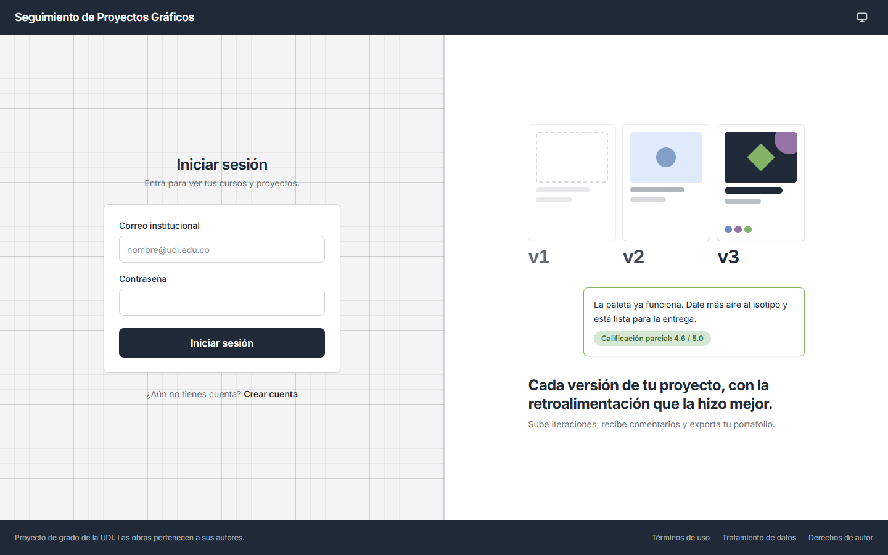 Inicio de sesión servido desde Container Apps | 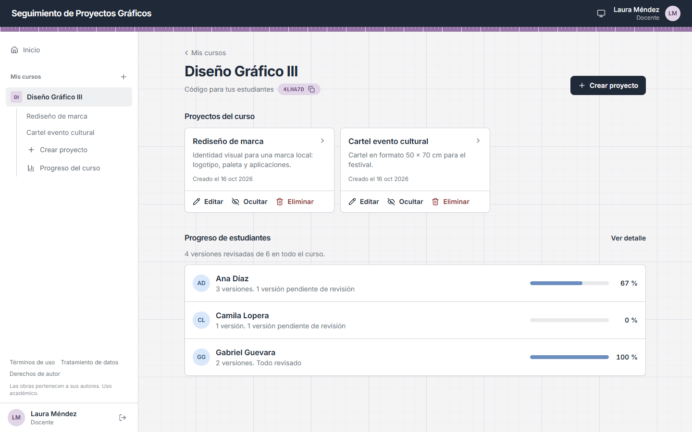 Panel del curso (docente): proyectos y progreso |
| 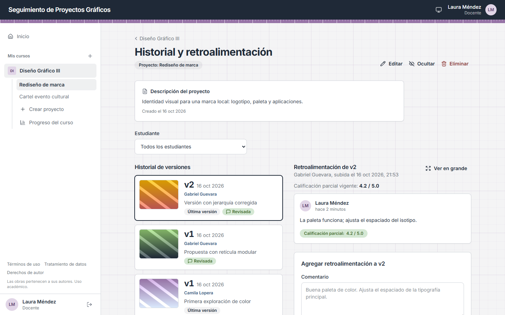 Historial con imágenes servidas desde Blob a través de la API | 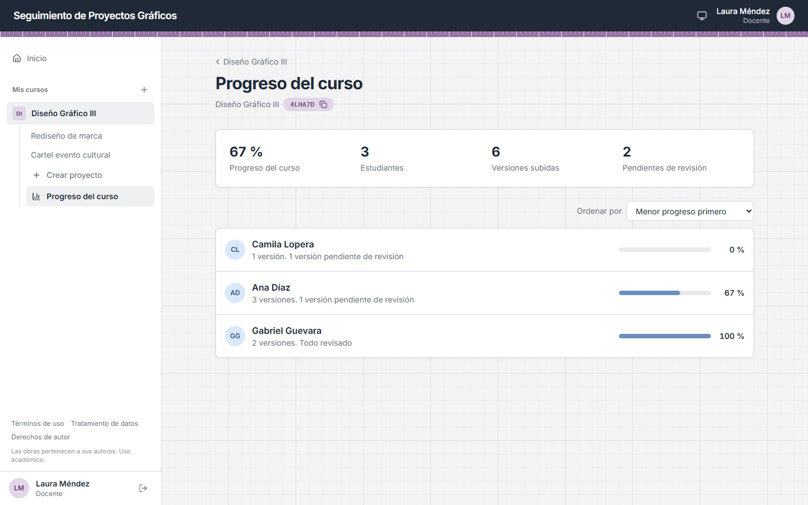 Progreso del curso |
| 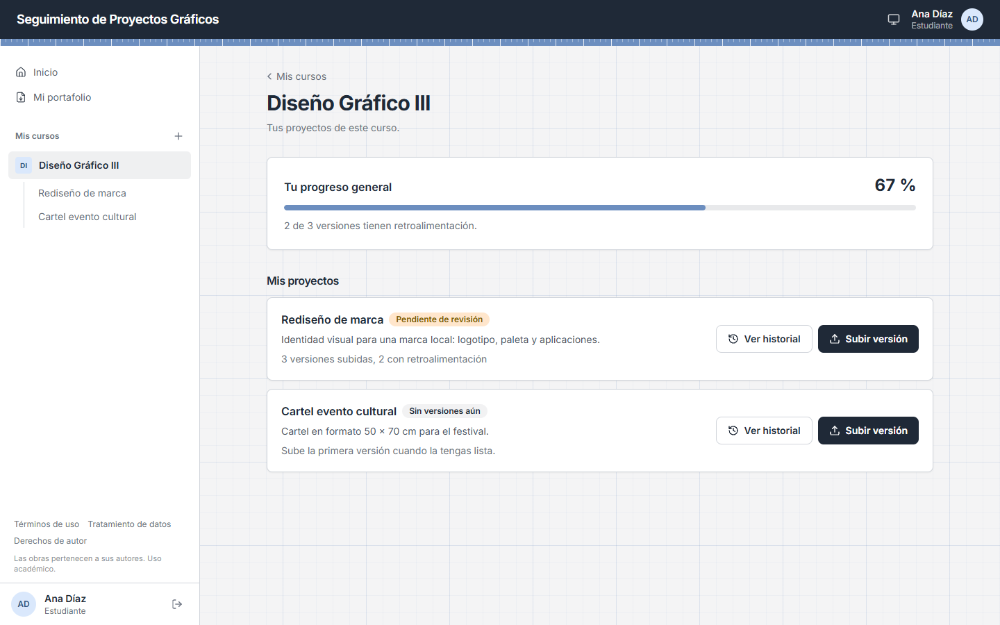 Panel del estudiante | 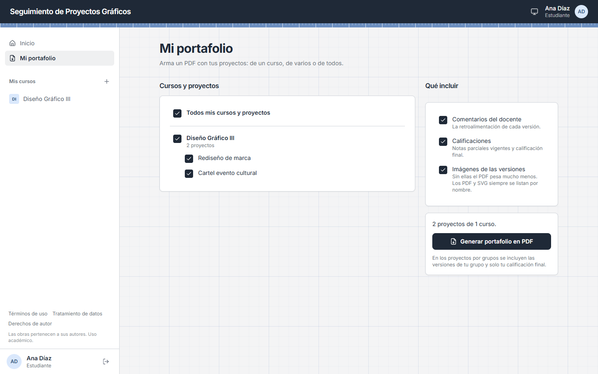 Mi portafolio (exportación académica) |
| 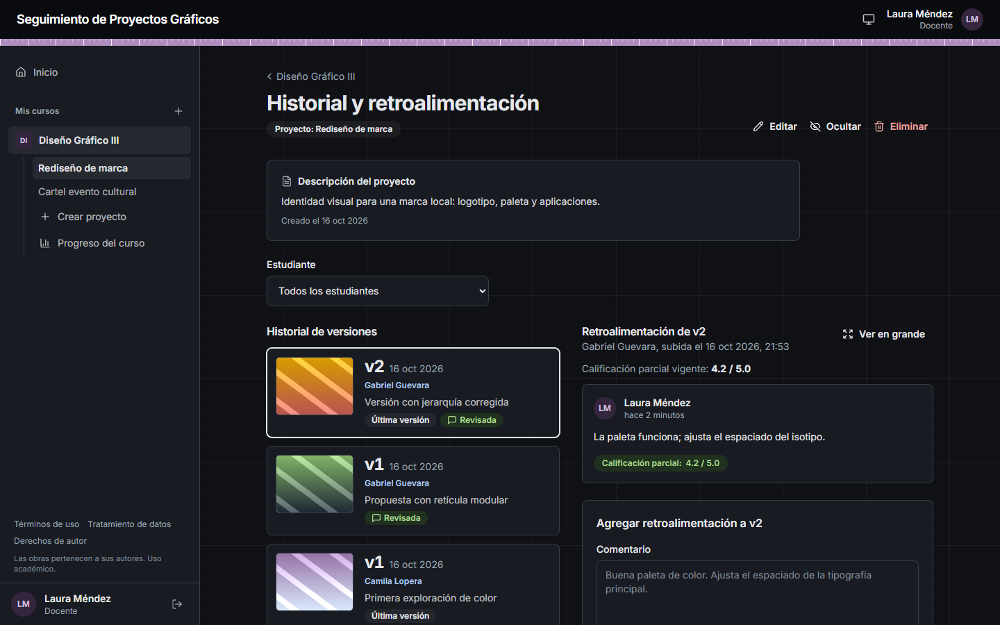 El mismo despliegue en modo oscuro | |

Las salidas de `az` de la sección 19.6 sirven como evidencia del lado de la infraestructura:
inventario, estados `Succeeded`, salud, logs de índices y respuestas del gateway.

### 19.8 Configuración de cada Container App

| Variable | auth | projects | feedback | export | frontend |
|---|---|---|---|---|---|
| `ENVIRONMENT=production`, `MONGODB_DB_NAME=graphic_tracker`, `JWT_ALGORITHM=HS256`, `JWT_EXPIRE_MINUTES=60`, `CORS_ALLOWED_ORIGINS=[]`, `LOG_LEVEL=INFO` | ✓ | ✓ | ✓ | ✓ | |
| `MONGODB_URI` → secreto `mongodb-uri` | ✓ | ✓ | ✓ | ✓ | |
| `JWT_SECRET_KEY` → secreto `jwt-secret` (la misma en los cuatro) | ✓ | ✓ | ✓ | ✓ | |
| `AZURE_STORAGE_CONNECTION_STRING` → secreto `storage-conn`; `AZURE_STORAGE_CONTAINER=versions` | | ✓ | | ✓ | |
| `AUTH_SERVICE_URL=https://auth-service.yellowsand-87b574b4.westus.azurecontainerapps.io` | | ✓ | | ✓ | |
| `SERVICE_NAME` | ✓ | ✓ | ✓ | ✓ | |
| `API_GATEWAY_URL=https://apim-graficos-js2026.azure-api.net` | | | | | ✓ |

Todas usan ingress externo con HTTPS: puerto 8000 en los servicios y 80 en el frontend. Las
revisiones activas usan la imagen `v1`, salvo el frontend, que usa la `v2` (19.13). Se consultan con:

```bash
az containerapp list -g "$RG" --query "[].{app:name, revision:properties.latestRevisionName}" -o table
```

### 19.9 Operación

```bash
source infra/azure/vars.sh && source infra/azure/secretos.sh

# Logs de un servicio (en vivo) y errores de arranque
az containerapp logs show -n projects-service -g "$RG" --tail 100 --follow
az containerapp logs show -n projects-service -g "$RG" --type system

# Publicar un cambio: imagen nueva con otra etiqueta y apuntar la app a ella
TAG=v2
docker build --platform linux/amd64 -t "$ACR_SERVER/projects-service:$TAG" Projects_Service
docker push "$ACR_SERVER/projects-service:$TAG"
az containerapp update -n projects-service -g "$RG" --image "$ACR_SERVER/projects-service:$TAG"

# Sustentación: una réplica siempre encendida (sin arranque en frío); después, volver a 0
for app in frontend auth-service projects-service feedback-service export-service; do
  az containerapp update -n $app -g "$RG" --min-replicas 1 -o none
done

# Volver a abrir la base para mongosh desde este equipo (la IP cambia), y cerrarla al terminar
CLUSTER_ID=$(az resource list -g "$RG" --resource-type Microsoft.DocumentDB/mongoClusters --query "[0].id" -o tsv)
IP=$(curl -s https://api.ipify.org)
az rest --method put --uri "https://management.azure.com$CLUSTER_ID/firewallRules/ClienteDespliegue?api-version=2024-07-01" \
  --body "{\"properties\":{\"startIpAddress\":\"$IP\",\"endIpAddress\":\"$IP\"}}"
az rest --method delete --uri "https://management.azure.com$CLUSTER_ID/firewallRules/ClienteDespliegue?api-version=2024-07-01"

# Cambiar una ruta del gateway: editar gateway/nginx.conf Y gateway/apim-policy.xml, y repetir la
# subida de la política del paso 10.

# Apagar TODO (borra datos y archivos, sin vuelta atrás)
az group delete -n "$RG"
```

### 19.10 Costos y crédito

| Recurso | Costo estimado al mes |
|---|---|
| Container Apps (5 apps, réplicas en 0) | US$0: la cuota gratuita mensual (180 000 vCPU-s, 360 000 GiB-s y 2 millones de peticiones) cubre la demostración. Con una réplica siempre encendida en las 5 apps (1,75 vCPU y 3,5 GiB a tarifa inactiva) son unos US$1,4 al día, unos US$40 si se deja así todo el mes |
| Container Registry Basic | ≈ US$5 (US$0,167 al día) |
| API Management Consumption | US$0 hasta un millón de llamadas al mes |
| DocumentDB Free tier | US$0 (32 GB, uno por suscripción) |
| Storage Standard_LRS | Centavos |
| Log Analytics | US$0 dentro de los 5 GB gratuitos; el tope de 0,5 GB/día evita sorpresas |
| **Total** | **≈ US$5–6 al mes** |

> **Importante sobre la cuenta gratuita.** El crédito de US$200 vence a los **30 días** de activar
> la cuenta, aunque no se haya gastado. Después Azure deshabilita los recursos de pago (los datos
> se conservan un tiempo) a menos que la suscripción se pase a *pago por uso*. Con pago por uso,
> este despliegue cuesta lo de la tabla. Revisa la fecha de vencimiento en el portal: **Cost
> Management → Créditos**.

**Recomendado: un presupuesto con alerta**, para que Azure avise por correo si el gasto se sale de
lo esperado. En este despliegue no se creó, porque las alertas van al correo del titular y lo
configura él:
1. Portal → **Cost Management → Presupuestos → Agregar**.
2. Ámbito: el grupo de recursos `rg-graficos-udi`.
3. Monto: US$10 mensuales.
4. Alertas: al 80 % del gasto real y al 100 % del pronosticado, con tu correo.

**Para la sustentación:** subir las réplicas mínimas a 1 la mañana de la presentación (19.9) y
bajarlas a 0 al terminar. Cuesta alrededor de US$1,5 por día.

### 19.11 Seguridad del despliegue

**Resuelto:**
- Todo el tráfico va por HTTPS. Container Apps y APIM traen certificado, y Storage exige TLS 1.2.
- Los secretos son secretos de Container App. El repositorio y las variables visibles no tienen
  ninguno.
- El contenedor `versions` es privado. Los archivos solo salen por la API, con la autorización
  H-6.
- La CSP del frontend solo permite conectarse a APIM, y CORS solo autoriza al frontend
  (verificado en el paso 11).
- Las cuentas demo usan una contraseña que no está en el repositorio.
- La regla temporal del firewall de la base (`ClienteDespliegue`) se borró al terminar.

**Pendiente (aceptable para el proyecto de grado):**
- **Los microservicios tienen URL pública (L15).** Quien la conozca puede saltarse APIM, aunque
  igual necesita un JWT válido. Para cerrarlo hay dos caminos: APIM con red virtual y las apps con
  `--ingress internal`, o una cabecera secreta que APIM agrega y los servicios exigen.
- **Firewall de la base.** La regla *Permitir servicios de Azure* (`0.0.0.0`) admite conexiones
  desde cualquier IP de Azure, incluidas las de otros clientes. La protección real es el usuario
  y la contraseña de la cadena. Se cerraría con un endpoint privado, que requiere red virtual.
  Además queda la regla de la IP del equipo que se usó al crear el clúster; esa IP ya cambió y se
  puede borrar.
- **Registro con usuario administrador.** Sería mejor una identidad administrada con `AcrPull`.
- **Key Vault.** Los secretos podrían vivir ahí y referenciarse desde las Container Apps.

### 19.12 Problemas encontrados y su solución

| Problema | Causa | Solución |
|---|---|---|
| `AADSTS530035: Access has been blocked by security defaults` en todos los comandos `az` | La sesión guardada expiró, y las opciones de seguridad predeterminadas de Entra ID exigen volver a autenticarse con MFA | Iniciar sesión otra vez: `az login --use-device-code --tenant <id>`, o `az login --tenant <id>` |
| `az login` se queda esperando sin mostrar nada | En Windows, `az` abre una ventana del sistema (WAM) para elegir la cuenta, y puede quedar detrás de otras ventanas | Buscarla en la barra de tareas, o usar el código de dispositivo |
| La cadena de conexión real de Mongo estaba pegada en la guía | Se copió como ejemplo al crear el clúster | Se movió a `secretos.sh` (ignorado por git) y la guía volvió a tener `<usuario>:<password>`. El archivo nunca entró a git |
| El clúster quedó en `westus` y la guía decía `eastus` | La región se eligió en el portal al crear el clúster | `vars.sh` separa `LOC=westus` (todo lo que usa Mongo) de `APIM_LOC=eastus` |
| `'charmap' codec can't encode character '\ufeff'` al subir la política con `az rest` | APIM responde con un BOM UTF-8, y `az` en Windows imprime con cp1252. La política sí se guardó | `export PYTHONIOENCODING=utf-8`, que ya está en `vars.sh`, y comprobar con el `GET` del paso 10 |
| `az rest ... &format=rawxml` devuelve XML y no JSON | Es lo que pide ese parámetro | Guardar con `--output-file` y revisar el XML |
| `mongosh` desde el equipo no conecta a la base | La IP pública del equipo cambió desde que se creó la regla del firewall | Agregar la IP actual (paso 2) y quitarla al terminar (19.9) |
| La versión de prueba de 18 MB quedaba en los datos demo y hacía pesar 22 MB el PDF de Ana | Los datos de la prueba de tamaño quedaron en la base | Se borró el documento de `versions` y su blob. No tenía retroalimentación, y la prueba queda registrada en el paso 13 |

### 19.13 Historial de actualizaciones

Cada cambio publicado después del despliegue inicial. Para publicar una actualización: construir
la imagen con una etiqueta nueva, subirla y apuntar la app a ella (19.9). Container Apps crea una
revisión nueva y le pasa el 100 % del tráfico. La revisión anterior queda inactiva para volver
atrás si hace falta.

| Fecha | Componente | Etiqueta | Cambio | Verificación | Commit |
|---|---|---|---|---|---|
| 16 oct 2026 | Los cinco | `v1` | Despliegue inicial | Secciones 19.6 y 19.7 | Incluido en `16a332e` |
| 17 oct 2026 | frontend | `v2` | Registro: si no se elige rol, el formulario mostraba el mensaje por defecto de Zod en inglés (*Expected 'estudiante' \| 'docente', received null*). | Prueba nueva en `tests/auth.test.tsx` (76/76 pasan) y prueba en vivo en Azure | `16a332e` |
| 28 oct 2026 | frontend | `v3` | Rediseño de la calificación final: barra arriba del historial con estado y acceso, bloques separados para la nota parcial y la final, y diálogo de confirmación (sección 10.3.2). Sin cambios en la API | 76/76 en Vitest, 52 comprobaciones con Playwright en local y textos nuevos presentes en el bundle publicado | `bb8ec87` (código) y `8a26b6e` (documentación) |

**Causa y arreglo del cambio `v2`.** Con ningún radio marcado, react-hook-form entrega `null`, no
`undefined`. `required_error` de Zod solo cubre `undefined`, así que se mostraba el error de tipo
por defecto. El esquema (`frontend/src/features/auth/schemas.ts`) ahora usa `errorMap`, que cubre
cualquier valor inválido, con el mensaje «Elige si te registras como estudiante o como docente».
Los demás `z.enum` del frontend no tienen el problema: los campos de modalidad del proyecto
siempre tienen valor por defecto.

Comandos ejecutados (build de 31 s y actualización de 20 s):

```bash
source infra/azure/vars.sh
TAG=v2
docker build --platform linux/amd64 -t "$ACR_SERVER/frontend:$TAG" frontend
az acr login -n "$ACR"
docker push "$ACR_SERVER/frontend:$TAG"
az containerapp update -n frontend -g "$RG" --image "$ACR_SERVER/frontend:$TAG"

az containerapp revision list -n frontend -g "$RG" \
  --query "[].{rev:name, active:properties.active, traffic:properties.trafficWeight, image:properties.template.containers[0].image}" -o table
# frontend--h5l48lx  True  0    acrgraficosjs2026.azurecr.io/frontend:v1
# frontend--0000001  True  100  acrgraficosjs2026.azurecr.io/frontend:v2
```

La prueba en vivo con Playwright completó el registro sin elegir rol. El mensaje apareció en
español, no hubo ningún texto *Expected* y no se envió ninguna petición a `/auth/register`.

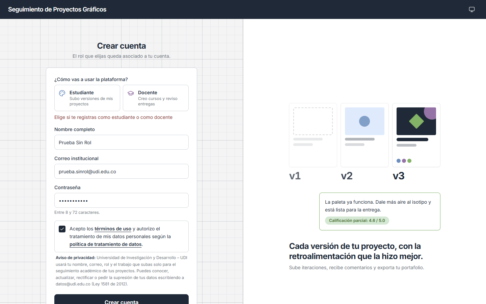

Para volver a la versión anterior, si algo fallara:

```bash
az containerapp update -n frontend -g "$RG" --image "$ACR_SERVER/frontend:v1"
```

**Cambio `v3`: rediseño de la calificación final.** Lo que cambió y por qué está en la sección
10.3.2. Antes de publicar se verificó en local: `pnpm run build` sin errores, Biome limpio, 76/76
pruebas de Vitest (3 se actualizaron al flujo con confirmación) y 52 comprobaciones con Playwright
(`infra/azure/.trabajo/shots/verif_calificacion.mjs`, con datos desechables).

Comandos ejecutados (build de 27 s y actualización de 21 s):

```bash
source infra/azure/vars.sh
TAG=v3
docker build --platform linux/amd64 -t "$ACR_SERVER/frontend:$TAG" frontend
az acr login -n "$ACR"
docker push "$ACR_SERVER/frontend:$TAG"
az containerapp update -n frontend -g "$RG" --image "$ACR_SERVER/frontend:$TAG"

az containerapp revision list -n frontend -g "$RG" \
  --query "[].{rev:name, active:properties.active, traffic:properties.trafficWeight, image:properties.template.containers[0].image}" -o table
# frontend--0000001  True  0    acrgraficosjs2026.azurecr.io/frontend:v2
# frontend--0000002  True  100  acrgraficosjs2026.azurecr.io/frontend:v3
```

En Azure se comprobó que el JavaScript publicado ya trae los textos nuevos, como «Revisar y
confirmar». El recorrido con inicio de sesión se hizo
en local, porque en el entorno publicado no se escriben contraseñas desde la automatización.

Para volver a la versión anterior, si algo fallara:

```bash
az containerapp update -n frontend -g "$RG" --image "$ACR_SERVER/frontend:v2"
```

Registro en git (hora de Colombia, rama `main`, github.com/JsDevHD/PG2):

| Commit | Fecha | Contenido |
|---|---|---|
| `bb8ec87` | 28 oct 2026, 00:30 | «Rediseña el flujo de calificación final: acceso visible, diferenciación de la nota parcial y diálogo de confirmación». Código del frontend y las 3 pruebas actualizadas: 10 archivos, +687/−226 líneas |
| `8a26b6e` | 28 oct 2026, 00:30 | «Documenta el rediseño de la calificación final, el manual de usuario y los resultados de despliegue y pruebas». Esta documentación, el manual con 10 capturas nuevas o rehechas, los resultados de pruebas y el informe de despliegue: 46 archivos |

La revisión `frontend--0000002` se creó a las 00:27 y el push a `main` (`16a332e..8a26b6e`) se hizo
a las 06:45. Para confirmar que la imagen publicada corresponde a `bb8ec87`, se compararon los
archivos del build local con los que sirve Azure. Los chunks `react`, `ui`, `data` y el CSS tienen
el mismo hash. El chunk `index` solo difiere en la URL por defecto del gateway: en local sale del
`.env` y en la imagen queda vacía, porque se fija al arrancar con `config.js`.
